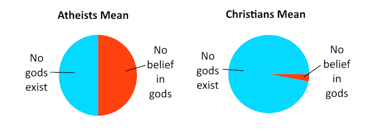

#  Definition of Atheism

From the etymology, atheism mean the opposite of theism. While theism is about a belief in gods, the opposite might be either “no belief in gods” or the “belief in no gods”.  The population is split across these two meanings in a curious way, and this has implications if you want to be understood.

:::tip[Kernel]

There are two meanings of atheism.  Some audiences actively undermine the meanings to political advantage.  Just use the term "non-believer" instead.

:::

## Two Different Meanings

The first meaning — **no belief in gods** — is a simple rejection of existing religions:  a rejection of the myths, a rejection of supernatural stories.  An atheist might deny that Jesus resurrected himself after 3 days, that Mohammad flew to heaven on a winged horse, that Thor throws lightning bolts, that Odin holds court in Valhalla, that Shiva gathered the world from dust, that all religions are based on stories that should not be _believed_ at face value.  In this meaning, atheism is not a positive claim about any aspect of reality, only a rejection of all such ancient religion-forming myths.

The second meaning — **a belief in no gods** — is a positive claim that no gods exist. This is considered by many to be the _strong_ definition of atheism because while rejecting existing religions it goes further by actually making the claim that the universe has no god, and that no matter what what happens humans will never find any evidence for god.  The second definition is also called the ‘_atheist-gnostic_‘ position, while the first definition is the ‘_atheist-agnostic_‘ position.

## What do Dictionaries/Books Say?

The dictionaries are split on the meaning of atheism:

*   Merriam Webster – a lack of belief or a strong disbelief in the existence of a god or any gods
*   Dictionary.com – the doctrine or belief that there is no God; disbelief in the existence of a supreme being or beings.
*   Cambridge Dictionary – the belief that God does not exist
*   Collins – the belief that there is no God.
*   Free Dictionary – Disbelief in or denial of the existence of God or gods; rejection of belief in God or gods
*   Oxford English Dictionary – Disbelief in, or denial of, the existence of a god.
*   Websters – disbelief in the existence of God or any other deity; the doctrine that there is neither god nor any other deity.

Basically, the dictionaries reflect the fact that both usages exist, and don’t really show a strong preference of one over the others.

It is also the case that many (but not all) famous landmark papers and books from philosophers and thinkers in the past have used the strong definition of atheism for discussion.

## What do the Atheists Think?

What I have found is that self-declared atheists mean overwhelmingly the first meaning of the word.  These groups openly insist on the first meaning:

*   [Atheist Community of San Jose](http://sanjoseatheists.org/faq/) – An atheist is a person who rejects the claim that any god (or gods) exist and, therefore, does not believe that a god (or gods) exist.
*   [Atheist Community of Austin](https://atheist-community.org/resources/atheism-faq) – We define atheism as the lack of belief in gods. This definition also encompasses what most people call agnosticism.
*   [American Atheists](https://www.atheists.org/activism/resources/about-atheism/) – Atheism is not a disbelief in gods or a denial of gods; it is a lack of belief in gods.
*   [Atheist Alliance International](https://www.atheistalliance.org/about-atheism/what-is-atheism/) – _atheism_ means ‘without a belief in a god or gods’ or the ‘lack of a belief in a god or gods’.

The first, weaker definition is more encompassing, including a lot more people, while the second, stronger, definition is more restrictive and includes fewer people.  Every person who fits into the second meaning, also fits into the first, but not the other way around.

I held a casual poll in an atheist Facebook group:

*   50% – I am an atheist, and I believe there are no gods
*   50% – I am an atheist, and I have no belief in gods, without any particular claim about whether a god exists or not.

The result of this poll is that about 50% of the atheists in that group identified with the gnostic definition as their own position, and about 50% identified with the agnostic definition.  In conversations, it seems like most atheists agree that the agnostic position is still included under the definition of atheism.  It is also true that there are theist-agnostics who believe there is a God but don’t claim to know it.  There certainly are no arguments in atheist groups with one side insisting that it has to be the strong definition.

## The Religious View it Very Differently

Traditional Christian and Muslim religious groups overwhelmingly use the second, stronger definition.  A cynic might suggest this is because the stronger definition is easier to argue against.  If you claim to have a belief based on evidence, then how can you have sufficient evidence that no god exists anywhere in the universe?  It is well known that in general you can’t prove that something does not exist, so any atheist must be believing there are no gods do so without sufficient evidence.  It makes atheism into a kind of religion with _faith_ that no gods exist.

I ran another polls on Facebook:

*   96% – I am Christian, and an atheist claims there is no God
*   4% – I am Christian, and an atheist does not believe in God, but makes no claim on whether God exists or not.

Here, the responses were stark.  **96% of the responses** say that atheism means the positive claim that there are no gods.  This was not a scientific survey by any means, with errors as high as 10%, however there is no mistaking how consistently the Christians attributed the meaning to the word.  This also corresponds to my own experience in talking with Christians:  they virtually always understand atheism to mean the claim that there are no gods.  In fact, they view the agnostic explanation as a sneaky attempt to make the word friendlier in order to gain more converts.  Most atheist and Christians simply talk past each other by using different definitions of the same word, and utterly fail to communicate.

This is important because **70% of the US population is Christian** according to the [2014 Pew Religious Landscape Survey](https://www.pewforum.org/religious-landscape-study/#religions).  That same survey found 3% atheist, 4% agnostic, and 15% other non-religious.  Christians are overwhelmingly the majority of the country, and they overwhelmingly understand atheism to mean the strong definition: someone who believes there are no gods.

## Philosophy

The best reasoning is found in the [Stanford Encyclopedia of Philosophy](https://plato.stanford.edu/entries/atheism-agnosticism/#DefiAthe):

_“Atheism” is typically defined in terms of “theism”. Theism, in turn, is best understood as a proposition—something that is either true or false. It is often defined as “the belief that God exists”, but here “belief” means “something believed”. It refers to the propositional content of belief, not to the attitude or psychological state of believing. This is why it makes sense to say that theism is true or false and to argue for or against theism. If, however, “atheism” is defined in terms of theism and theism is the proposition that God exists and not the psychological condition of believing that there is a God, then it follows that atheism is not the absence of the psychological condition of believing that God exists (more on this below). The “a-” in “atheism” must be understood as negation instead of absence, as “not” instead of “without”. **Therefore, in philosophy at least, atheism should be construed as the proposition that God does not exist** (or, more broadly, the proposition that there are no gods)._

## Does It Matter?

Shouldn’t atheists be able to define the word any way they want?  They are, after all, claiming to be atheist, so shouldn’t their opinion matter?  The term agnostic means simply that you don’t know, but the atheist is sure that they don’t believe in God.  Can’t they use atheist any way they wish?

**It matters only if you want to be understood.**  Words have meanings only to the extent that we agree on those meanings.  One can always redefine a word, but when you do, anyone who does not know your specific meaning will be confused or misunderstand you.

If you insist on using atheist to mean lack of belief, you will be confusing or miscommunicating to 70% to 95% of your audience.  If you don’t care about this, then by all means continue.  It is overwhelmingly clear that regardless of the logic of the etymology, the overwhelming majority of the audience still views atheism as the claim that there are no gods.

Some atheists enjoy the sense of shock that they get by employing the word in the presence of those who are horrified by the term.  They feel it is way of counterbalancing years of religious privilege.  If that is your motive, then perhaps being understood is not high on your agenda.

I, for one, will henceforth only use the word atheist when I want to talk about people who make a claim that there are no gods.  I will use other words for the more general rejection of religious beliefs.

## Non-Religious

May I humbly suggest that if you want to say that someone has no beliefs about God, but doesn’t claim to have a knowledge against there being any gods, then simply use the term **non-religious**.  It fits quite well. It clearly means they reject the Bible, they reject the Quran, they reject supernatural claims, they don’t believe in miracles, and they do not buy into mysterious religious claims in any way.  Still it leaves them open to possibly accepting those if evidence ever presents itself.

It is not perfect, it does not have the cache of atheist, and it has more syllables, but it has the advantage that almost everyone knows _exactly_ what you mean by non-religious.