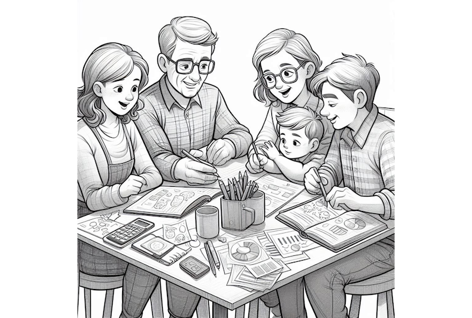

# Meaning of Life for an Atheist

Some Christian have this odd belief that atheists have no meaning in their lives.  I don't really understand the source of this belief, except of course the Christians tell each other this over and over until they believe it.  I was wondering, well is that true?

So I asked some atheists:  What gives you life meaning?

Did I get a bunch of responses saying that life has no meaning, that it is empty, devoid of joy.  No I most certainly didn't.  Here is a list of different responses I got from people who self proclaimed to be atheists:

**Fellow atheists: what would you say gives your life meaning?**

* Life is even more precious when you realize we are soon gone with no silly afterlife bs.  I'm filled with gratitude every single day.
* Every. Single. Thing. give my life meaning.
* Meaning is a human construct so what every we choose.  It can be many things and that changes moment to moment.  For example Helping others. Going for a hike.Sunrise or sunsets.  etc.  Helping people doesn't even have to be someone I consider close. I do some work in the addictions/recovery community.  I don't know many of the people I help. It could be said that I help the organization I am involved with but it goes much deeper than this.  Calling it meaning or purpose is kind of a non sequitur though I think.
*  life is fun, and I want to see what happens next.  I don't need a reason to enjoy something, I just enjoy it.
* Life can be viewed as a random gift. And in my opinion the best thing is to just live as well and decently as you can. And that doesn't necessarily mean a comfortable life. But one that doesn't destroy us personally, our loved ones, humanity and the entire planet and perhaps leaves everything a little better than how we found it.
* Family, friends, loving relationships
* My family
* Being able to enjoy it some of the time when not having to work. I love walking with my rescued and other dogs. I also like good music, making and trying out different foods, along with wine and weed appreciation. I am not in this life to be a cog in someone else's wheel and I assert that right. I also reserve the right to educate and call out theists. It is satisfying to spread reality.
* Love
* Whatever is my project at hand. I've done music. I've learned new instruments. I learned to design telescopes a few years ago and sold a few dozen models. I'm retired now and play video games. It's hard to believe but this game I'm hooked on is a lot of fun.
* Educating Theists
* Anything. Everything. Some things. Most things. Whatever I choose.
* My life's meaning is whatever I want it to be. Being a good father, grandfather, sharing what I can with my fellow man.  There are so many things that it's actually a silly question.
* Being happy
* It is all that there is, and shall forever be.
* Each moment
* What I do every day as a living being
* Music
* If I live long enough I might see a fair amount of the planet die before me. It’s really quite amazing.
* Independence
* Being content with myself and following my inner desire
* My cats!
* Music (again)
* Religious/spiritual people search for meanings. I don't. I just enjoy and try to be kind.  On my grave shall be written: "Game over, but it was awesome!"
* Whatever I decide . . 
* Knowing that I'm trying to make a difference
* Making sure I pay attention to what's going on in the world means I can try and not leave it worse than I found it
* I am an Atheist, Secular Humanist and Scientist. I find meaning in environmental activism, helping the homeless and tutoring kids. I'm a passionate amateur astronomer and one of the most meaningful and satisfying things I do is show kids their first looks at Saturn's rings or Jupiter's cloud bands.  It's one of the most offensive things I hear when people assume the life of an atheist is devoid of any meaning. Look around you!
* Waking up every morning.
* Doing good things for others. Finding ways to love the peeps in my life. Generally just trying to be kind and have value.
* Whatever we make it. For ourselves and our loved ones and friends around us
* I prefer purpose over meaning. Meaning implies I was created for something as opposed to finding a purpose(s) after the fact.
* Life itself. It is beautiful, exciting and you never know what is around the corner.
* Music and my husband
* Life
* It's whatever is important to you!
* Relationships with good people, good food, music, travel and a decent bottle of red 
* Love. Love of one another, of nature , of animals
* Embracing change and my grandchildren
* Family. Pets. Traveling.
* My family, sunsets, my little farm.
* Still knowing the question to the answer "42".
* Many things: learning new things, having new experiences, spending time with my significant other/family/friends, etc. Most of these activities are fun, and they're fun most of the time.
* Living it. I’m thankful for my life every day and I won’t squander it.
* I provide my own meaning. I no longer require someone or something else to do it for me.
* Breathing, eating, staying healthy. Without that, I wouldn't be "living."
* My family, my cat, my friends, my art, fighting to defend people from religious abuse without using violence, good food, cooking, music, creating videos, playing video games, enjoying emotional reactions to stories and music...
    * It's the little things that add up to a good life. And you have to choose to find them everyday.
    * We are evolved to get bored - you can't have the same meal all day, everyday - and the key to lasting happiness is finding one thing everyday to smile or laugh at.
    * And understanding there's no "one ultimate goal" in life, it's about passing time.
    * We have the same life importance as mold growing on a warm, wet rock, left out in the sun a few billion years too long.
    * We get to CHOOSE our meaning.
    * Anything promised to be "eternal" is ALWAYS a SCAM, because we are merely evolved to get bored.
    * The sooner we understand this, the fewer ways capitalism and religion can manipulate you through your boredom!
* Not feeling like I have to answer to a flying magic man in the sky, like almost everyone I know does! Lol
* My daughter is my world!
* Happy and free.
* Music. Whether I'm singing, playing, or just listening, music gives me life.
* The life goes on, it started eons ago before you, it will go on , with you, after you. All you or I are here is to see the life do its dance, from a very narrow perspective, never knowing its infinite nature.
* Making my family happy, reaching my goals.
* being in the moment
* Helping those I Care about in ways I am good at. Learning and growing as a person
* Life its self
* Living itself
* The honest answer is... I do.
* I never understand why people say -God is good! Maybe when something good has happened to them ,and they think -'Gods done that' ,if so why is there so much evil,war,starvation . It's just in humans DNA. People are desperate and hold on to a name that they think will save them ,and be re-born into a happier place!
* do the things i like
* Living and enjoying it.
* My wife
* Pizza
* My kids and the people I love
* Family, good food, love, hobbies, music, entertainment, nice house, etc. . . . . .

## Common Themes

**Family** - many of the responses say that family gives their life meaning, like "my wife", "my husband", "my family", "my daughter is my world".  That is not surprising at all, because relationships like this can be some of the most fulfilling of a lifetime.

**Helping others** - a lot of responses echoed this this idea that helping itself is inherently meaningful, with one answer pointing out that they don't even know most of the people they help.

**Life itself** - Life is its own reward. Pay attention, be in the moment, see what it there, and marvel at the gloriousness of it.  There is a strong sentiment that life is all you get, so don't waste it.

**Music, arts** - lots of answers from people who found meaning in music and art, either making it or enjoying the expressions of others.

**Improving the world** - many answers reflected the idea that a meaningful life includes some aspect of making the world a better place for future generations, which is a way of showing thanks for earlier generations that made the world better for us.  Many scientists find great meaning in hoping they can make a discovery that would have a large effect on the future world.

**hobbies, entertainment, enjoyable occupations** - Many feel that life is what you make it, and that there is a wide opportunity for different ways to enjoy, that the joy itself gives meaning to life.

**not about wealth** - none of the responses talked about material wealth or possessions as being meaningful for life.  This is used as a strawman argument by some Christians, however we see that mature people both atheist and Christian find that wealth does not produce happiness.

This being Facebook there were some number of joke responses.   Some of the responses mentioned how arrogant the Christians are for thinking they have some kind of exclusive on meaning of life.  It is really quite frustrating to be told by someone their presumptions about how meaningless your life it.  Several answers lashed out at the idea that a God would make life meaningful in any way.

## Christians Lack Meaning beyond God

The most surprising or maybe shocking claim, is when a Christian says "Without God my life would have no meaning."  I always think: what?  You you get absolutely no meaning from your family, your friends, you community.  You get nothing out of helping others.  Your only meaning is the very selfish thought that you will go to heaven when you die.  I can't help think that it is so sad that these Christians can't see life for what it is, and need to instead pin all their hopes on an afterlife.

### 7 reasons that life would be meaningless without God

Consider this Christian site which gives [7 reasons that life would be meaningless without God](https://www.beliefnet.com/inspiration/7-reasons-life-without-god-is-meaningless.aspx).:

* We wouldn’t know the true meaning of love.  Several atheists mentioned love and specifically love for their family as being meaningful. One has to wonder why this is not meaningful for Christians.  From observations, I have found that a mother loves her children in a way that has no peer.  I have never seen a Christians acting in a more loving way than a mother for her child.
* We wouldn’t witness miracles.  Yes this one is true.  There is no evidence that Christians witness miracles anyway.  None of the atheists mentioned miracles as adding meaning to their lives.
* God wouldn’t be able to carry us through the storms of life.  But other people would.  I didn't see atheists claiming that storms in their life was any particular problem.
* There would be no perfect plan for our lives. No evidence of a perfect plan in any case.  Atheists don't seem to need a perfect plan, and seem happy with the imperfect one they are able to find on their own.  
* There wouldn’t be someone always there by our side.  Maybe, maybe not.  The atheists seem to find joy and satisfaction from the people around them. Maybe Christians lack this ability?
* God wouldn’t be there to heal our wounds.  But there might be a person.  I didn't see atheists mentioning that their wounds were causing them trouble.
* There wouldn’t be someone there to hear our every need.  But there might be a person.  In general atheists pointed to their personal relationships as being particularly meaningful.

What this list tells us is that Christians feel the need to eliminate their dependence on other people.  As far as I can tell, atheists do this without need to pretend there is a God.  It is almost as if in becoming Christian, you lose the ability to enjoy personal relationships, and instead gain some kind of dependence on an internal feeling provided by the belief.  It is almost as if Christianity was a drug that they become addicted to.

### Meaningless Life Without God

Another site claims [Meaningless Life Without God (Ecclesiastes 6:6)](https://radical.net/podcasts/pray-the-word/meaningless-life-without-god-ecclesiastes-66/) and talks about people with great wealth which the Christians should not be jealous of.  No amount of wealth would give you the satisfaction of a life with God.  None of the atheists mentioned anything about wealth or possessions providing meaning.  

In this article the following quote is relevant: "We see the emptiness of things in this world, even the best things in this world, if we separate them from the God who gives us those things and praise and glory and honor and gratitude to God."  But this statement ignores relationships like family and friends.  Sure, money and wealth is empty, but why do they then presume that money and wealth is the only thing other than God?  Atheists seem to find much cause for meaning in life without needing a God.

Repeating this is the next paragraph:  "... life that doesn’t center around God. It is not a full, abundant life. It is quite simply meaningless."  It seems that atheists find a full and abundant life without God.  Atheists find plenty of reasons for meaning; perhaps Christians have lost this ability?  It is as if Christians need to tell themselves this in order to maintain their faith in God?  It is rather sad that Christians fail to find meaning in their family, friends and community.

### Bible verses about being nothing without God

A third article proposes "[Bible verses about being nothing without God](https://biblereasons.com/being-nothing-without-god/)."  

* Christians are told that "apart from [Jesus] you can do nothing."  
* "the Son can do nothing by himself."
* "nothing was created except through [God]."
* "the way of man is not in himself"
* "I can do all things through him who strengthens me."  Christians seem to lack confidence to do things themselves.
* "God created man in his own image" - not really relevant in this discussion
* "Man shall not live by bread alone, but by every word that comes from the mouth of God." Once again Christians are told they are not able to do anything themselves.
* "seek first the kingdom of God" - not really relevant here.
* "For if anyone thinks he is something, when he is nothing, he deceives himself." Christians are told to not even try to do anything, yet another message used by cults to keep members in.

In reviewing this, it seems that Christians need to be told that they can not do things on their own in order to keep them in the cult.  If Christianity actually built up confidence in yourself, they would lose members, so it become very important to tell people that they are worthless without God.

## Conclusions

There was no sign that any atheist was having any trouble identifying what gave their life meaning.  There really was a surprising number of thoughtful responses.  Most of them came down to the idea: there are so many things that can give life meaning, just see them and appreciate them.  The group as a whole is full good feelings, and value life to the fullest.

## Comments and Answers

> any atheist who is not a nihilist is being dishonest to his religion.
> Atheism, taken to its logical conclusion, nihilism is the end result of atheism.

That is what you think.  You need get a ticket to heaven where you will live and live and live forever.

The atheist realizes that they play a particular limited role in the world, and they leave behind them a better world for their friends, family, and all of humanity.  THAT is what the atheist lives for, not the silly selfish dream of an everlasting life. 

That is NOT nihilism

