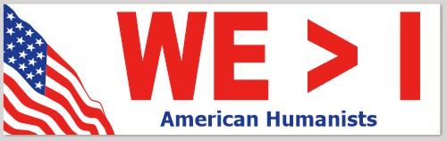
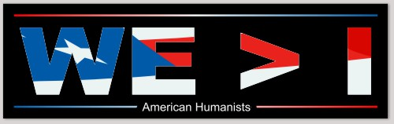

#  WE>I

**WE>I** is a secular symbol to recognize the importance of humans working collaboratively together. It is a mindset that leverages our superpowers of communication and empathy.  It reminds us that without others, we would be nothing.  

It’s almost impossible for human to live in the wilderness alone. Humans have always gathered together as bands or tribes in order to survive. The ability to speak to each other using abstract concepts have allowed human beings to dominate the planet.

Humans love working together. There’s nothing better than starting out on a goal with a group each bringing their individual expertise to bear and arriving at a successful coordinated conclusion. We call it teamwork.

There’s nothing better than sitting down to a great meal with friends and family members and reflecting upon the accomplishments of the day. Relishing your achievements by yourself is simply not as good.  We call it _camaraderie_.  

**WE>I** is recognition of the fact that by ourselves we are less powerful than if we work together. Synergy: The fruits of our collective labor are greater than what we could accomplish individually.

**WE>I** is nothing that you don’t already know.  Every human endeavor is done in the midst of, and with help of, a community of others.  

**WE>I** is a statement of humility. Who would be so egotistical to think that they need nobody else?  We’re stronger together and we need that strength.  We are grateful that others are around to lend a hand in times of need.  We are honored to lend a hand in return.  

**WE>I** is a mindset. It’s a way of looking at the world not so much as what is me and mine, but what is ours. For truly nothing you have came about from your individual work. Everything we have has been touched by multiple people at sometime.

**WE>I** honors our ancestors. It’s a recognition that the world we live in was built primarily by people before us, and left to us by their love and good intentions.

**WE>I** is about love. Love is precisely those acts that go beyond the minimum needed, and recognizes that without the love for each other to work together, we might perish.  It rejects the selfish notion that we work separately. It is the claim the everything we do benefits not only ourselves but the people around us. It’s a reminder that we should think about the consequences of her actions so that we are seen as a contributor to the overall good and not as simply a leech on society.

**WE>I** is a primary principle among atheists, humanists, and secularists strive to live according to the principles of respect for your community. We recognize the good of the whole as being of paramount importance. We can give of ourselves to the community because after all the community supports each and everyone of us.

**WE>I** is reminder about equality. It’s about seeing ourselves in proper relationship to everybody else.  No person is an island. It honors agreement. It honors fruitful argumentation. It honors teaching and training and spreading knowledge for the betterment of all.

## Messaging

Maybe you want to declare this value to others?  What better way than a bumper sticker?   I designed these bumper stickers.  I don’t make any money off the sales, but hopefully the company that fulfills these order do.  Feel free to borrow any design you like and repurpose it elsewhere.  You can edit the details on the design before printing, so maybe put your own organization in there.

