# Optical Illusions

Optical illusions give us the ability to see how the perceptual system does not always represent the world to us exactly as it is.  Each illusion tricks the perceptual system in different ways to give the viewer an impression that is simply false, which can be easily verified by looking closely at the image.

:::tip [Key Takeaway]

We don't perceive the world the way it is, but instead our perception presents a view of the world that is useful to survival.  Seeing is not believing.

:::

## 1. Checker Board Shadow

Probably the best illusion, the most important to see how the mind interprets what you see to make sense of the world.   The squares marked A and B have exactly the same colors.  The background color of the two squares (actually rhombuses, but looks like squares with perspective) is exactly the same, and the color of the letter is exactly the same.

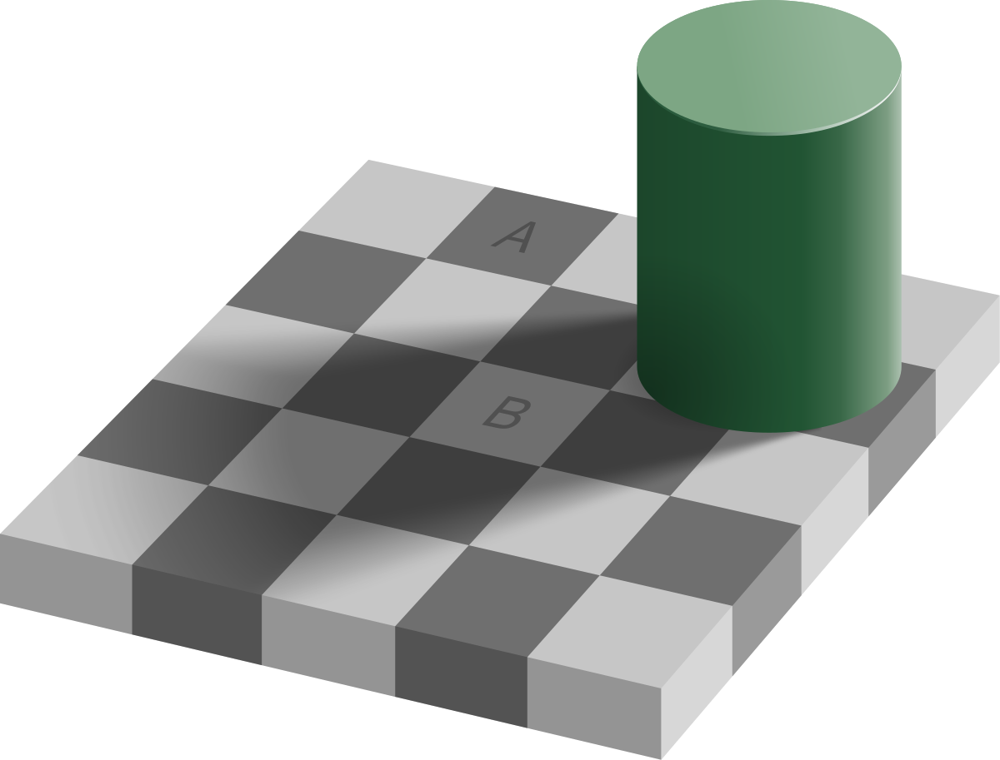

The mind sees that B appears to be in the shadow of the cylinder, so it compensates for the shadow, and assumes that square B must actually be lighter than it appears, and so you see it as being lighter. 

Because this illusion is so compelling, it is worth proving to yourself that A and B are the same color.  Take the image into an editor, and the draw a solid color rectangle that bridges both squares.  You can easily see that the drawn rectangle matches the colors of A and B exactly where they touch.  Yet the illusion is so strong the rectangle itself appears to change color over the length of it. Below I offer an example showing a simple rectangle that is a simple solid color.  You should really do this yourself so you know that no trick is being played here.

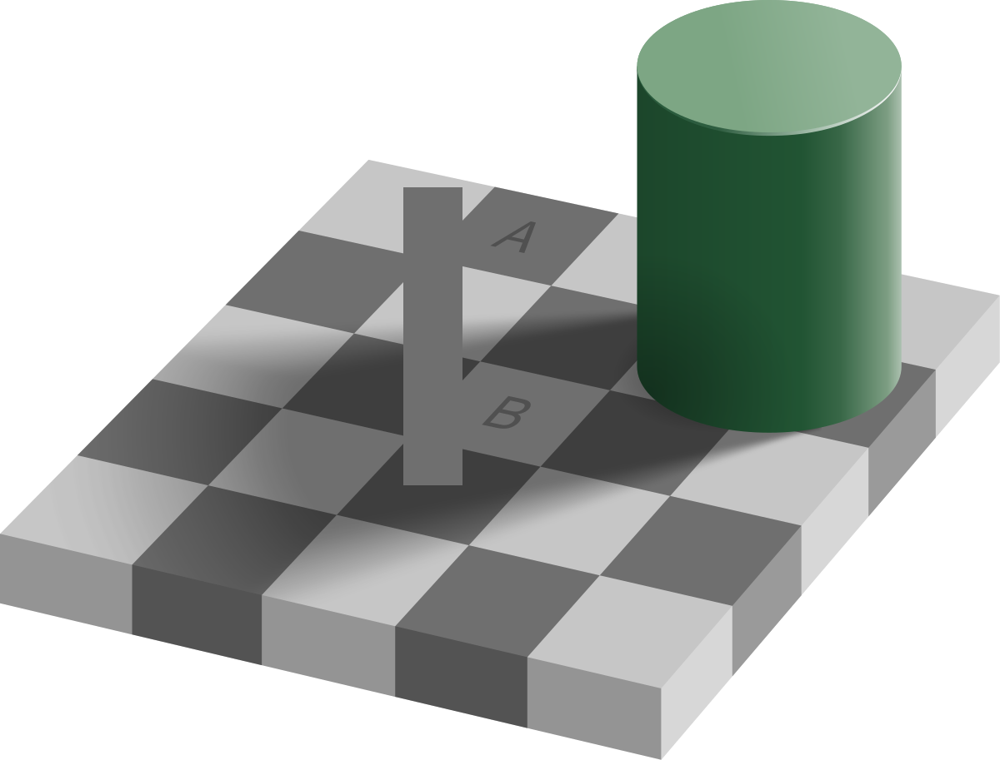 

## 2. Circles on a Checkerboard

Another illusion follows the same line.  The entire picture shades from light on th eleft, to dark on the right.  The eye interprets this as a change in lighting.  The two circles are exactly the same, but the look entirely different.  The mind has compensated for the circle appearing in the darker side, to make it appear lighter than it is.

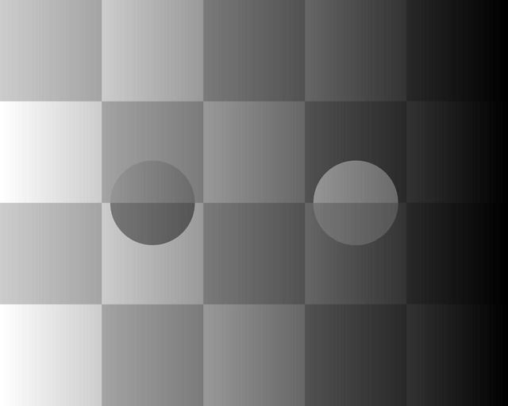

Again, I needed to convince myself, so in a graphical editor, i picked a color from the center of the top half of the circle.  I painted both circles to be the same solid color (the original has the top of both circles fading color from left to right as well) and then I linked the two tops with a solid single color rectangle.

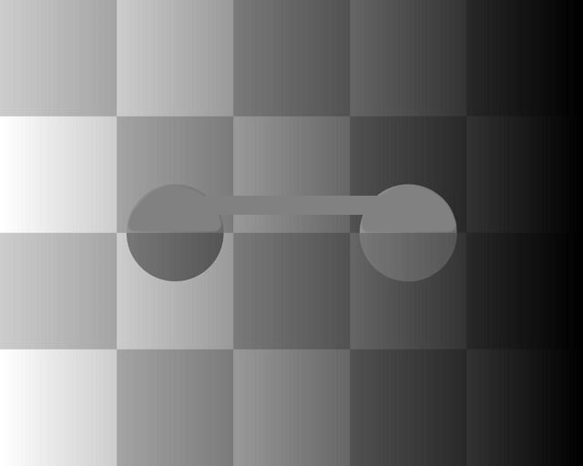

Again, the solid rectangle appears to change color, but in reality it is a single color.  The eye does not see colors exactly as they are, but it interprets the scene taking possible lighting conditions into account.  This is actually quite important because if the eye saw the colors change every time the lighting changed we would not be able to track prey in a forest where the trees are moving in the breeze.  This is clearly an evolutionary advantage, we need only be aware that perception does these tricks.

## 3. Heart Motion

Here is an illusion that tricks the perceptual system when the eye moves, it thinks it sees motion in the image.  Normally when you look at something the eye darts from place to place to pick up details.  Along with that are sensitive elements that detect edges.  The coloration of the lines here fool that edge detection as the eye moves, making it appear that the figure itself is moving.

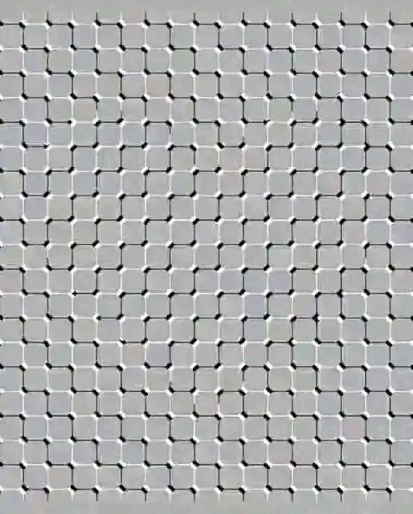

## 4. Radiating Motion

Here is another, where the motion of the eye is fooled by the pattern of colors into making the mind think the image is moving.

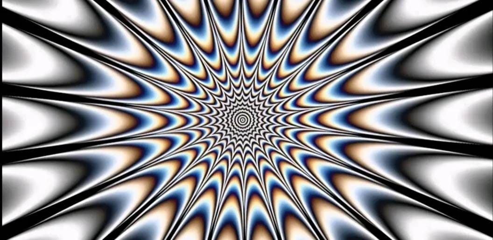

## 5. Shifting Sphere

Another apparent motion image, this one using color.  Blue is somehow pick up and processed differently than the white.  My uneducated guess is that the processing of blue is somehow slower, and this causes the apparent motion when the eye shifts.

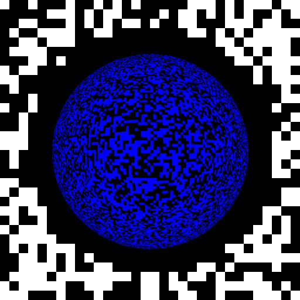

## 6. Divergent Rows

These rows are built with square boxes all the same size, but because of the way the squares are colored, the rows appear to either slant up or down.  I urger you to verify that the lines are all straight horizontal by dragging another window over the image so you can see from end to end the row is the same.

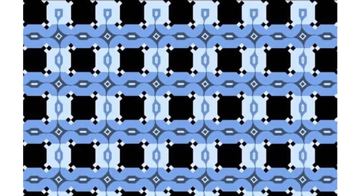

## 7. Apparently Wavy Lines

This illusion consists of an exactly square grid checker board with colorations on the square that trick the eye into thinking that the rows are not straight.  Again, I urge you to drag another window over the rows to assure yourself that each horizontal and vertical line is exactly straight.

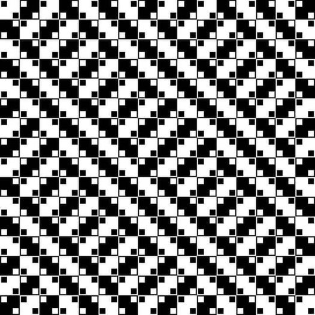

## 8. Apparent Creeping Motion

This one is quite tricky.  It appears to be moving, but when you look to a part in particular you can see that it is not moving.  The motion appears to be where you are not looking.

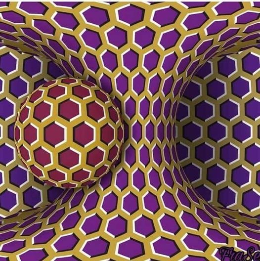

## 9. Four Concentric Circles

This illusion consists of four circles colored in black and white such they tent to fool the eye into thinking that there are spirals.  Curiously, spirals going both direction, but you will see that they never cross.

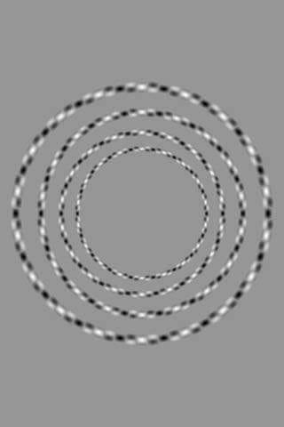

## 10. Apparent Spirals 

Like the last, this diagram is made completely from circles which are colored in such a way that the eye concludes that it is one big spiral shape.

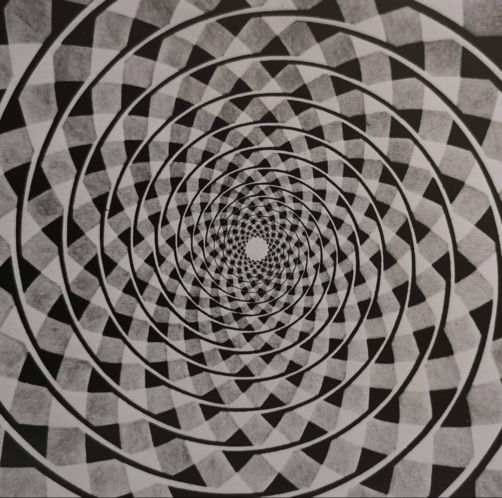

## 11. Moving Dots

These dots are shaded such that eye movements fool the perceptual system into thinking they are moving, but again moving at places you are not looking directly at.

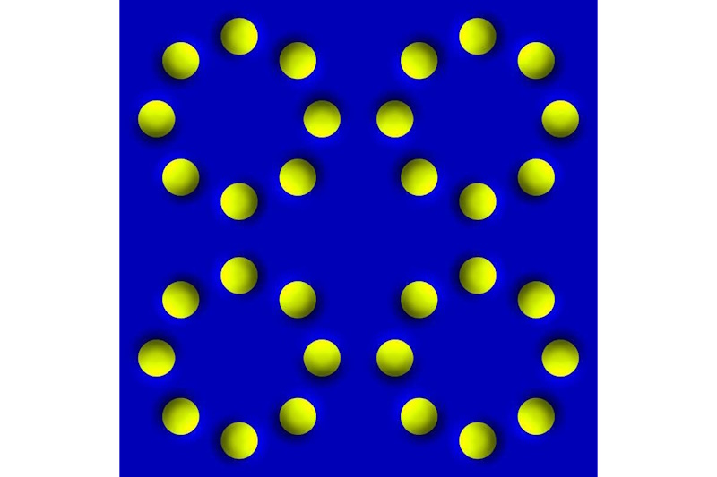

## 12. Circulating Dots

Similar to the last, but a little more elaborate.

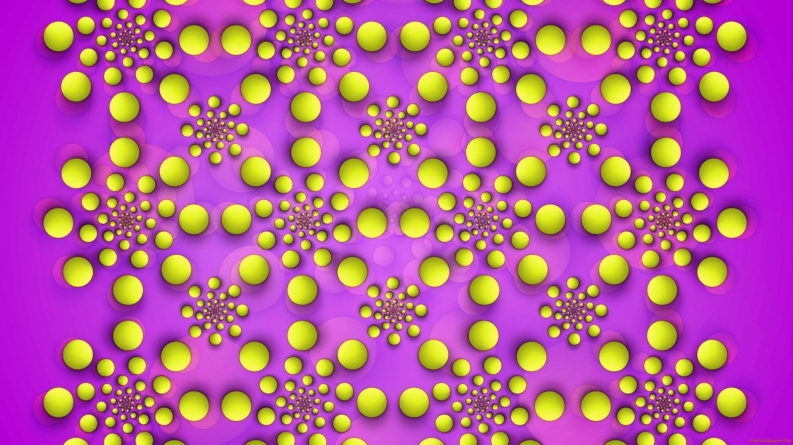

## 13. Same Color Spheres

This is a color illusion.  The balls are all exactly the same color.  There are colored lines red, green and blue, which sometimes cut across the spheres. That appears to make the sphere to be colored between the lines.  But the spheres themselves are all the same color.

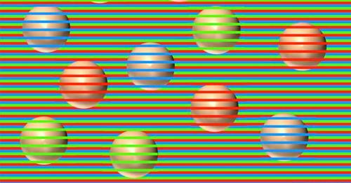

## 14. No Red

There is actually no red color in this image.  Since the entire image is shaded toward blue, the eye assumes there is an overall blue light on the subject, and then interprets white parts as being red as a compensation for the blue.  Zoom in on the image to check this.

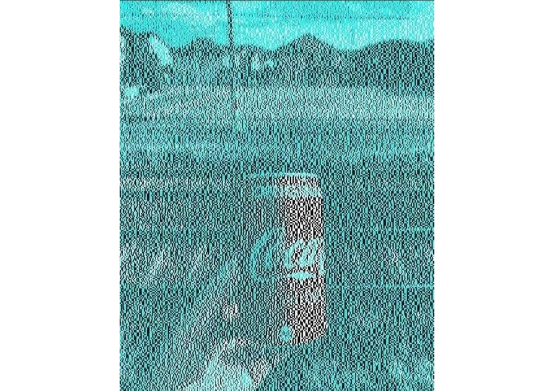

## 15. Spinning Motion

Another apparent motion where the image appears to move at places you are not directly looking at.

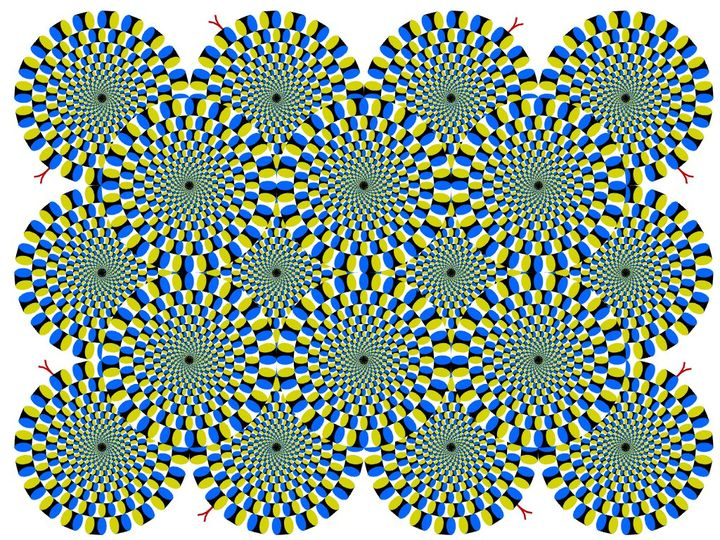

## 16. Missing Dots

This is an interesting one in that you can clearly see each dot individually, and you can even confirm that there are twelve of them, but when you look at one dot, the other seem to disappear.

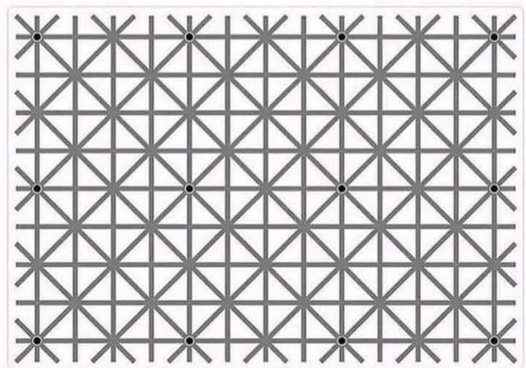

