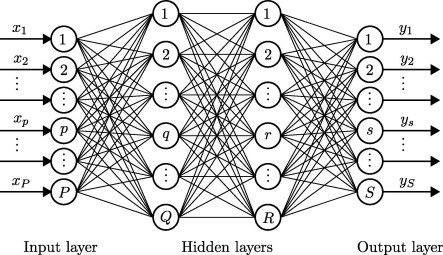
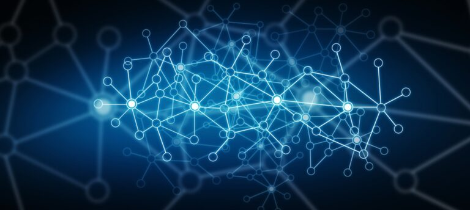
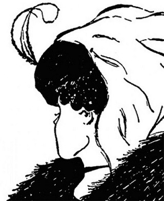

#  Classes and Perceptions

To understand the illusion of universals, we need to understand how the human perceptual system works in order to classify what we see.

## TL;DR

The purpose of the perceptual system is to notice commonalities in the sensory stream that arrives at the brain in order to classify what is being seen. This is what we mean by saying we recognize objects in the world around us. Once classified, the perceptual system passes along a signal representing an object of that class.

Everything in the mind that we can think of has a frame built of neurons.  Thinking of something is literally the activation of that frame.   Frames are connected to other frames.  Frames can activate or inhibit other frames.

When sensory input activates a frame, you experience whatever that frame represents.  You have a frame for the color red.  You also have a frame for an apple.  Seeing a red apple would activate both of these, and you would experience red, and you would experience an apple.

The point is, you don’t just experience the red, you also experience the apple, because your perceptual system recognizes the apple.  This experience of the higher level object leads to the illusion of universals.  The apple is presented to the mind as an apple which appears to have the essence of apple in it.

## Nerves

The ancients were trying to figure out how the world works, and how it is that we recognize and classify things.  They did not have the advantage that we have of information theory or regular practical uses of information technology.  While the hard problem of consciousness remains unsolved, most aspects of the easy problem of how the brain receives and makes sense of sensory data are pretty well known.

Nerves work like a simple rule gate.  The nerve has a set of inputs, and based on the inputs it will pass along a output or not.  Inputs can stimulate or inhibit the output.  Generally, a specific combinations of inputs is needed, and so we can say that the nerve recognizes a particular pattern of input.

Nerves are arranged into a neural network.  It conceptually looks like this:

There are a large number of inputs x, then some number of hidden layers, and finally a set of outputs y.   Specific combinations of inputs will cause certain outputs. This is how pattern recognition works, and an analogous circuit is used in machine learning applications.  The inputs could be a raster image, and the output signals one might be for a cat, one for a dog, on for a monkey, etc.   This is an overly simplified example, but still the right idea.

In reality the brain goes through many levels of this.  In the retina a network like this will recognize colors and edges.   Deeper in the brain a neural network recognizes shapes from the edges.   Then volumes from the shapes.  Eventually, from the volumes, there is a network that recognizes animals, plants, cars, all the things we know.

## Learning

How does the network get programmed in order to recognize these things?  It is trained.  Basically, you see a fruit and don’t know what it is, you can see it is red, and small, and round, and feel that it is hard.   Someone tells you it is an apple, and you remember that:  apples are small, round, red, hard things.

Nerves literally make connection.  The recognizer neural networks are identifying something small, red and round.   Recognizers in the audio circuits hear the word “apple” being spoken which is a short sequence of well known phonemes.  The nerve carrying the spoken apple signal grows and connects to the nerves carrying the small, round, and red signals.

Once the connection is formed, many of the links work both ways.   If I show you an apple, the word “apple” is ready to be spoken.  If I say the word apple to you, the image of an apple appears, and you are expecting to see something small, round and red.

This is how you learn.  in the scenario above, you learned some facts about apples, and if the neural connections become permanent, you will remember that association the rest of your life.  Such connections are re-strengthened every time you encounter a reinforcing situation.  See lots of apples, and you will remember them strongly.   However, if the connection is not reinforced, the nerves can become disconnected, and that is how you forget things.

## Rules

The nerves act like rules:  if you see a largish animal in the middle of a field, with four legs, hooves, horns, and a udder you quickly recognize it as a cow since you have learned these things about cows in general.  Everything you know about someone or something becomes a feature that might be used to recognize them.

Without the advantage of information theory, it was hard to understand what thoughts themselves were.  The ancients had the idea that thoughts were real things that floated from person to person like a ghost.  Evidence for this is seen in Parmenides and Plato below.  Aristotle had a different concept, but it still involved universals.  You have to remember that simple ideas like molecules, chemical energy, and electricity were all completely unknown.  Your tall friend who always wears bow ties become associated with the sensory pattern from being tall and the look of a bow tie. See a tall person with a bow tie, and your first reaction is that it is your friend.  There are more details, and maybe some other detail tells you that it is not your friend.

Nerves fire in parallel.  Whenever a signal comes in indicating a small red fruit, all the nerves for small red round things will fire.  When enough rules have fired to recognize an apple, then you know you are seeing an apple.  The rules for large, four legged, horned features don’t fire, and therefor you don’t think it is a cow.

So the perceptual system works through rules that associate a feature with a class.  By seeing enough features, you recognize the class.  Once recognized, you are reminded of many other features or details one would expect to see on the instances of that class.

## Experience of Seeing

As we look around the room, your visual perception system will automatically detect colors, features, edges, shapes, volume.  It will estimate size of things, and volume.  Based on these features, it will recognize all the things around you that you know: tables, chairs, lamps, wall hangings, windows, curtains, furniture, etc.

Classification simplifies your world.  Once you know how to recognize a class of objects, you no longer need to pay attention to the details.  A dog is complex bundle of fur, color, shapes, and movement.  Once you recognize it as a dog, you now can ignore a lot of details.  You can predict what the dog might do.  You know that it won’t for example fly up to the top of a tree.

This is the point of recognition and classification.  Instead of seeing 10^30 molecules around you, you see 50 to 100 objects.  From those object, you can make predictions about what they might do.  Many are known to sit without moving, posing generally no danger or interest, so you can mostly ignore them.  Some things, like a tiger, you might want to pay close attention to.

The important point is that what you are seeing is recognized, classified objects.  Once recognized, the object appears to take a volume in your perceived world.  You only see one side of an apple, but since apples usually have another side, you presume it has the other side.  In a sense, you are actually “seeing” a distinct completely round apple, even though you can only see one side.  You experience not just the redness, not just the round shape, but you actually experience the **_apple_** as a class of object.  You have direct experience of these higher level things.

## Frames and Thinking

I mentioned earlier that everything you can think is represented as a frame.  I also mentioned that frames are connected to other frames.   An apple is small, round, and red and this is denoted in the brain as the apple frame is connected to the small-object frame, the red frame, and the round-object frame.  It is also connected to a frame representing a kind of sweet flavor, to the verbal sequence of the pronounced “apple”, and to the sequence of letters that form the written word.   Hear the word apple, and that frame is activated, and it will subsequently activate the frames for the sweet taste, and the small round red shape.   Or, smell an apple, and the you will be primed to say the word apple.

Thinking is always this kind of association.  Hear a siren (activate the siren frame), and suddenly you think of an ambulance (activate the ambulance frame) and you wonder if there was an accident (activate the accident frame) and whether anyone was hurt (activate the injured person frame), etc.   Activating and deactivating frames is precisely how we think.  These frames are wired together, and activating one prompts either activation or suppression of another.

Experiencing something is also the activation of a frame.  Important point: seeing an apple activated the apple frame and you experience the apple.   Remembering the apple also activates the apple frame, and in many ways you re-experience the apple again.  There are parts of your mind that can not tell the difference between an apple that is being currently perceived, and an apple that someone just told you about.  The salivary glands can be started by both of these: seeing an apple and being told of an apple, although clearly extra saliva is not needed in the latter case.

The fact that you experience the activation of frames directly makes it feel like you experience higher order objects directly.  The frames actually exist.  Thus any experience of activating a frame can be named.  If you can readily identify a famous actor, then chances are you have a frame dedicated to that actor.  When you see the actor, the frame is activated, and along with it the frame for the phonemes that make the name.   This is how you remember the name of a famous actor when you see them.

We also can have frames for imaginary things.  The character of Harry Potter for instance.  If you know the books, mere mention of the name brings up images of a boy with glasses and a scar on the forehead. That is because frames for those concepts are wired together.  But notice that frames can represent things that do not exist.  We can have frames for unicorns, purple cows, flying saucers, and honest politicians (just kidding) even though these don’t exist.

## Universals

The ancient Greeks did not understand the functioning of neural networks and how features and classes can be detected.  Instead, they really didn’t know how thinking worked.  They thought that thinking was a kind of touching of the real objects, and that dreams were actual visitations of things from elsewhere.

The feeling of looking around the room, and seeing objects directly, recognized clearly for what class they are in, gave the ancients a feeling that they were perceiving some essence about the thing.   Cows had cow essence that made it a cow and not a tree.  Trees had an essence as well.  Look at a couple of cows in the field, and each cow appears to have some essence of cowness that makes it “look like a cow”.   This was assumed to be a universal somehow showing through the material object.

Generally the argument is one from presumption.  “Just by looking at the two cows, you can see they share something in common.”   Of course they do:  your recognition circuits fire for both of them.  But there is nothing “out there” that they have in common.  They have common features, but those are different feature that just look the same.   Both cows have four legs;  they each have their own legs, but in both cases the number of legs is four.  That is not any physical commonality, but that is in fact just a measure that measures the same.

Secondly, there was in the past a strong feeling that anything you can talk about must be real, because a word has to be about something.  So if you have a word, it must be about something real.  Apparently, and surprisingly, fiction was not a big thing in the ancient world.  But we know we can have words for things that do not exist.  The word is mapped to a frame.  The frame can be connected to other frames.  But the thing that the frame is about does not exist.

There is just no evidence that there is anything “in” the cows that they share.   They have a similar shape, and this was caused by the similar DNA when they were growing.  But from visual appearance, it is just the fact that your recognizer circuits measured them to have enough of the same features that they were of the same class.

## Evidence for Perception

You can feel the effects of the perceptual processing for yourself when you look at a vague and somewhat ambiguous picture where something is in the picture but it is hard to see.  The best examples have features of two separate interpretations of the picture.  Do you see a young girl, or an old crone in this picture?

The ambiguous image sometimes looks like a girl turned away from you, and sometimes looks like an old crone looking down.  Make sure you can see both, but then notice how it seems to “flip” from one to the other.  It is not possible to see both at the same time.  Notice that when a particular interpretation clicks in, there seems to suddenly be something there more than black and white ink.  When you see the girl, suddenly there seems to be a complete girl there, and you are sure that there another side to her face that you can not see.  That extra essence when you recognize something is the feeling of the universal:  suddenly it seems clearer.

## Summary

This is just a capability of the perceptual system.  Recognizing an object type (or class) is useful in predicting what it is going to do in the future, and that is good for survival.  Evolutionary psychology would easily argue that this kind of mechanism to recognize and classify things would be a huge advantage for survival.

The capability to recognize things was seen as evidence that there really is something out there that is the universal object.  You access that universal object which is how the concept is made known to you.  I would say we now know better, but many people still argue today that there must be still a universal in order to say things about it.  This belief is particular strong when talking about mathematical abstract objects, like a circle, triangle, and even numbers.  I call it the illusion of universals, and it is a very strong illusion.