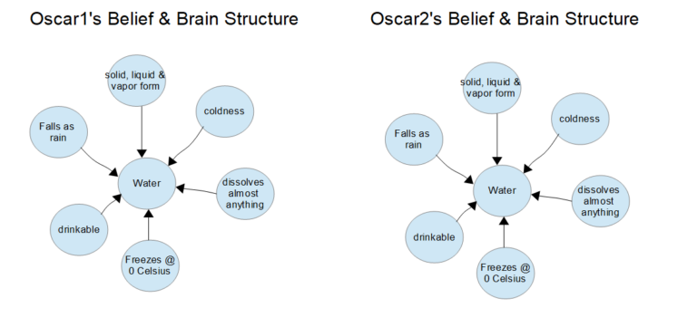
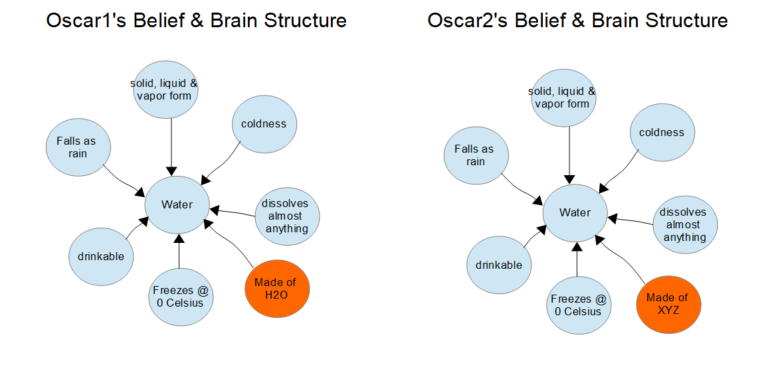
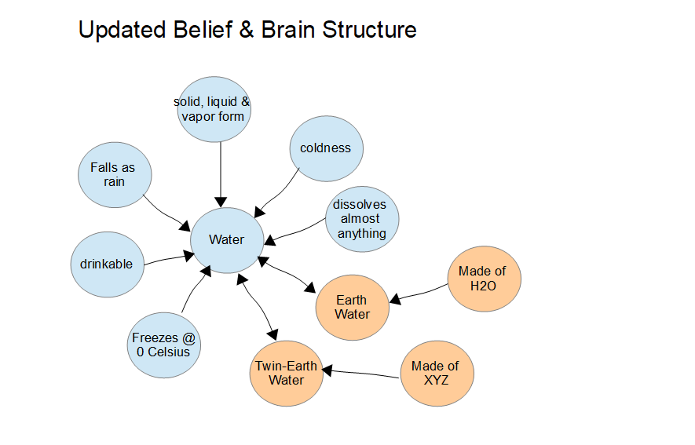
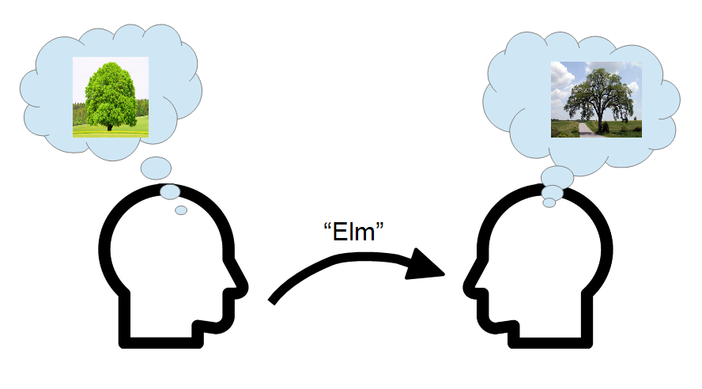

#  Putnam And Meaning

In “Meaning of Meaning” Hilary Putnam puts forth his ideas on meaning, and comes to some odd conclusions which I don’t see standing the test of time. I focus my criticism on the Twin-World thought experiment.  Putnam claims that the characters “mean” things they don’t know.  I don’t find Putnam’s assessment of “meaning” to be legitimate because people can not possibly “mean” something they don’t themselves know.

## Twin Earth Scenario

Brief review of the scenario: There is another world that is exactly like Earth, called Twin-Earth, and they are exactly the same except for one thing: on Earth water is made from H2O while on Twin-Earth water is made from something else, called XYZ. It turns out that H2O and XYZ are exactly the same chemically and in all normal interactions indistinguishable from each other. They are both colorless clear liquids (at room temperature). The streams, rivers, lakes, and oceans are filled with XYZ, and people there can swim and drink it just like H2O.

Let Oscar1 be such a typical Earthian English speaker, and let Oscar2 be his counterpart on Twin Earth.  The two Oscars are twins, identical in every way except one has H2O for water and the other XYZ for water.   The twins have exactly the same brain states in exactly the same situation. One of the twins will say “water” and **mean** H2O, while the other will say “water” and **mean** XYZ. Neither Oscar knows the chemical composition of water, and they are not aware that water is different on the two worlds.

It gets more interesting when Oscar1 (from Earth) travels to visit Twin-Earth, and see the oceans, and drink the XYZ-water, and all this time thinking it is H2O-water.  Both Oscars look at the ocean, say “That’s a lot of water.”  Putnam says that they have different **meanings**, but that is not supported by the evidence.

## You Mean Only What You Know

Putnam says that when Oscar1 says the word “water,” he **means** H2O water.  After all, he grew up on regular Earth and that is what the water is there.  I don’t think that is his **meaning** at all, because in this scenario, he specifically does not know that water (on Earth) is H2O.  That is a detail that is not explicitly part of Oscar1’s mental model, and therefor he can not possibly **mean** that.

To Oscar1, the word water **means**: “clear liquid, cool to touch, wet, no specific taste, it comes down as rain, and fills lakes and streams, and you can swim in it.”  If you press Oscar1 he might be able to continue for some while expressing all the things he knows about water.  When he says the word “water” he **means** what he knows about it.

Oscar2, as it turns out, has exactly the same **meaning**: “clear liquid, cool to touch, wet, no specific taste, it comes down as rain, and fills lakes and streams, and you can swim in it.”

It is quite clear that because Oscar1 and Oscar2 have exactly the same understanding for what water is, that they use the word in exactly the same way and have exactly the same **meanings**.  And they conclude that Earth and Twin-Earth have exactly the same stuff in the oceans: water.

Putnam says the opposite.  He says that Oscar1 **means** H2O style water only, because Oscar1 learned this word on Earth, and therefor **means** what is there.  Putnam says that Oscar1 means H2O even when he does not understand the chemical composition of water.  He says that when Oscar2 says “water” he **means** only XYZ style water.

Neither Oscar can **mean** the chemical composition which they do not know. This can be easily demonstrated with any scenario where someone is mistaken.  Let’s say Joe offers Mark a cup of coffee.  Unknown to Joe, the coffee has been poisoned.  Did Joe **mean** to offer poison to Mark?  Certainly not.  He **meant** to offer coffee, even though reality was not so simple.  Joe can only mean what he knows.

Say Oscar1 (visiting Twin-World) fill a glass from the faucet and offers Oscar2 the filled glass.   Did he **mean** to offer XYZ?  Did he mean to offer H2O?  Neither of those!  He **means** to offer water, and he understand the glass to be filled with water, and more importantly, Oscar2 agrees that it is water.

**The person who uses a word, can only mean what they know.**  They certainly can not in any way **mean** things that they simply do not know.

## No Universal Meaning

In the movie “Crocodile Dundee” there is a point where the hero is confronted by a gang member who says “I have a knife”.   Dundee response, “What?  That’s not a knife.  THIS is a knife.” and pulls out a much bigger one.  The joke is that first knife is so small that it should not even be considered a knife — Dundee’s **meaning** for the word knife only encompasses bigger knives.  People have different **meanings** for words all the time.

There is no universal **meaning** for the word “knife.”   Every speaker could have a slightly different understanding of what a knife is.  To communicate, there has to be some commonality: a knife must be able to cut things, however even that is not certain because obviously a “rubber knife” or a very dull one might not actually work.  There is, however, no universal, official **meaning** of the word knife.  Instead, we all have our own **meanings** for words, and we succeed in communicating when our **meanings** for the words overlap.

> “When I use a word,” Humpty Dumpty said in rather a scornful tone, “it means just what I choose it to mean — neither more nor less.”
> 
> — Lewis Carroll, Alice in Wonderland

When you speak them, words **mean** what you want them to **mean**.  Say  at In-N-Out Burger to ask them to “double the vegetables” which means they will give you extra lettuce and tomatoes.  You used the word “vegetable” to include tomato, even though it is a fruit.  The person at the cash register understands you, and gets the order right (!) , even though you are technically doubling the fruit on the hamburger.  It seems that “vegetable” is used for tomato because people use tomatoes the way that vegetables are normally used.  What people **mean** by a word, is not the technical underpinnings of reality, but instead a more practical and pragmatic **meaning**: _an accounting of their interaction with the subject of the word._

**When a speaker utters a word, the speaker intends a particular meaning to that word.**  The listener unfortunately may get a different **meaning** upon hearing the word.

## Listening and Learning

All words are learned.  We are not born with any **meanings** of words built in.  We have to learn them.  That learning involves speaking with others until someone notices that a sentence makes no sense.  If someone says “I want squirrel on my hamburger.” we strongly suspect that something was misunderstood.  (Because people rarely put rodents on their hamburgers.)

This might be followed by an exchange:

*   “Why do you want that?  What do you mean by squirrel?”
*   “Oh, there is a new kind of ketchup with cumin and tumeric in it.  It has a funny French name, but most people call it squirrel.”
*   “Oh, OK, I learned something today.”

Clearly the speaker **meant** the new fancy sauce and not the rodent.  We can clearly see that there is no universal **meaning** of “squirrel” that the listener can draw upon.   The **meaning** that the listener gets is limited by the listener’s knowledge.  In this case there was a gap – the speaker and listener **meanings** did not overlap.  We don’t always notice these gaps, but when we do, it is a learning opportunity.

**The fact that learning goes on, it evidence that there is no universal meaning to words, and that each person has a potentially unique meaning associated with every word.**

## Brain Structures

Both Oscars have in their heads an understanding of water that is drawn from their experience.   One might diagram it as this:

The real situation will be thousands of times more detailed — this drawing necessarily highly simplified just for demonstration. Water is the ellipse at the center, and it is linked to all the related ellipse. The concept of water is represented in the brain as a set of connections with varying strengths on the connections.  You can think of each ellipse as a neuron connected to other neurons, just remember that in reality a concept might be spread across many neurons.  This is a real spot in the brain that is activated every time you recognize the concept water, whether from a word, or from an experience, or from a memory.

The mind is a set of connections within the brain, and those connections actually form the memory, and that formed memory can be used to recognize things in the real world.  So when visiting a beach, and something cold, wet, liquid touches your feet, you know instantly it is water.  When someone says that water is coming, you know to expect something cold and wet.  This is how we know and understand things.

Both Oscar1 and Oscar2 have had the same experience with water, and so their understanding of water is the same, and they **mean** the same things when they say water.  Oscar1 might point to some H2O and declare that it is water because it fits all the conditions.  He might as well point to XYZ and call that water, and it also fits all the conditions.  When either Oscar says the word “water” they **mean** the exact same thing, and the chemical structure is not relevant.

Putnam says that Oscar1 and Oscar2 **mean** different things when they say the word water, but that is absurd.  Putnam speaks of “brain states” but it is not clear what he understands of the brain, or of a brain state.  It seems to me, that brain state to him is the content of the “inner dialog” at the moment, but this is a very naïve view of how the mind works.  Perhaps our understanding of the mind is just a lot more better today than it was in Putnam’s day.  Or maybe Putnam simply didn’t know a lot about the brain when making this argument.  I can only speculate.  Either way, his conclusion seems absurd.

## Discovering More Details

Back on Twin-Earth:  an chemist appears and explains to both Oscars that water on Earth is H2O while water on Twin-Earth is XYZ.   By doing this, both Oscars learn something new: the molecular structure of water.   _Now they have a different understanding of water._  You can still swim in it, drink it, and watch it fall as rain.  Their interaction with the substance is exactly the same and that is why they think it is the same, and they use the same word for all of these.

Because all of their prior experience with water was around the way they interact with water, the chemical structure does not change this.  Both Oscars would look at the situation and say that there are two kinds of water: H2O and XYZ but they are both still agree on the meaning of the word “water” in every way that make a difference.  You can still drink it, it rains down, and the streams and lakes and oceans are filled with it.

Instead, let’s change the scenario so that both Oscars learned the molecular structure at a young age.   Oscar1 knew from an early age that water is H2O. That is part of his knowledge of water.   Similarly, Oscar2 learned at an early age that water was XYZ.  They actually have different meanings for the word water.  Their brain states might be modeled like this:

As you can see, the models now differ.  Because they have different understandings, then we can say that Oscar1 has a different **meaning** for the word water than Oscar2.  When Oscar2 offers a glass of water to Oscar1, it is now possible for Oscar1 to say “That is not water.  Water is H2O and that is not H20.  I will call it Twin-water which is a different concept from real water.”

**If their understanding of water is different, then I agree that their meaning of the word is different.**  They both say water, but they mean different things, and — this is important — their brain states are different as well.

Since they both learn about the water on the other planet, it is more likely that their understand will expand in this way:

Here you see the concept of water, and some new concepts: Earth-Water and Twin-Earth-Water.  They do, after all, know that the other world has different water, and so the conceptual map has to include the other water in there.  How this actually forms depends on the details of how they interact, however on this understanding it is possible for Oscar2 to say to Oscar1: “Here is a glass of water . . . oh sorry, I mean Twin-Earth water.” (upon realizing that the use of generic water might not be specific enough.)  Or if he is bigoted, he might stay with just “water” and insist that Oscar1 is just “wrong” about what water is.  Many things are possible.

Putnam however goes to great lengths to construct a situation where their brain states are exactly the same, and then claims that their **meanings** are different.   I disagree.  There is never the situation that they have the same brain state with different meanings: **the brain state is a one-to-one mapping to meaning.**

## Summary

Putnam says that even though Oscar1 and Oscar2 have identical experience with water, and they have identical brain structures, they have different **meanings** of the word “water”.  I can not agree.  Just because one had experience with H20 and the other XYZ, they still had an identical experience with water, and because of that, they have identical **meaning** when they say water.  To them, water is water and they agree on this **meaning**, but unknown to them, there are two kinds of water, and that distinction does not affect their **meaning**.

* * *

## Appendix – Did Putnam really say this?

Maybe I misunderstood Putnam?  I put here the statements from this paper that support my interpretation of what he said.  (Don’t read this unless you really want to dig into the meaning of Putnam in a lot of detail.)

At the bottom of page 133 he considers the compound terms “creature with a heart” and “creature with a kidney.”  He points out correctly that these are two different meanings, but that the extent is the same (since every animal with a heart has a kidney and vice versa).    He says “_But they obviously differ in meaning._”

But then he says something bizarre:  “Supposing that there is a sense of “meaning” in which meaning = extension.”  He does this to introduce the term “intension.”  In that paragraph he has already demonstrated sufficiently that our colloquial use of “meaning” matches that of “intension” and not “extension” however he has a point that this ambiguity has harmed all prior discussion of “meaning”.

On page 134 he says “_Most traditional philosophers thought of concepts as something mental._”  Yes of course, the intension maps directly to a structure in the brain.  He says Frege and Carnap rebel against this, claiming that “meanings are public property.”   Considering any misunderstanding scenario, we can easily see that meanings are not public, and there is only overlap in private meanings.

He lays out two assumptions:

I. knowing the meaning of a term is just a matter of being in a certain psychological state.

II. the intension determined the extension

On page 136 he says “_these two assumptions are not jointly satisfied by any notion, let alone any notion of meaning._”  Clearly he must be referring to traditional notions of meaning.  I see no problem satisfying both, but it depends precisely on what he means by “psychological state.”  With a connectionist view of the mind, we clear can map intension to brain structures isomorphically.  And also intension determines the extension in the same way that a database query determines the result set.  So both are easily satisfied based on a proper understanding of (I).

On page 136 he introduces methodological solipsism for the purpose of demonstrating this, however this is a mistake, since methodological solipsism introduces a constraint that itself prevents (I).   He says “_When traditional philosophers talked about psychological states (or mental states), they made an assumption which we may call the assumption_  
_of methodological solipsism._”   We might agree that this assumption is unwarranted, however Putnam never says this.  he simply accepts it as far as I can tell.

Still on page 136, he says “_This assumption is the assumption that no psychological state, properly so called, presupposes the existence of any individual other than the subject to whom that state is ascribed._”    Yes, so this is a bad assumption, no?  Building on bad assumptions brings you to bad conclusions. On pages 137 and 138 he explores the problem with this assumption.

On 139 he clarifies “_Oscar and Elmer understand a word A differently, then they_  
_must be in different psychological states_”  and “_Thus two speakers cannot be in the same psychological state in all respects and understand the term A differently._”  OK, I agree.

This is the key: “_**We claim that it is possible for two speakers to be in exactly the same psychological state (in the narrow sense), even though the extension of the term A in the idiolect of the one is different from the extension of the term A in the idiolect of the other. Extension is not determined by psychological state.**_”

It is the purpose of the Twin-World Scenario to demonstrate this, but it fails to.  He will set up Oscar1 and Oscar2 (he uses different names in the different descriptions, but I substitute the consistent names for this blog post.) to have the same brain state (I agree) but claim they have different meanings (I disagree).  He says Oscar1 only means water on Earth, but that is not at all what one means when talking generically about water.  Oscar1 really means water on ALL planets — he always did.  Extension includes all water everywhere — on all planets.   Oscar1’s extenion is NOT just the water on Earth.  While his understanding only come from Earth, he really did intend to mean all water, even that on Twin-Earth.

On page 139 Putnam asks “_Are meanings in the head? That psychological state does not determine extension will now be shown with the aid of a little science fiction.”  The Twin-Earth Scenario is introduced.  Oscar1 and Oscar2 are unnamed at this point: “He may even suppose that he has a Doppelganger – an identical copy – on Twin Earth, although my stories will not depend on this._”

On page 140 he introduces space travel between the planets: “_If a spaceship from Earth ever visits Twin Earth, then the supposition at first will be that “water” has the same meaning on Earth and on Twin Earth._”   Part of the scenario is that XYZ is indistinguishable from H2O except by very careful chemists. This is where the scenario gets weak.  Non-chemists see and experience something exactly like water. Since the two substances are exactly the same, they are both water, because that is what water means to the non-chemist.

On 140 he quotes an earth chemist saying “_On Twin Earth the word ‘water’ means XYZ._”  This sentence makes sense only to a person (a chemist) familiar with both the molecular structure of H20 and of XYZ.  We are told that is it almost impossible to distinguish H2O from XYZ, and only a chemist could determine this.  So this statement does not reflect the **meaning** that the average person would have.  It is only a meaning that a chemist would have, and he blurs these two different speakers into one, thereby propagating the ambiguity that he is attempting to address.  I will continue to use “chemist” to mean someone with a knowledge of the molecular structure, and everyone else is assumped to be a non-chemist.

This is a strange way of saying it.  The word “water” does not change **meaning** based on location.  It would be clearer to say that the chemists of Twin Earth use the word ‘water’ to mean XYZ.   The difference that those same chemists mean the same whether speaking on Earth or Twin-Earth.  It is the speaker (based on their knowledge) that associates the meaning to the word, and NOT the location that it is being spoken.  I think this should be obvious, but he tries to say that this is a property of dialect.  Of course it is, but only because you have a group of people speaking the same dialect.

We agree that: “meaning” never means “extension.”

At the bottom of page 140: “_On Earth5 the word ‘water’ means H20._”  NO, that is not true at all.   Chemists _from Earth_ might mean this, but they mean this no matter where they are speaking.  The word water **means** whatever the speaker **means** it to **mean**.

Here he says “_The word simply has two different meanings._”  Remember this is true only of chemists, but otherwise I agree: There is one meaning that chemists from Earth use, and another meaning that chemists from Twin-Earth mean.  There is no surprise that different people attach different meanings to the same utterance.  Different intensions specify different extensions without surprise.  Then why make this elaborate scenario?

Then on page 141 he says to roll back time to 1750 when the molecular structure of water was not known.  Now the scenario has no chemists it in (as I have been using the term), and only non-chemists unaware of the molecular structure.  This is the case where Oscar1 and Oscar2 — both non-chemists — have the exact same understanding of water: all the properties which are identical.  He says “_You may suppose that there is no belief that Oscar1 had about water that Oscar2 did not have about water._”

At this setting, for anyone speaking the word “water,”  the extension is to both Earth and Twin-Earth as well as all the other planets in the galaxy.  For some reason Putnam believes that a planet is big enough to bound the extension of a concept.

This from page 141 is key: “_Yet the extension of the term “water” was just as much H20 on Earth in 1750 as in 1950; and the extension of the term “water” was just as much XY2 on Twin Earth in 1750 as in 1950.  Oscar1 and Oscar2 understood the term “water” differently in 1750._”

No, it wasn’t.   Oscar1 spoke of water, and means water on Twin-Earth as much as water on Earth.   Remember, water is on lots of planets and at no time did Oscar1 say he means only the water on Earth.  Oscar1 did NOT mean H2O at all!   The meaning was all the experiences properties of water that was known, and these properties apply equally well to all the water on Earth and on Twin-Earth.   By water, he “means” (in this strange sense of meaning things you don’t know) both H2O and XYZ — even if he does not know about Twin-Earth.  This is of course an abuse of “meaning.”   The main point is that he simply does NOT mean H2O (he can’t because he does not understand it) and he similarly does NOT mean just the kind of water on Earth because there is no reason for him to suppose that water is different anywhere else.

It is quite strange that Putnam somehow feels that by separating these speakers on different planets that this justifies isolating the extents.  As meaning had a size limit, and planets were big enough to limit the extension to one planet.   Putnam never addresses why he thinks a planet is big enough to bound an extension.

He concludes on page 141: “_Thus the extension of the term “water” (and, in fact, its “meaning” in the intuitive preanalytical usage of that term) is not a function of the psychological state of the speaker by itself._”  But he is completely wrong.  The extension includes the types of water on both planets, and both Oscar1 and Oscar2 both have the same meaning, and the same extension.  He has not demonstrated anything except a bizarre belief that extension is bounded by a planet.

Then he discussed how it can be that the word stays the same while the molecular structure of water is discovered?   Well, this argument is based on the assumption that planets bound the extension, so it is flawed from the beginning.  The real mistake is mixing up the chemists with the non-chemists, and the different between them is knowledge.  The chemist knows the molecular structure, and THUS has a different meaning for water.  The meaning for water did not remain the same, and THUS the extension of water does not remain the same either.  For non chemists the meaning has remained the same, because they don’t know about the discovery.

At the top of 142 he finally says: “the necessary and sufficient condition for being water is bearing the relation same to the stuff in the glass; but this is the necessary  
and sufficient condition only if the empirical presupposition is satisfied.”  Here he is mixing up the “meaning of water” with the stuff in the glass.  Oscar says “water” and means everything that matches his meaning.   Pour two glasses, one with H2O and one with XYZ.   Oscar calls both of them water — because remember he can neither tell the difference, nor does he know a difference.  Though the glasses have different chemicals in them, they are still both water according to the meaning of water held by Oscar.

More bizarreness on page 142:  “_Thus, the fact that an English speaker in 1750 might have called XYZ “water,” while he or his successors would not have called XYZ water in 1800 or 1850 does not mean that the “meaning” of “water” changed for the average speaker in the interval._”   I disagree.  If a chemist now understands that water is H2O, then his meaning of water has changed.   Insisting that the meaning of water is the same now that we know the molecular structure feels to me like motivated reasoning: Putnam has already decided that the word never changed meaning, and is trying to defend that, but does so poorly.  The fact that someone does call XYZ water at one point, and then later insists that XYZ is not water is precisely what we mean by saying that the meaning of water has changed.

Page 143 sees the introduction of the argument about aluminum and molybdenum is probably a better scenario, but still: If Oscar thinks the pan is made from aluminum, then he **means** that it is aluminum, even though that **meaning** might be wrong.  Again, he insists “_there may be no difference at all in their psychological state when they use the word “aluminum”; nevertheless we have to say that “aluminum” has the extension aluminum in the idiolect of Oscar1 and the extension molybdenum in the idiolect of Oscar2_.”   Oscar1 simply does not mean aluminum because he does not know it is aluminum, nor does he know that the other is molybdenum.   This is nonsense: they both mean the same thing: a metal pan and their extensions for both of them include BOTH pans.

He seems to insist that an “idiolect” exists in some real fashion which extends Oscar’s meaning to things that he does not know.  I just don’t see meaning working that way.  You can only mean what you know.

Meanings can be wrong.  This is an every day experience that you encounter someone who means something and is wrong.  Putnam might say that this person didn’t **mean** the real **meaning**, as if a real **meaning** existed. He wants to say that the meaning can only be the true meaning — from an idiolect — but there is no such thing.   We only have agreement, and that is partial at best.

Again, on 143 Putnam says “_Also we have to say that Oscar1 and Oscar2 mean different things by “aluminum,” that “aluminum” has a different meaning on Earth than it does on Twin Earth, etc.)_”   No, we don’t have to say this.   Neither Oscar knows the difference, and so any reference to the pan includes BOTH pans in the extension.

On 143: “_Again we see that the psychological state of the speaker does not determine· the extension (or the “meaning,” speaking preanalytically) of the word._”   This is entirely wrong.

143-144 he talks about elm and birch.  It is a good example that shows that our meanings of words are based on knowledge, and not on any official idiolectual meaning.  “_My concept of an elm tree is exactly the same as my concept of a beech tree._”  That is right, the **meanings** of those words are exactly the same for you, but may be different for others.  He then extends this to an unjustified conclusion: “_This shows that the identification of meaning “in the sense of intension” with concept cannot be_  
_correct, by the way._”   No, in fact it shows the opposite, that you intension is precisely the meaning you give to a word when you speak.

At the top of 144 he says “_If someone heroically attempts to maintain that the difference between the extension of “elm” and the extension of “beech” in my idiolect is explained by a difference in my psychological state. . . ._”   He already uses the heart/kidney example to show that meaning is not extension.  We certainly agree that for him elm and beech has the same meaning and extension.  Why would anyone want to show that these have difference extensions?   Especially since extension has no bearing on meaning, it is just bizarre.

We get to the final argument on page 144: “_It is absurd to think his psychological_  
_state is one bit different from mine: yet he **means** beech when he says “elm” and I **mean** elm when I say elm. Cut the pie any way you like, **meanings** just ain’t in the head!_”

This is where we simply need to part ways with Putnam.  The fact that two people disagree on the meaning of a word is precisely why meanings ARE in the head.  This example demonstrates better than anything else that there is no universal meaning to the word “elm.”  One person means one thing, another means another.  One of them is wrong, but only because a majority of people agree to what “elm” means, and those in the minority are labeled “wrong.”   The meaning that a person uses for a word is in fact in their head, as an structure isomorphic with their meanings.  This structure, physically present in the head is the direct representation of the meaning of the word being uttered.

Obviously, because the people associate different things to the word “elm” it is entirely obvious that they have different psychological states.  It is not absurd in the slightest.  In fact, to insist that they have the same state, and yet have different meaning is absurd.  I have no idea what Putnam means by psychological state when he says they are the same.  They are quite obviously different.  I can only assume that Putnam means something very different by the term “psychological state” than I and most people today mean by the term.

I don’t see how Putnam can have any different meaning than I attributed to him.  I am hoping someone can give me some insight that would lead to a different interpretation to any of these statements, but they all seem to amount to the same thing: Putnam was very confused about meaning.  Obviously he is a far greater thinker than I am, however his intuitive arguments simply do not match my intuition.