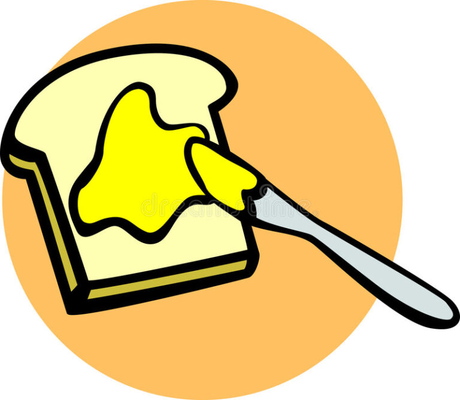

#  Self Will is Determined

Do we have self will, or are all our actions determined?  Physics says it is determined, but it sure feels like I am able to make decisions.  Tough to choose between the two.  You don’t have to!  You can have your cake, and eat it too!

:::note

I originally wrote this post using the term “free will” but I have changed my mind about the term, and to avoid confusion use the term “self will”.    See the note at the bottom about why.

:::

## Definitions

*   **Self Will** – simply a name for a capability to choose one action from alternate courses of action where those choices are determined by our own internal needs and desires, and not imposed by anyone else.
*   **Libertarian Free Will** – the idea that will is completely free of any fact of the universe.
*   **Determinism** – the idea that every event is caused by prior events and conditions together with the laws of nature.
*   **Moral responsibility** – the idea that a particular outcome was primarily caused by actions that one person did based on their internal needs and desires (self will).
*   **Punishment** – a disagreeable action taken against a person in response to an action they took; negative reinforcement of an action.

## Philosophical Self Will

Free will is normally defined as the ability to make choices that have no dependency on anything in the universe. Literally not anything: not your past, not your experience, not your knowledge, not your upbringing, not the people who are around you, not your culture: freedom depends on nothing.  No fact about any existence would constrain your choice in any way. That is how the problem has traditionally been framed. We think we desire this, but in fact most people are very confused about what it means to make a choice that has _no dependency on anything in the universe_.

Instead, we desire _self will_.  That is, our will should be determined by ourselves, by what we have learned, what we desire, and what our culture has taught us.  We don’t want undetermined choices, but instead we want choices determined by _ourselves_.

**Here is a choice:** do you put butter or arsenic on your toast? If your choice is not constrained by any dependency on anything, then (assuming you have equal access to both ingredients) half the time you would choose butter, half the time arsenic. The standard way to make a choice that has no dependency on anything in the universe is to use a random number generator which can choose one option or the other without any dependency on anything in the universe. 

 

A standard pseudo-random number is not good enough, because the number produced depends on the previous number generated, and that number on the one before, and so on. If you really want a choice that is not constrained in any way by anything in the universe, then a quantum random number generator is your only way to get there.

**But wait a minute:** _that is not what I want! I don’t want to make a choice that has no dependency on the rest of the universe!_ I want to make a _good_ choice. I want to make a logical choice. What do we mean when we say a logical choice? It makes sense that I choose to put butter on the toast, and not arsenic. Putting arsenic on the toast would be bad, but why would it be bad? Where do we get the idea that one choice is “good” and one choice is “bad”? From our experience in the universe, of course.

What we actually desire, is to make choices that are the best for us. I choose butter because it tastes good, and I will live longer. My decision is entirely dependent upon the fact that butter is safe to eat, while arsenic is not. My choice is not unconstrained at all!

Consider the very exceptional situation where I am being tortured and I have information that could be very harmful to my family, friends, and country, and I figure the only way to protect them is to sacrifice myself using the arsenic in order to protect my family, friends, and country. Notice that even this calculation is dependent upon the universe: specifically upon **my** desire to protect my friends, family, and country. Again, my choice is not unconstrained.

One friend proposed at one point that self will is simply the possibility that you have other choices to make, does not mean that you actually ever make any of the deviant choices. Remember the chess-playing computer? It has the capability to move any piece on the board, does that mean it has self will?  We watch the program run, and we know that the moves that the computer chooses will be defined by the logic in the software. It chooses to move the knight, but it could have moved the rook. There were no constraints in the universe that prevented it from choosing the rook. That does not satisfy me that the computer has free will.  But the moves are constrained by its own programming, and that is self will.

When I watch other people, I see the same thing. Everyone I know will choose butter over arsenic, and I am 100% confident of that. I see their choices being constrained by the universe in exactly the same way that the chess computer choices are constrained. The fact that they could have chosen arsenic does not mean that their choice was unconstrained by their needs and desires.

## Colloquial Self Will

Colloquially, what do we really mean by self will? Free will is choices that are completely unconstrained by the universe.  Instead we want choices that are completely dependent upon our own concept of what is the right choice for me.  That is **self will**.

There is an interesting twist on the toast scenario: what if I had no knowledge of what arsenic was? What if it came in a fancy jar, and looked like jelly with a pleasant almond smell?  If I was misled into thinking that it was good for me, I might — horrors — choose to put it on my toast. I am at some level OK with this. I don’t want to be ignorant of arsenic, but if I was, I would want my choices to be constrained by _my own knowledge and desires and not anyone else’s._

That is the core of it. Nobody desires the ability to make choices that are completely unconstrained by the universe. What we want, is the ability to make choices based on our own knowledge and desires, and that no other person can force us to make a choice we don’t want. We want to be the sole source of the logic for our choices. Self will means that _no one / nothing else_ decides whether to put butter or arsenic on the toast, but that I decide that. Someone can’t force their will upon me. That is really what we mean by self will: not that my choices are completely unconstrained by the universe, but that my choices are constrained by my own understanding and desires.

When choosing from the menu at a restaurant, I want to choose something that I want. I don’t want to make a choice that has no dependency on anything in the universe. I certainly don’t want someone else making the choice for me. I want to make a choice that is as perfectly in line with my desires as I can.

## Where are my Desires?

In writing this, it became clear to me that this question depends on whether you view yourself as being part of the universe or not. Descartes believed that his consciousness was outside of the universe, and that the material universe was a dead place with no real meaning. For him, stating that choice would be free of anything in the universe still meant that his choices could still be entirely dependent upon his knowledge and desires. Because knowledge and desire was outside the universe.

This is nothing more than a disagreement on what the universe is. It would seem reasonable to ask somewhat whether they believed they were in the universe or not. If the universe is just the stuff outside of themselves then there is a point of agreement: we don’t want our choices constrained by anything outside of ourselves.

## Compatibilism

The choice between determinism and self will is a false dichotomy. Instead, there must be determinism for you to have self will. In order to do what you desire, your actions have to be determined by your desires. Only of of these is possible:

1.  your actions are determined by your desires
2.  your actions are determined by somebody else’s desire
3.  your actions are random, completely undetermined, or determined by forces you are completely unaware of

Clearly option 3 and option 2 are not what we would normally consider self will. Only option 1 — determined by your desires — would we consider to be really doing what you want. For some reason people mistaken think that determined means determined by someone else, and forget all about determined by your own cognitive powers.

It is really the fear of #2 that drives people to insist that nothing is determining their actions. We reject the idea of being ruled by someone else, and in doing so go too far and jump to the idea that there are no rules at all.

## Blame

There is another false dichotomy. Some say: “if your actions are determined, then you can’t be blamed for anything you do.” This usually is followed by some sardonic lunacy about releasing all the murders and rapists from the prisons because they are not at fault. Be afraid.

This is such a strange statement. You can be blamed for your self will actions exactly because your actions are determined by your needs and desires. Even if you decide on a whim that you want to flip a coin, and the result harms someone, you are still blamed because of your desire to flip the coin. If your actions are determined by you, then you are still to blame.

**Are your desires yours?** Recognizing that all action is determined only shifts the burden to whether you can be held accountable for your needs and desires. Imagine the situation where Alex (falsely) convinces Betty that Charles is about to nuke the entire country. So Betty is convinced that Charles is a huge menace, and Betty then kills Charles (saving the country). Is Betty to blame? Or Alex? According to libertarian free will, Betty made the choice independent of anything in the universe. Alex gets off scott-free because Betty is an _independent agent_. I think we all see the problem here. We know that Alex convinced Betty, and that convincing caused Betty to take action. At least a little. The libertarian free will proponents can not answer this conundrum. Any theory of how the mind works will have to account for one person convincing another.

## If Will is Determined, then Why Study the Mind?

Isn’t the mind that thing that transcends the physical world and allows you to inject a moral choice into the world? If your desires determine your actions, and your experience determines your desires, then why is the mind interesting?

Descartes shows us that subjective experience is irrefutable. Subjective experience appears to be exclusive to minds. I can easily imagine animals wandering around, learning what food is good, which competitors are bad, and taking actions to increase food and decrease fights, without needing subjective experience. Yet, consciousness is irrefutable. So why is that? Why does it feel like something to alive? Do thermostats have a subjective experience? Do lizards? Do dogs? Do bats?

Three topics are tied together: self will, consciousness, and subjective experience. We need clear definitions, before we can claim any kind of understanding of them. We study the mind in order to figure out how these are related to what the brain does.

## Predictable Actions can still be Self Will

On Fridays I give my wife a ride to work. It is approximately half way to my office, so I drop her off on the way as close to 8:30 as I can be. So today, I did that as well: dropped her off at 8:30. This act was completely predictable. After all, we have an agreement to do so, and I don’t want to let her down.

Can we agree that this is an act of self will? I consciously decide to do this. It is perfectly predictable, and therefor determined.

Is the fact that it is determined make it any less an act of self will? I am satisfied that it is an act that is determined by MY desires. That is, “I” determine the action. What is “I”???? It is, after all, all _the thing that determines what I do_.

Why would any “determined” act be considered to NOT be self will? That is easy. If the action is determined by someone else. If someone took handcuffs, and locked me to the front gate, preventing me from driving my wife to work, then I would say that was NOT self will. Someone else locked me up, and prevented me from doing what I wanted to do.

Another friend (M) says he has a hard time “reconciling belief in self will and determinism”

My question is: why do we have this concept that self will is about indeterminism? This is this concept that causes all the confusion about self will.

Another friend (W) says that we call it self will when it is complex enough that we can’t figure out what determined it. That seems pretty good. But more: even actions we know are determined can still be called self will.

I would suggest that act is attributed to self will, when the things that determine it are part of me. That is, I want to do it. It is not self will when the things that determine it are not part of me. That is, I didn’t want to do it.  Imagine we define self will as the opposite: an act that is not determined by anything at all.  That would be crazy.

> An act is attributed to self will, when the things that determine it are part of me.

We always have internal reasons for doing things (even if they are bad reasons). Just TRY to do something without having a reason. We might say “I did it for no reason” but that does not mean you have no reason — just none that you are willing to admit to.

## Doing Things for No Reason

Imagine that you really could do things for “no reason”. That would be a nightmare. Because at any moment there are millions of things you might do, and most of them would be really really bad. You could drive off a bridge for no reason. You could simply not stop at a red light for no reason. You could poke a pencil in your eye for no reason. You could swallow that battery acid for no reason. The list is endless.

A person who did things for no reason would surely die very quickly. It is impossible to do things for no reason. Everything you do has a reason. Even if you flip a coin to determine what your next action is, your reason for doing that act is because you decided to flip a coin.

One might then ask: can I make up my own reasons and therefor be completely free of any influence of the world? For example, you just decide that battery acid is good to drink, and that is your reason for doing so. Making up reasons fully unrelated to reality would be equally bad as doing things for no reason. This is insanity. Your reason HAS to be based on reality, and therefor your reasons (your needs and desires) are in fact determined by your prior experience and knowledge. And that is what we want.

It is not just that the indeterminism of the will is an illusion, free will is actually the _opposite_ of what we want. We certainly don’t want our actions to be indeterminate. We absolutely want them to be determined by our own reasons, and not anyone else’s reasons. That is what we mean by self will: my actions are determined by my reasons, and not determined by anyone else’s.

## We do things Unconsciously

Some of our actions do not involve self will. As I sit here, my heart is beating, and my stomach is digesting a slice of cinnamon bread. I have no conscious control over these, and therefor no self will needed.

Self will has to be associated with a choices that are (theoretically) possible. I can choose to swat a fly, or not.  I can not choose to jump to the moon. (I might choose that, but my failure to do so has nothing to do with self will.)  I cannot choose to stop my heart nor my digestion, so clearly those are not related to self will.

It is not that swatting a fly is more complex than a beating heart. Swatting a fly is an act of self will because there was the choice to not swat the fly.

> Self will is simply a name for a capability to choose one action from alternate courses of action where the reasons for choosing one course over others was from our own internal needs and desires, and not imposed by anyone else.

## Self Will is an Illusion

Some people still believe self will is an illusion.  This is usually from very intelligent people who have considered carefully their lives.  We go to work every day: is that determined?  Or self will?   We visit a friend at the local happy hour and drink a beer together.  Is that determined?  Or self will?

All day long, every day, we are trying to make the best choices.  Those choices are constrained by situation of our lives and ways we have learned to react successfully.  When we make a mistake, we try never to do that again.  I think it was Dostoevsky who said that in order to demonstrate that we have free will, you have to do something terrible, like destroy your lover at the height of being in love with them.  Even if you did this, I suspect this would not really be a free act, but instead one determined by your need to prove to yourself you have free will.  You can’t escape it: everything you do that you are not forced to do by someone else, it done because of your needs and desires.

> The illusion is that self will is NOT determined

The only real question is why we believe that self will is about acting without anything determining it.  Do you think it might be the ego?  Is it possible that the ego has such a need to be at the center of all actions, that it simply rejects the idea that anything could be responsible for your actions?  Think about it: the ego is constrained by your needs and desires.  What self-respecting ego is going to accept that?  The ego is . . . egotistic.   It pretends that it is in complete and undiluted control of every choice, however a close consideration of the facts shows this to be an illusion.

## Responsibility

Finally, we get around to the real reason that theists insist that your actions are not determined.  They want to punish you when you do the wrong thing.  You are responsible for your actions. 

Self will agrees with this.  Your needs and desires, your experience with the world, put your mind into a state that caused you to do a particular action.  The fact that your needs and desired determine your actions is exactly _why you need to be punished_.  When a kid does the wrong thing, you punish them so they learn that it was wrong.  You do this because you expect their future behavior to be _determined by_ what they have learned about the world.  Think about it:  if a person had true libertarian free will, then punishing them would make no difference.

No my friend, if you do the crime, you have to do the time, precisely _because_ your actions are determined by your prior experience, by your self will.

The theist is afraid that determinism would somehow let you off the hook.  They are not responsible for what they do.  Strange.  The scary thing about this is that if such a person decided that Eric Dahmer had no choice in killing all his victims then that person would also conclude that there is no reason to punish.  I would say the opposite: if he had no choice in killing then that is exactly why you want him locked up.  This is clearly the sentiment behind the ‘temporary insanity’ plea: you couldn’t help yourself so you are not guilty of what you did.  As if it really didn’t matter what you did, just whether you intended it.  But there is no evidence that anyone else reached in and forced Dahmer to commit the crimes.  If he is unable to control his actions, then even more reason to lock him up.

You are responsible for what you do, because you determined them.  Again, self will is when the things that cause your actions are inside of you.

## Conclusion

I hope I have persuaded you that the problem of self will is simply the way that the original problem is framed.  Free will comes from dualists who see the soul as separate from reality, and independent of it.  However, a more enlightened person sees that our choices are driven by our experiences, expressed as needs and desired, and that this is a good thing.  You experiences are recorded inside of you, but are just as much a part of the world as you are.  Self will is not about being able to make any arbitrary decision with no dependency upon the universe.  Self will is when your actions are completely determined by your own — and nobody else’s — needs and desires.

> “Excellence is never an accident. It is always the result of high intention, sincere effort, and intelligent execution; it represents the wise choice of many alternatives – choice, not chance, determines your destiny.” – Aristotle

## Note on Terminology Change: Self Will

I originally wrote this with the idea that the colloquial use of the term free will was not always libertarian free will.  Colloquially, when court of law asks if someone did something of their own free will, what it means is that they were not coerced;  nobody was holding a gun to their heads.  These uses of the term free will correspond more closely to what I mean by self will than they do libertarian free will.  So I made the case.

But in the subsequent years I came to abhor the term free will for a couple of reasons.  First of course is that most of the formal academic discussion of free will clearly means libertarian free will — that I already knew.  But beyond this, I found that theists who believe in a soul — and that is a large segment of the population in America — believe that the soul is completely free of the universe.  I also found that anyone else who has not thought about it associated free will with the libertarian meaning without thinking through the consequences.  That is: if one could go back to a certain point in time, you could have made a different choice.  In the end, I felt that mostly I was getting the criticism that compatibilists get: you have simply redefined the term to confuse people.

After some discussion, I settled on using the term “self will” because “will” by itself was too hard to use as a part of speech, but mainly because it accurately reflects the idea that it is you who determine your will.  Freedom is about nothing determining the will.  But that is incoherent.  Instead, it is **you** that determines the will, which is not only what I think really happens, but it also is what we desire to be the case.  The noodle has been thrown to the wall and we will see if it sticks.