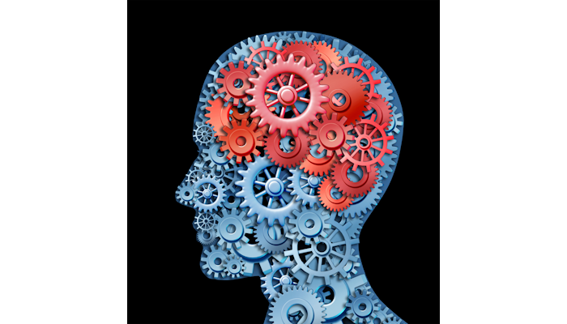
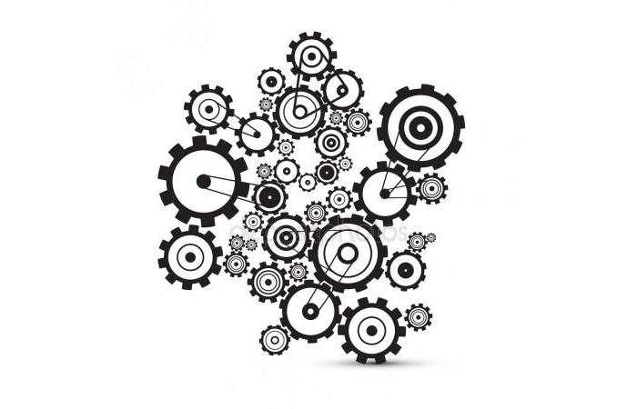

#  You Can’t Feel Your Brain

We all have the impression that choices are completely free, and not determined by anything else, not even needs and desires.  However, this illusion might be simply because we can not feel the brain working, and are completely unaware of how choices are made.

## Brains Don’t Feel

Cutting a brain does not hurt.  There are no pain sensors located in the brain itself.  In one sense, all pain is felt in the brain, but that is not what I mean.  For example, when you stub your toe, pain from sensors outside the brain in the toe send signals to the brain, and the pain is experienced inside the brain.   But, there are no pain sensors in the brain, so, for example, slicing into the brain does not cause any pain sensation.

The brain works, but as it does so we don’t feel it working.  Old comics used to portray the brain working as a jumble of gears and sprockets turning to crank out the thought.   Imagine a chess grand master sitting there working on the next move.   What does that feel like?  Most of what we feel is a _response_ to what has been thought up.  If a good move appears, then we feel elation.   If no good move at all appears, then perhaps we feel despair.   Those are feelings about the situation and about the conclusion of the thinking.  Yet, the question at hand is what does the act of thinking feel like?

[Brains use a tremendous amount of energy](https://www.brainfacts.org/Brain-Anatomy-and-Function/Anatomy/2019/How-Much-Energy-Does-the-Brain-Use-020119) when we are otherwise at rest.  When sitting still, the brain is [metabolizing 80% of the glucose](https://www.scientificamerican.com/article/why-does-the-brain-need-s/) that the body is currently using.  We know this well whenever we are forced to continuously pay attention and become exhausted.  So we can feel that a lot of energy is used, but the actual thinking itself feels effortless until we get very tired.

## Friction Sensors

This idea came from a discussion with Mike O’Neill.  We were talking about free will and how choices just appear to us, apparently just bubbling up from the subconscious without any effort on our part.  But actually the subconscious is working very hard, comparing this situation to many situations in the past, eliminating nonsense responses, and eliminating undesirable choices.  Only the best potential choices make it past the muster but we are entirely unaware of all the work that went into selecting the choice.

Mike texted:  “**There are no friction sensors in the brain.**”

This is an analogy to a machine with gears and cogs working away. If you want to be aware of what is happening inside the engine, you need to have some sensors there.  If one part of the engine is rubbing against another part causing friction you would only know it if there was some kind of way to measure the friction between the components.  Or maybe it could be a heat sensor, or an oil level sensor, or any number of other kinds of things that might tell you how well the engine is performing.   The brain does not have anything like this.   We are not aware of the work that the mind does, only the end product.

It seems like an ability to feel how the brain is working would be a completely unnecessary capability when hunting down food to eat.  Evolution is stingy and nature is a struggle, and getting the brain to work at all is primary.  Feeling how it works is unnecessary, so it clearly has never developed.

## Free Feels Undetermined

Most of the work of the brain is in the subconscious and we are completely unaware of it.  Say you are presented with two choices of ice cream:  Rocky Road or Cherry Garcia.  The mind needs to recognize and understand what those two choices mean first of all.  Then it needs to search the memory for how those might taste or be enjoyed.  This has to be compared with the context at the moment of which might be preferable now.  All of this happens without us feeling like it takes any effort.  In a flash, we respond that _Cherry Garcia_ is the better choice, and choose that.

 

If we actually felt all the cognition that goes into making this choice, then maybe we would have a better appreciation of what it means to be a favorite flavor of ice cream.  You have to search all your memory which includes many things that are not ice cream.  The relevant memories are selected, sorted, and somehow weighted against each other.  If we were actually aware of all this, we might say:  _“I did not simply choose out of thin air, but actually I tasted Cherry Garcia 14 times since 2003 and liked it most the time, while I had Rocky Road only once and did not really enjoy it._”  That is not the way it feels.

It just feels like “_I prefer Cherry Garcia completely independent of anything else._”

Because we don’t feel the act of thinking, because it is mostly subconscious, we really never quite appreciate how much our decisions are dependent upon our needs and desires.  This is where the **illusion of free** **will** comes from.  We feel as if we are making a choice and that choice is not related to anything.  But the fact is that it is related to many things, and the brain worked very hard to sort it all out.  If we felt the brain, we might realize how much of life is mechanically working through the possibilities and isolating the best choice from hundreds of options.  That work is not arbitrary, but instead critical to get right according to hundreds of internal criteria.  Sometimes our survival depends on it.

## Determinism and Free Will

No matter how free our choices appear to be, psychological studies have shown that these choices can be manipulated by priming the brain with certain ideas before asking the question.  These all point to the mind being mostly determined by memory and recent context.

Our colloquial understanding of free will is “doing what we want,” but we constantly underestimate what is required to simply bring a clear assessment of what we want to the conscious parts of the brain.  Other studies have shown that our conscious recognition of having made a choice actually occurs some fraction of a second after other parts of the brain have already made the decision.

This does not diminish our role in making the decision.  It is after all my own brain that chooses between the two flavors of ice cream.  No matter how the brain accomplishes this, nor how much effort is involved, it still remains my choice and nobody else’s.  But the illusion that this could be an arbitrary decision independent of anything else, is an illusion that comes because we are largely unaware of what the mind actually did to make the choice.  Free will as a completely unconstrained act might be an illusion, but our ability to control our own behavior remains in tact and is what we really wanted for free will in any case.

## Further

Mike has done some interesting work on free will and determinism.  He has written a guest post on this blog named “[A Tale of Two Riddles](https://meta.purplehillsbooks.com/2020/11/01/a-tale-of-two-riddles/)” about a different kind of mind trick that prevents us from holding the idea of determinism and free will in the mind at the same time.  The human brain brings the wrong assumptions to bear, making it hard to see reality.  Check it out.  He is working on a new book on free will, and maybe we can feature that here some day.

## Questions and Answers

> define subconscious thoughts?
> Define Conscious thoughts?
> And how they are practically produced in the universe?

Thoughts are networks of activated neurons.  They are physical processes that run in the brain.  Your memories are connections between the neurons and that is how thoughts are based on things you have learned.

As you walk, you are controlling dozens of muscles in precise sequences.  There are parts of the brain that run processes (indistinguishable from "thoughts") that actually run the muscles, but you don't notice them.  Subconscious thoughts are thoughts you don't notice.  They were not always this way: there was a time when walking was a challenge and required concentration.  It was a very conscious thing.  But once we learned it, we push those thoughts into the subconscious.

You can actually see this when you are walking along and suddenly about to step in a puddle.  You might have been walking for 5 minutes with absolutely no awareness that you were deciding where to place each foot.  During normal walking this decision is made subconsciously.  But when a puddle appears in the wrong place, these thoughts will suddenly jump into conscious, and you will try to (consciously) step in a different place to avoid getting wet.  The fact that this suddenly became a conscious concern shows that some part of you really was watching _every_ step you placed.  If some part of you had not been watching and thinking about foot placement, you would never have noticed the puddle.

Subconscious thoughts are just like regular thoughts, but we are unaware of them.

> Decision making was the only definition of will that makes sense to me. But if it is not accessible to me consciously then it can not be free, at least not for me.

I understand you to say that only decisions that you are conscious of are your decisions.
Have you considered that "you" might be bigger than you think. For example, walk down the street. When you get to the end, do you remember deciding where to place every footstep? For most of the time while walking, we have no conscious awareness of deciding where to place the foot -- but you actually do that.

Evidence for this can be seen when a puddle appears ahead of you. Suddenly foot placement become a very conscious action to avoid getting wet. But in fact, there was a part of you that was "automatically" figuring out where to step automatically when it was not too hard to figure out.

Your subconscious is not really different from your conscious, except that your conscious top level does not need to be interrupted for it. This is a feature of the brain: things that can be automated are pushed down into the subconscious. This allows you to focus on longer range goals.
What i am arguing is that it is still "YOU" making those subconscious decisions, even when not "accessible" in the normal sense. Make sense?

We train ourselves this way all the time. Play tennis? You practice the serve until it is "automatic". But it is still "YOU" that is doing the serve, even if you have automated it.

