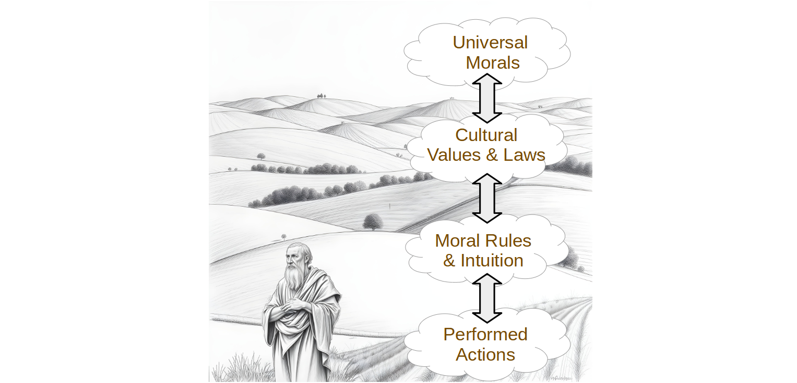

# Terms of Discussion

We start with some definitions of terms, none of which are intended to be controversial, but but just saying that in this work I will use these terms in this way.

**good/right** - Good has many meanings.  Actions, qualities, or principles are morally good when they are considered right, virtuous, benevolent, and beneficial.  Doing the right thing, is to act morally good.  Such as being kind to people is morally good.  Instead of saying something is physically good for you, we can use the term beneficial.  So that there is no confusion, if something feels good, we will call it pleasurable.  If something tastes good, we will call it delectable.  Instead of saying that the student picked the right answer, we will use the term correct answer.

**bad/evil/wrong** - We will use these words interchangeably to mean simply morally bad, the opposite of morally good.  The word 'evil' will not necessarily used to mean profoundly bad, but just the action is not morally good.  Instead of saying that the student picked the wrong answer, we will use the term incorrect answer.  If I use the term 'sin' it will mean the same as bad or evil.  

**good life** - means a morally good life, a life where the actions you make are morally good, but at the same time quite possibly be beneficial for you and your tribe.  The good life is a life where you make all the best decisions along the way so that you always maintain what Aristotle calls the golden mean where you neither sacrifice too much, nor do you squander too much.  A life with neither excess nor deficiency.  

## Morality vs. Ethics

Morality and ethics are guidelines for finding the good life.  I won't be giving you any specific guidelines, but instead discussing how these guidelines have come about and the reason why we should be able to trust them.  There is a subtle difference between these terms:

**Morality** - Refers to personal beliefs about right and wrong, often shaped by cultural, religious, or personal values. It's more subjective and can vary greatly between individuals and societies.

**Ethics** - Refers to systematic rules or principles governing conduct, often established by professional organizations, institutions, or societies. Ethics are more objective and provide a framework for making decisions in various contexts.

Both of these terms are about living the good life.  Both of them define what you should do.  I will tend to use them *interchangeably* since the basis for morality and ethics are the same: guidelines to the right way to act.

## Basic Terms

**Morality (& Ethics)** - is concerned with distinguishing what is right from what is wrong; good from evil; sin from virtue.  In all cases we are talking about *conduct* which is actions that and agent does.  Here are some definitions from dictionaries:  

*   a doctrine or system of moral conduct
*   conformity to ideals of right human conduct
*   The quality of being in accord with standards of right or good conduct
*   A system or collection of ideas of right and wrong conduct

**Actions** - are things a person might decide to perform.  An action can be measured by morality.  Morality, simply put, is a way to distinguish good actions (those which you should do) from bad actions (those which you should not do).  It is a way of measuring the goodness of an action.

The morality of an action depends not only on the act itself, but also the context as well as who is involved.  Starting a fire in a campsite fireplace is probably a good action, starting a fire in a crowded airplane definitely a bad action.   The entire situation must be measured and compared with other acts that could be performed in that situation.

**Agent** - is the person deciding to do the action.  I will use this interchangeably with person, but they are not always equivalent.

**Tribe** - I will use this term for any group of individuals trying to work together.  Today tribe can mean many things: your community, your city, your school, your family, your nation, etc.  To keep from having to spell these different grouping in every occasion, tribe will be used to mean a collection of people working together at any scale.

**Subjective** - is about things defined within the mind in relation to perceptions which might be unique to each individual subject:

*   characteristic of or belonging to reality as perceived rather than as independent of mind
*   relating to or being experience or knowledge as conditioned by personal mental characteristics or states
*   peculiar to a particular individual
*   arising out of or identified by means of one’s perception of one’s own states and processes
*   Not caused by external stimuli.
*   Dependent on or taking place in a person’s mind rather than the external world.

We will spend a lot of time exploring what it means for morals to be subjective but it is clear that anything that is subjective is something that is unique to that person and possibly only knowable by that person.  Your feelings are subjective because nobody else can feel them.

**Objective** - is about things that are outside of an individual mind, and can be observed by any number of people the same way:

*   expressing or dealing with facts or conditions as perceived without distortion by personal feelings, prejudices, or interpretations
*   having reality independent of the mind
*   involving or deriving from sense perception or experience with actual objects, conditions, or phenomena
*   not influenced by personal feelings, interpretations, or prejudice; based on facts; unbiased
*   intent upon or dealing with things external to the mind rather than with thoughts or feelings

## Context and Locality

When considering whether an action is moral or not, we must consider the context.  Breaking glass is normally a bad thing to do, but if there is a fire then breaking the glass to get to a fire alarm is considered a good thing.

Notice that there is a built in assumption that the morality of an action can be judged by the immediate local circumstances: usually a physical area of a few meters, a time duration of less than an hour, and a participant dimension of only one or two people.  

Cheating on a test involves the person taking the test at the time and location that the test is given.  We assume that a passenger getting on a flight in Hong Kong, or a hunter in the middle of Alaska will have no relevance to this decision.  We normally also assume that it has nothing to do with the student sitting next to the cheater.  Thus normally morals actions are judged only by circumstances in their locality, and we can ignore the other 8 billion people on the planet.

Of course there could be occasions where things far and wide actually are relevant.  We might call those *extenuating circumstances*.  Circumstances matter, so morality must take that into account.  The "thou shall not kill" needs to include details like "except if in self defense" or "except if it is an insane sniper in a tower" and a host of other exceptions.

## Layers and Scope

To be able to talk about morals clearly, we need to distinguish between the multiple layers and scope of morals.  Much of the confusion in discussions of morality often have to do with 

 

**Universal Morals** - This is the ultimate valuation of whether a specific action was actually good or bad.  These are objective, however people might disagree on what is and is not universally moral because of differing understanding.  These apply universally across space and time however they might be different at different places and times.  They are extremely complex in order to account for all the possible extenuating circumstances.

**Cultural Values & Laws** - Cultures will embody statements about what is and is not good, usually expressed as a rule to follow.  Some of these are formally written and adopted as laws.  Moral rules and laws are different degrees of the same thing: they both encourage (or enforce) behavior which is considered to be good.  Some cultural values are less explicit, and appear only as guidelines or simply a shared idea among the participants of the culture.  Laws exist from local, to community, to city, to state, to country, and somethings the whole world.  Laws will occasionally conflict with each other.  Because these are rules, they only approximate the real moral valence.  The term **ethics** generally plays at this level.

**Personal Code of Conduct** - A set of rules that an individual claims or aspires to live by.  These are largely adopted from the culture, but an individual does not always agree with their culture, especially when they find themselves in a multi-cultural situation where the individual might have to chose between two conflicting rules.  These must be expressed as rules.  It would be the set of rules that an individual would claim to follow if they could.  That set is limited to what a person can remember and internalize.  The term **morals** generally plays at this level, when we talk about an individual having good morals or bad morals.  Notice that comparing morals at this level implies some higher level morality to compare various morals.

**Performed Actions** - What an individual actually does. People follow their own rules most of the time, but sometimes it is too much trouble and shortcuts are taken. The actions are the true measure of what an individuals thinks is good or bad, and they are somewhat more pragmatic than the explicitly stated rules. 

There is a tension between the bottom two as people try to put their own morals into action.  Most people have an internalized code of conduct.  They may have an intuitive understanding of right and wrong that transcends the rules they claim to follow.  That is, there might be an explicit rule to turn someone in for a crime, however one might allow someone to get away because for some reason they did not deserve it.  There may not be an explicit rule to cover the situation, however rules conflict in their detail, and one must use judgement in selecting which rules apply to which situation.  

There is a tension between the personal code of conduct and the cultural values and laws.  Most laws represent the morals of a culture in a written form. But in the case of an unjust law, it can be moral to show civil disobedience when the law can be shown to contradict other recognized moral rules.  Your personal code of conduct may override the laws or cultural norms.

Sometimes a minority group embedded in a larger culture may be faced with conflicting rules they need to choose between.  In this case the individual has to choose which cultural rules to follow, and which rules to breach.  Again, the personal morals must guide that decision.

Finally it is also possible there is a tension between the top two.  A culture may adopt practices it views as moral but in fact turn out to be immoral.  Two examples: bloodletting and slavery.

## A Rule is Approximate

We will talk about morals as being the rules we live by, but remember that rules themselves are only approximate expressions of the real moral.  A couple reasons for this:

**Brevity**: a rule can be stated in a brief sentence: "don't break windows".  For most windows you encounter -- probably more than 99.99% of them -- if you follow this rule you will be safe.  But occasionally there are situations that are exceptions.  If there is a fire, and someone is trapped inside, it is OK to break the window to save them.  We put glass in front of fire alarms for the same reason: if there really is a fire then breaking the window is preferable to letting the fire burn down the house.  

**Classification**: Rules talk about a set of actions which are categorized in a certain way.  For example:

* Using a knife to slice meat 
* Using a knife to slice a person 
* Using a knife to remove a ruptured appendix from a person 

The first is a good action normally part of preparing food.  The second adds context to describe an attack which is bad.  The third adds more context to refine the situation into surgery which might be life saving and good.  

To recognize an action, we need to "slice it out" of reality: that is we select a set of facts that we believe relevant to the situation, and then we classify according to those facts.  From whatever is happening, we need to classify the action into some identified form which can then be subject to rules.  The classification of actions is culture dependent.  The same actual occurrence might be classified several different ways, by different people, using differing levels of detail.

**Scope**: It is generally the case that the action can be defined by the immediate surroundings at the time, but in some cases situations quite far away or removed in time might have relevance.  An act that is permissible in private, might be illegal in public.  An act performed in one city or state might be legal while the same act in a different state is illegal.  It is possible that an occurrence on the other side of the world has bearing.  Considering the entire state of the entire universe is not possible nor reasonable, so some judgement needs to be used to assure that enough scope is included to decide the morality of an action.

**Exceptions**: To keep the rules brief, there is an understanding that for every rule there are a number of exceptions which counteract the regular rule.  In an emergency, a lot of things become permissible, but then what exactly is an emergency?   What are all the exceptional situations for breaking a window?  In a perfect moral system it might be that every rule would be complete and would stand alone and unambiguous, but those rules would be incredibly detailed, impossible to learn, impossible to recite, and not usable on a daily basis.

The conclusion is that when we talk about morals, we need to express them in terms of rules or laws which are by their very nature approximate, and can not possibly describe accurately what is and is not moral.  They work more like 99% of the time, with the remaining 1% unspecified.

