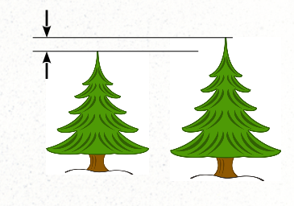
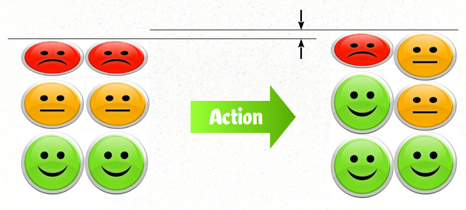

#  A Foundation for Objective Morality

This is a defense of the idea that morality which guides what we should and should not do, can be based on objective measurements of well-being.  A subjective standard for morality does not work as well.

## Definitions

**Morality** is concerned with distinguishing what is right from what is wrong; good from evil;  sin from virtue. Here are some definitions from dictionaries:  

*   a doctrine or system of moral conduct
*   conformity to ideals of right human conduct
*   The quality of being in accord with standards of right or good conduct
*   A system or collection of ideas of right and wrong conduct

**Actions** are measured by morality.  Morality, simply put, is a way to distinguish good actions (those which you should do) from bad actions (those which you should not do).  It is a way of measuring the goodness of an action.

The morality of an action depends not only on the act itself, but also the context as well as who is involved.  Starting a fire in a campsite fireplace is probably a good action, starting a fire in a crowded airplane definitely a bad action.   The entire situation must be measured and compared with other acts that could be performed in that situation.

**Subjective** is about things defined within the mind in relation to perceptions which might be unique to each individual subject:

*   characteristic of or belonging to reality as perceived rather than as independent of mind
*   relating to or being experience or knowledge as conditioned by personal mental characteristics or states
*   peculiar to a particular individual
*   arising out of or identified by means of one’s perception of one’s own states and processes
*   Not caused by external stimuli.
*   Dependent on or taking place in a person’s mind rather than the external world.

**Objective** is about things that are outside of an individual mind, and can be observed by any number of people the same way:

*   expressing or dealing with facts or conditions as perceived without distortion by personal feelings, prejudices, or interpretations
*   having reality independent of the mind
*   involving or deriving from sense perception or experience with actual objects, conditions, or phenomena
*   not influenced by personal feelings, interpretations, or prejudice; based on facts; unbiased
*   intent upon or dealing with things external to the mind rather than with thoughts or feelings

## Objective and Subjective Measurements

An example of a subjective decision is: “Which ice cream tastes better?”  The experience of the taste of ice create is entirely subjective.  So, you might say Rocky Road is the best, while I say Cherry Garcia is the best.  Even though we disagree, I can’t say you are wrong, because it is a subjective measure.  You experience is completely separate from my experience.

*   A subjective measure depends upon the person (the subject) doing the measuring.
*   Two different people will get two different measurements for the same thing.

An objective measurement is like measuring to see which of two trees is taller.  If measured carefully, it does not matter who does the measuring.  There really is an actual difference in the height of the trees, and that that difference has a specific value.

*   An objective measure is independent of who measured it
*   All people will get the same measure (approximately)

Like all objective real world measurements, there are a couple of things you need to keep in mind:

*   No measurement is _infinite precision_.  That means in any measurement there is a certain amount of _uncertainty_.  The two trees might be so close in height that your method is not sensitive enough to measure a clear difference.  If the difference is smaller than the uncertainty then you have to call them the same height.
*   It might be difficult or very costly to measure the trees.  Simply because you can’t afford to make the measurement does not turn it into a subjective measurement, it is just a difficult objective measurement.
*   Because of uncertainty, two people may get different results, but unlike the flavor of ice cream, both results can not both be right.  At least one of them is wrong, because objective measurements do not depend on who measured them.

Like any objective measurement, if the values are very close, and you may not be able to exactly tell which is taller because of uncertainty.  Yet if the difference is significant, then everyone will always agree because objective measurements do not depend on who measured them.

## A morally good action is one that increases the general well-being of the population.

In a nutshell, that is how morality can be defined in a purely objective way.  Good actions (actions that should be done) increase the general well-being of the population.  Bad actions decrease the well-being of the population.  Morality is a way to distinguish good actions from bad — and better actions from worse actions.

The well being of a population, though it is hard to measure, is an objective measurement.  You poll everyone in a population and ask them how they are feeling, and add it all up.  That is quite an expensive way to do it, but there are cheaper, more effective ways to get an approximate value of the well-being of a population.

This style of moral foundation is known as Utilitarianism or Consequentialism which was proposed by a number of famous people during the enlightenment, most famously Jeremy Bentham and John Stuart Mill.  Each action is measured by the consequence of how it effects the entire population.

## How to Measure Well-Being?

It seems complicated, but actually is not that hard.  There are some obvious starting points:

*   Life > death — count the number of living people, and generally more living (fewer deaths) is better
*   no pain > pain — ask people how much pain they have.
*   happy > unhappy — ask people how happy they are.

Pain is a subjective experience, and so is happiness, however this does not make the measurement subjective.  You can objectively measure how much pain there is.  This is done all the time with pain medication and we can be quite precise on measuring how much pain relief a given dose provides.  If you add up all the values across the population, it is an objective measure of well-being because it does not matter who does the measuring.

Of course, one has to determine how various things are valued, and what the tradeoffs are.  For example, are 10 right arms worth one life, or worth two eyes.  How much are functioning ears worth, or the ability to walk?  Such relative values can and are used.

It is true that a culture needs to agree on what the goals of well-being are.   Everyone reasonably safe, reasonably healthy, reasonably happy, and live for a reasonably long time.  Measured equally across the population and you have a fair system, but more importantly, you have an objective way to measure the morality of all actions which does not depend on who does the measuring.   Even if these relative values are completely arbitrary, it does not make the measurement subjective:  two cultures with differing relative values simply have two different system of objective morality.  It is objective because it does not depend upon the person doing the measuring.

## Actions in the past, guidelines for the future

A specific action can be retrospectively measured for the effect it has, but how do we decide what to do in the future?  What we need are guidelines that help us to identify what actions we should take in the future.   So we identify **types of actions**, or classes of actions, and I will call them here “guidelines.”  When we talk about doing “something” in the future, that something is a type of action.  These guidelines tell up which sort of action is likely to be good in a situation, and which is likely to be bad.

We set rules about what should and should not be done. For example breaking a window is almost always a bad action and almost always makes us worse off.  So we make a guideline “don’t break glass” which helps when we are trying to decide what to do.  For each rule, we can ask “is this rule moral?”  It is considered moral if it guides you to actions that increase general well-being.  At the end of it all, you are judged not for the guideline, but for that actual action that results.  For example, if there is a fire, and you have to break a window in order to get someone out of building, then breaking the glass is a good thing.  In any situation you have to weigh many guidelines to decide what to do, but after the action is performed, there is a consequence, and the morality of the action is measured by the change in general well-being attributed to that action.  Different people might come up with different rules, but the morality of those actions is still measured objectively.

We have laws that tells what should and should not be done.  Laws generally enforce moral behavior.  Again, we can ask whether a law is moral or not, and that is when the behavior that results from a law increases general well-being of the population.

## How are Guidelines Determined?

This is done in essentially the same way that evolution works: thousands of experiments being done all at the same time, and the results are shared.  We can look at a single culture over time, and decision they make, and how those decisions effect their general well-being over time.

For example, in the 1920s America got the idea that banning alcohol was the right thing to do. What happened was that the public was objectively worse off.  So the ban was repealed, and consequently well being improved.   This is how we know that banning alcohol is morally bad thing to do.  We try different things over time, and then see the result.

It is very much like the way we determine that drugs are effective or not.  After they are determined to be safe, then they are tried out.  Over time we learn, scientifically, which drugs are useful for which purposes, even though different people can have very differing experiences with it.

We can also look at two relatively similar lands which have different laws, and compare the effect.  For example the people in North Korea are very similar to the people in South Korea and they have a similar history and culture.  We also can measure that the people in South Korea are significantly better off, than North Korea.  That tells us that the actions of the North Korea government is at some level morally bad compared to those of South Korea.  Of course you have to compare over time, and isolate the causes of the differences.  Just because a country is rich does not means its laws are morally good, because there can be many other factors for that.  But in general, over time, the countries that are improving in well-being are the ones that have rules and laws that are more moral.

It is worth noting that countries all around the world generally end up “discovering” that the same things are moral.  Peace is favored over war.  Murder, laying, and stealing are made illegal and punished. Elimination of starving poor is a good thing.  General healthy practices improves the lives of all.  So many of the ancient practices, now considered superstitions, have been eliminated.  We no longer perform bloodletting.  Eye-for-an-eye style justice is considered bad.  Hands are not chopped off for stealing.  Yes, there still are some backward countries, but we can be confident that either they will find the moral actions that maintain their

## Guidelines Change over Time

While I have presented an objective measure for morality, it is not fixed or static.  The actions that increase general well-being will change over time depending on the any number of things.

One of the biggest causes of change is technology advancement.  Some things are possible now that were not possible 2000 years ago, and so out assessment of their morality has changed.  For instance, cutting open a person’s chest cavity was certain death 2000 years ago, however open heart surgery is perfectly moral thing to do today.  Today it is considered bad (immoral) to shop for groceries without a virus mask, but that was not the case 6 months ago.  Consequentialism allows the rules and guidelines for action to change in whatever way needed to allow the population to continue to increase general well-being.

## Problem of Subjective Morality

The chief problem with subjective morality is that the goodness of an action is measured differently by different people and actually is different values.  In a system of objective morality, people may disagree, but that is only because it is difficult to measure and there is some uncertainty, but ultimately there is a correct value, and at least one of them is wrong.  But in a system of subjective morality, what is and isn’t moral depends on the person measuring.   It is not that think different measured values, but in fact they ARE different values.

In a system of subjective morality, the goodness of an action simply depends on whether you think it is good or not.  You can argue with another person about the morality, but there is ultimately no way to determine who is right and who is wrong.  Subjective morality is at the very core just the opinion of the perceiver.

More insidious is the idea that if a leader is charismatic enough, they might convince the public that anything is moral or immoral.  All they need to do is to sway the majority opinions, and once that group agrees, then for them it is moral.  There is no need to check further.

A system of objective morals solves this problem: a despot might convince people that a bad action is good, but over time, the effect can be measured by anyone in the population, and  the consequences of that law or an action tells whether it is or is not moral.

## Divine Command

Christians and other faiths believe they escape the problem of subjective morals by claiming that the guidelines to follow are commanded by an omniscient being.  This way it is not just the opinion of the person measuring, but instead there is a single special opinion that is better than all the rest.  Different people might think that an action is good or bad, but God is the one who really knows whether it is good or bad, and commands it to be so.

The problem with this should be fairly obvious:  if God did command it, and it is important to know that, then there would have to be a way to tell, unambiguously exactly what God commanded.  The bible says that eating pork is a sin.  Some think it is.  Some think that Jesus changed that command so it is not.   There are thousands of different interpretations of the various rules in the bible.  Nobody is exactly sure what the real rules are.  Most Christians say that you have to go talk to a theological scholar to determine what the bible really means, but the scholars don’t have a unified opinion either.  If morality is defined by God, then morality hinges on the command of God being accurately conveyed to every single person.  If that was the case, we would surely see all people agreeing on what is and is not moral.  We don’t see this in the world today.

It is far more likely that leaders along the way have injected their own sense of morality, and told other people it was from God.  A charismatic leader will be able to convince people that their own favorite actions are moral and commanded by God, because there is absolutely no unambiguous way to challenge such a claim.  Divine command without proof of authenticity is an opening for despots to manipulate the public.

The reality is that Christian morality is just as subjective as any subjective morality system.  When asked whether wearing mixed fabrics is moral or not, most Christians fall back on how they feel about it.  They follow the commandments from the Bible that make sense to them, and they ignore the ones that do not make sense.  Except for a relatively small number of clear cases, Christians think something is moral simply because they think it is moral.

## Evolution

Consequentialism says that good actions increase generally well-being.  Nature judges well-being in a particularly harsh way.  Animals that do things that are good for their population tend to thrive, while animals that do not tend to die out.  When a population of animals stumbles across an action that helps the population, the genes that cause that action tend to be propagated.  Genes that cause an action that is detrimental tend to disappear.

We come from millions of years of learning what actions are “good” and help our population, as well as what actions are bad and hurt them.  Our brains are pre-wired with guidelines about what is good and what is bad.   Standing too close to a cliff is bad.  Murdering a tribe member is bad.  Sharing food is good.  Avoiding spiders is good.  Animals that learned these things millions of years ago tended to survive.

Some people say that God wrote the moral code on our hearts.  In a certain sense, that is what you can see evolution doing, it is just a matter of whether or not you see evolution as part of God’s design for the universe.

## Summary

At no point in this discussion did I say that something is good because I think it is good.  I did not anything about how things seem to me.  I did not use my personal subjective opinion in any of this.

Instead, I have shown that it is possible to define a moral system that is based purely on objective measures.  Such a system has the quality that the measure of the morality of an action can be determined by any person given effort and enough time.  It does not matter who measures, but any person can in principle examine the measurement and come to the same conclusion.

So do people actually use such a system?  I don’t know.  Some do, some don’t.  I know that nature does. And ultimately successful cultures do as well, for the same reason:  a culture that fails to align actions with the general well-being of public, will ultimately die out against cultures that succeed in this.

* * *

* * *

* * *

* * *

Q&A
---

**Objective morality does not exist because what we see as moral guidelines are changing all the time.**   – The rules and guidelines do not need to be fixed and they are not static.  Objective refers only to the quality that independent people can measure the moral goodness of an action and come to the same conclusion.  Done accurately, all people will get the same answer.  But that answer can change over time as the situation changes.

**If morals are objective, why do people have differing opinions on what is moral?** – Two reasons.  The first is that everyone does not use consequentialism.  Some people feel that their morals are commanded by a God from heaven and those people sometimes walk around with signs protesting against gay people.  My goal was to show that there can be a moral system which is objectively measured, but I am not saying that this is in widespread use.  The second reason is that the world is complex, there are many actions going on at any moment, and it is hard to work out what causes what benefit or harm.  So people guess.  They try things out. We can over time discover what works and what doesn’t.  Finding moral courses of action are like finding the the best recipe for a particular food, or the best medicine for a particular illness.  There are many thing that humans do that involve fiendishly complex situations and optimizing many variables, but over time it is possible to discover the better approaches.  Each differing opinion is an experiment.  If, however, there is a big change in well-being, then the results will become known and rules will be adapted.

**How do you explain cannibals?** – Cannibalism exists as long as it helps a particular population to thrive.  I don’t know what the combinations of situations have to occur to lead a tribe or a civilization to believe that it is OK to eat other humans, but those conditions have existed at least briefly.  There are none alive at this time and maybe that is an indication that it is not a morally good thing to do, and cannibal cultures tend to die out.

**How can you know if your society is getting better or worse if there is no absolute standard?** – Everyone at all levels have a goal to survive, and to increase well being.  Actions that cause the most  harm to people are identified first as being bad, and we work to eliminate those.  In general we have to work together to survive.  If you culture is growing, then this is an indication that you are generally promoting moral behaviors.

**It is impossible to poll everyone in the country for every action you do, so therefor it is impossible to actually tell if an action is moral or not.** – actions don’t affect all people. You only have to poll the people affected.  We can estimate the change in well being in many situations.  If a soldier is killed, we know that not only the well being of the soldier, but also that of everyone who knew the soldier goes down.   If an action prevents a death we don’t need to necessarily ask everyone if they are better off.  Many actions are morally ambiguous for many years.  For example, should you wear seat belts?  That was a real question in the late 60s and early 70s, but by the 90s it was pretty clear that seat belts are quite effective.

**If people have to go fishing around for the supposed absolute standard that exists somewhere in another dimension, then people have to ultimately decide what standard to use, which is the same as saying that no standard exists and people have to decide by consensus.** – While it is true that people are often forced to take action before the consequence of the action is known, we do eventually find out what is good and bad.  They key is that after enough example of the action, there will be enough knowledge, in order to isolate the effect of a given action.  We indeed may not know right away whether an action is good or not, but eventually if it makes a difference, we can learn it.   Compare this to discovering a new recipe for a dish: we don’t know ahead of time that it will be good, but once the right combination has been hit upon the recipe can be replicated.   It is like writing a good song: nobody knows for sure how to generate a popular song from scratch and instead many songs are written, one eventually becomes popular.

**Utilitarianism does not work because it does not give you an absolute measure for how good an action is** – You don’t need an absolute value, you only need to know whether action A is better than action B.  You need to know the relative moral value of any action, and then you pick the most moral action.  Going to war almost always hurts a country, but sometimes it is the best option available.  There is no absolute scale, only better and worse choices.

**A biological gut reaction that helps us make decisions that we call moral decisions.  This may be where you get the feeling of an absolute standard.** – Nature has learned right and wrong in exactly the same way: things that increase survival are good.  We have a built in repertoire of actions that we know to be good and that generally sustain our populations.  Those are wired into our brains.  There are some things wired in that make sense in a primitive world and no longer fit the modern world, and those have to be weeded out through education.  Still, as we try out laws and rules, we eventually learn which are the best.

**Was slavery good 2000 years ago, while it is bad now.  Has it changed moral value, or has it always been bad?** – Hard to say for sure.  It could be something that does not make a big difference and took a couple thousand years to discover it was bad.  But I think it is more likely that slavery actually works in primitive civilizations.  That is, very primitive societies that have slaves overall do better (even for the slaves).  Then, after the enlightenment, advances in technology made it possible to thrive without slaves.  This meant that cultures without slaves started out-competing those with slaves, and the acceptance of slavery dies out with the cultures that went away.  You might see it as shocking to realize that Utilitarianism does not guarantee equal outcome for all people.  It does not.  It measures only the overall well being of the entire population.  Clearly, people play different roles and have different social status and this is not necessarily found to be immoral or maladaptive.  It is quite clear that having a king in the ancient world was something that helped both the rich and the poor.  But societies change with growth of knowledge and so to the patterns of government that are considered right and just.

**Where is the locus of some absolute moral standard?**  – If by absolute you mean that our evaluation of whether a particular action is moral or not, then there are not absolutes.  Morals change with the times.  I am saying that the system can be objective in the sense that it can be measured by different people and they can get the same result.  That result may change over time, but it does not depend on the person making the assessment.

**We have empathy for others because our mirror neurons fire when we see pain in others, and thus we learn to avoid that.** – Empathy is part of the reason that we don’t need to do a lot of polling for every situation. We can use our understanding of pain as it is caused in others to come up with a quick estimate of how moral an action might be.  One has to be careful to distinguish short term pain from long term well being.  Obviously a dentist drilling in a tooth is a short term pain, that can in the long run prevent a much greater pain.  Our goal is to increase general well-being, not to eliminate all pain.

**What if your calculus only includes the well being of a subset of people?** – This is where some of the greatest evil can be perpetrated. The Nazis clearly did not include the well-being of the Jews in their decision that extermination was moral.  Clearly the slaveholders of the American south did not consider the well being of the slaves when deciding the moral consequences of their actions.

**What support do you have for the idea that ‘morality is essentially about measuring’?**  – We agree I believe that morality is about distinguishing what you should do from what you should not do, right?   It is about distinguishing good from bad, right?   We also agree that this is not black and white, and that there are many shades of grey.   So, I don’t understand why you object to the idea that “morality is about measuring how good an action is.”   Is there something about the verb “measuring” that gets in the way?

**What is your argument for the idea that ‘what is measured is well-being'”** – In my [latest post](https://meta.purplehillsbooks.com/2020/09/11/views-on-objective-morality/) I introduce the concept of ‘cultural morality’ and by that I mean simple the rules and laws that a particular culture lives by.   There are thousands of different conceptions of cultural morality in the world.  The orthodox Iranian believes that wearing a burqa is a good action.  Others think this is bad.  This is an example of different cultural morals.  We compare cultures on their morals all the time.  The Azteks believed that sometimes human sacrifice was good, and most modern people are shocked by that.Not only does cultural morality vary across the globe, but it also changes over time.  Bloodletting used to be good in European culture, but now it is universally considered bad.I am saying that there exists a logical necessary optimal set of rules and laws that would allow a culture to flourish better than any other, and all these various instances of ‘cultural morality’ can be compared to that objective standard.  The closer they are to the optimum, the better the culture survives.   “Well being” is a term that I use that when averaged across all the members of a culture indicates the likelihood that that culture survives.  It is clear that a culture where everyone suffers all the time will not last — not when cultures exist nextdoor without the suffering.  I need to work on exactly how I say this to make it clear, but to me there are clearly attributes of a successful culture that are agreeable to the members of that culture, and for lack of a better term, I use ‘well being’.   So did Jeremy Bentham and many others.

**You are missing the other key dimension of moral discourse; its affective component.When we make a moral judgment, we are not simply describing an act or thing. We are also expressing a pro- or con-attitude to it and commending or censuring it.** – OK, I need to clarify this in the original post I guess.  We actually live according to a set of rule and laws.  I call that cultural morality.  We express dislike (or disgust) at people who act against those rules and laws.  I would think that would be obvious, but maybe I can make it clearer.

**People disagree for a whole host of reasons outside of measuring well-being.** – Right.  This is complicated.   People adopt a set of rules and laws to live by.  In general a culture has a set of shared rules and laws that people mostly agree on (but individuals will always have some differences).   They certainly ACT based on those perceived social agreements.  When I drive on the correct side of the road it is not because I am measuring my well being.  It is because I learned to drive that way, however there is no question that driving on the wrong side would could have consequences to my well being.The “well being” is indirectly related by driving which sets of cultural morals are more successful.  I realize this is a conceptual stretch, but it is important.One might hypothesize that there is a cultural morality that is successful, but for which every member is miserable.  For example, there might be a totalitarian state where everyone is essentially a slave, but which “beats” all the other cultures.  I don’t believe this is possible.  Any culture where people are generally miserable will eventually crumble from people leaving or committing suicide.  A successful culture must, at some level, provide a reasonable amount of ‘well being’.  There is probably another blog post on this topic alone . . .So, I see success of the culture, and success of the (average) individual as being intimately linked.  If one can buy into that, then the idea that ‘well being’  contributes to the success of the culture, and the propagation of that cultures morality is tied as well.   And that is an indication that that culture has a morality closer to the optimum objective morality.

**Alex O’Conner addresses this question in two videos:  [Morality Can’t Be Objective, Even If God Exists](https://www.youtube.com/watch?v=6tcquI2ylNM), and [Sam Harris is Wrong About Morality (It Can’t Be Objective)](https://www.youtube.com/watch?v=ZUtXmT_sIxI). He claims that all morality is subjective**.  – He defines morality as “the intuition that we ought to do what is good, and ought not to do what is bad.”  For him, morality is not about determining what is good or bad.  Morality is simply the intuition that you ought to be good.  He feels this definition encompasses all popular definitions of morality, but he is wrong, it does not cover the definition I gave at that top: that it is a way of distinguishing good actions from bad action.  It is nonsense to suggest that some people strive to do what is bad, because a “bad action” means precisely an action that ought not be done.  Ought and ought not are baked into the definition of good and bad.

**So, it seems the warrior moral principles of Spartan culture were more correct than the cultures they vanquished. Same with the Vikings incursion into England.** – The concern is: the criteria that success of a culture means (by definition) better moral, does that mean that all _invaders_ have better _morals_.  Seems like that is somehow backwards.  We think of people with better morals not invading their neighbors.   There are two parts to my response:

*   (1) a culture with a worse moral code might win for a short time due to a charismatic leader or a burst of prosperity.  We know that Hitler’s moral code was flawed, but then Hitler was defeated.  We don’t know a lot about the Spartans since most of what was written was written by Athens.  (Herodotous confirms the ‘300’ story, but again he was Greek.)  Spartans lost ultimately, so even if they won for a little while we can’t say anything conclusive about whether their morals were superior or not.  Winning a short war is ambiguous;  only long term cultural wins can be due to superior moral systems.
*   (2) Basically, yes, when a culture invades and succeeds in the long term, then yes I am saying that culture’s rules and laws would have to be in some sense superior to what they replaced.  For example Gengis Khan set in place to all appearances a fair and just society, probably better than the places that he took over.  We has plenty of evidence that his moral code was better than that of the conquered Chinese at the time.  The Romans conquered a large part of the world, and that is in no small part dues to their superior moral code.  The Muslim conquest of most of the Roman territory tells a story of better morals than what the Romans left behind.  Europeans took over America and Australia, and while technology is certainly a factor, I would accept at least as default until contrary evidence than the European moral code was in general superior to what was there before.   Even considering the heinous massacre by Cortez of the Aztecs, this was a short term action, and the longer term success of Spanish culture in the area shows a better moral code than the Aztecs had before.    I know there are lots of books about the ‘noble savage’ and how great their society was, however there is a lot of romantic twisting of the facts to get there.  Shocking as this may seem, I stand behind the idea that when a culture invades and succeeds over another culture, it is because that culture at the root is more moral.

**If humans occupy the planet Vulcan in 500 years time and the Vulcans, an intelligent and peaceful species, make a ready and cheap food source for the human culture, then it seems objectively right for humans to cull and eat Vulcans. No?**  — There are several assumptions.  The first is the assumption that (1) Vulcans have a superior moral code, (2)  that pacifism is superior to the opposite, and (3) that Earth Federation would “win” over the Vulcans.   THEN the humans at the same time have a strange desire to eat the Vulcans.   My position is that (ignoring short term effects) if (A) the human moral code included eating Vulcans, and (B) human culture was still dominant and “winning” over the Vulcan culture, then yes in that case we would have evidence that the human code was superior.   The hypothetical proposed is quite unlikely.   If the Vulcan moral code was superior to human, then it is MORE likely that humans occupying Vulcan would adopt the superior Vulcan code, and would never end up eating them.  The hypothetical assumes that humans have a lower moral code, and at the same time win over the superior Vulcan moral code, and I am saying that this is not likely too ever happen that way.  Perhaps there are non-fictional scenarios that support what you propose, but I doubt it.

**\[On the claim that well-being of humans is all that matters,\]  Bentham, Sidgwick, Hume and Mill all implored that we take animal suffering into account because what mattered, in the words of Bentham, is not that they think, but they can suffer.** – Clearly I differ from these great people, but it is somewhat nuanced.   The Hindu consider is a major moral evil to kill a cow, but Americans butcher millions of cows each year.  India is crowded and dairy products are essential.  America has lots of land and can easily provide grazing room for cows to be developed purely for eating.  In both cases we consider the well being of the humans, and _not the cows_.   Clearly the cows would like to live longer, but in America they never grow old.   At the same time, one can not say that they ‘suffer’.   From what I can tell, the killing of a cow is very fast and efficient.  Bentham argued for animal rights, but I can’t find any evidence that he was a vegetarian.    Still, even if we only consider the well being of humans, this does not mean automatically the being cruel to animals is the best morals.   A culture that enjoyed killing puppies with a sledge hammer would probably not survive for many reasons.  Mirror neurons make that kind of behavior painful.  Some amount of caring for the suffering of animals is likely to be part of a successful culture _even if we consider only human well being_.    The reason I draw a sharp line is because success of a culture depends on the survival of the humans and does not depend on survival of any animals.  A culture that protected animals but lost all the humans would no longer be a culture, and would disappear.   So, the well being of humans is the ONLY thing that can pass a culture on a new generation.

**\[From that argument above\] then \[human care for animal suffering\] is a contingent fact unrelated to the moral worth of the principle of preventing animal suffering. It might just be a contingent fact about a successful culture that its members value eating plum pudding. You wouldn’t want to say that eating plum pudding is a morally right action because that’s what people value in that successful culture? Would you?** –  If we found that a common feature of most successful cultures was that they value eating plum pudding, then I would be forced to assume at some level that _eating plum pudding is morally good_.   Our culture values a certain amount of recreation, and from this we can say that recreation is morally good — and it really is good and important to take tome off work.  A culture has millions of such values:  some matter and some clearly don’t matter.  The U.S. has George Washington printed on every $1 bill — does that mean it would be morally bad to print anything else on the bill?   It probably does not matter.   Many things that a culture does does not matter.  It is _impossible to tell_ whether a particular value is moral virtue or not simply because a culture does it.   BUT, if a particular value is common across most of the successful cultures, then most likely something that matters.  Is breathing morally good?  I would say yes, breathing is morally good.