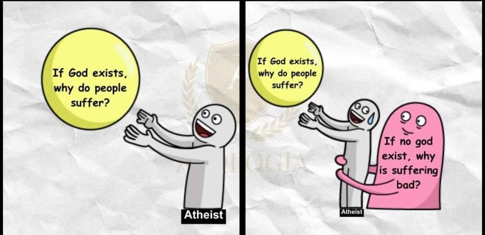

# God and Morality

Here we ask the question, why do Christians think that a god is necessary for morality.

The above cartoon represents the thinking that only god can create morality, and so those who don't believe in god should expect to have no morality.  This is simply Christian glad-handing each other.

## Argument for God and Morality

This was provided by a christian as an argument for god being the basis for morality.  Lets discuss in detail.

> So I'm going to describe a being, and explain why I think this being can be the grounds for morality. Let's leave aside whether the being exists or not and consider the question, "If this being were to exist, could this being provide an ontological grounds for morality?"
> Let's say that there is a maximally great being (MGB), a being that is as great as possible in every possible way where one can reach a maximum of greatness (knowledge, power, existence, full personhood, etc.). That's typically the way we think of the Christian God.
> As a person, the MGB has a character, which is in line with the being's knowledge. There is no external source of morality for this being, but the being acts in accordance with his maximally great character.
> Then let's say that this being created other beings. As their creator and as the one who determines their purpose, the MGB is their authority. And the MGB created them with a concept of what is "good" and what is "right."
> It makes the most sense to link "good" with the character of this being, which was the being's guide to the way everything is set up. We ought to be in line with this, since the character of a maximally great being will be greater than ours, and it creates the only really reasonable reference point for evaluating our character.
> It makes the most sense to link "right" with the commands of this being, which are binding because of his authority. We ought to be in line with the commands, because they align with the maximally great knowledge of the MGB, and the being knows what to reveal to us in order for us to follow our purpose, which is determined by his character and choices.
> So here's a way that morality has an ontological grounding outside of humanity, and it requires there to be a God like the Christian God.

### "If this being were to exist, could this being provide an ontological grounds for morality?"

Actually we are looking for the answer quite a bit stronger than "could".  If you are to claim that morality is grounded by a god, you need to show that such a god "must" provide grounds for morality.  After all, morality "could" be a random accident.  Simply saying something could be possible does not mean that it is so, nor does it mean we even need to give it anything more than microscopic credence.  Let me generous and assume that you really meant to say that if a being existed it MUST be the grounds for some morality of some sort.  If you disagree, let me know.

### Let's say that there is a maximally great being (MGB)

I am willing to accept this hypothetical for the purpose of discussion.

**Maximally Great** is an ambiguous term. What you think as being maximally great is probably different than what I think is maximally great.  For example, would we agree on what kind of music a MGB would prefer to listen to?  i am using music here as an example for which there is no single dimension, and no maximally great music, no maximally best meal, no maximally best way to solve a complex problem.  Thinking that there is one maximally great way to be is a kind of reductionist fallacy.  It simplistically assumes that there is a linear dimension of greatness, and that you just keep following that line further than anything else that exists.  

One response to that is that a MGB is maximal in all dimensions.  This is a different kind of reductionaist fallacy in thinkings that all dimensions are independent.  As you increase in one dimension, you decrease in others, there are always tradeoffs.  Say for example that "speedy decisions" is something that you think a great being would have.  But at the same time, a judge who is slow, methodical, and fair might be preferable.  Would god then be maximally slow?  Of course not, but I am trying to show that "slow" in some cases it a vey positive attribute, while "fast" is positive in other areas.

What constitutes "great" quite often depends on the current situation.  There is no single agreed upon direction for maximal greatness.  What I assume you mean is that of a being with N properties (X1, X2, X3 ... XN) where all the values of those properties are the highest they can be.  There is no guarantee that there is only one kind of maximally great being.  There might be different combinations of properties with different tradoffs.

I asumme you are aware of the problem with assuming that all the properties have infinite values: this leads to logical problems the most famous is the "Can God make a rock so big that even He can not move it?"  He can't be infinitely great in any one dimension, however I am willing to accept MGB to be a being that is so far beyond our capabilities that we can not conceive any shortcomings, though some may exist.

### As a person, the MGB has a character, which is in line with the being's knowledge

Looking up the definition of character, we find it is "the combination of mental characteristics and behavior that distinguishes a person or group."  Character as the set of responses that can be expected from a person for any give situation.  This is a learned characteristic, and so it seems reasonable to see this character tied to a very large amount of knowledge.

### There is no external source of morality for this being, but the being acts in accordance with his maximally great character.

Here we have jumped to "maximally great character" which I guess a MGB would have, but once again character is a very ambiguous term as well.  Like the rest of the maximally great, there are going to be tradeoffs, and there will not be one particular set of character traits that define a unique character.

### Then let's say that this being created other beings.

Let's just say it: he creates humans.  Is it important that we believe the creationist story, because there is a lot of evidence that Creationism is simply wrong.  But let's set the creationism aside, and instead focus on the fact that humans have come to exist, and God is somehow responsible.

### As their creator and as the one who determines their purpose, the MGB is their authority.

We would have to establish that god exists, and that he really did create humans, and at the beginning the topic was waived as to whether this MGB actually exists. 

We further need to determine whether god actually determines the purpose of humans. We don't actually see any evidence of this.  Women create babies but that does not give them any kind of right, legal or otherwise, to determine the purpose of their babies.  This is another completely unsupported conjecture that Christian claim and say to themselves so often that they don't even notice that it is an unfounded assumption.  Can this be proven?  I don't think so.

On top of all that we are asked to believe that this MGB is then "their authority".  I take from this that the intended meaning of authority is: "The power to enforce laws, exact obedience, command, determine, or judge."  We are now pretty far out on a limb.  I have certainly heard Christians claim that their god is a judge often enough.  We have not established that a MGB would necessarily be a judge as well.  One can easily imagine an MGB that is not interested in being a judge for all humans.  Once again this is an un founded claim.

### And the MGB created them with a concept of what is "good" and what is "right."

More of the same: how do we attempt to show that all MGB would infact create humans with a concept of good and right?  I would agree that people have a sense of the right way to treat others, however this would clearly be the result of millions of years of humans trying to live together, and the ones that could not figure that out didn't survive.  Acting good and acting right is clearly a survival skill.  But how do we know that a typical MGB would necessarily take the step of actually doing this.  It is one more unfounded claim.

### It makes the most sense to link "good" with the character of this being, which was the being's guide to the way everything is set up.

Why would this "make sense"?  What proof do we have that god really is good?  It is perfectly concivable to consider a "trickster god" who created the universe for amusement, and subsequently puts people in very bad situation to see how they squirm.  I am not claiming that this MGB is a trickster, however is there any way to guarantee that it is not?  We have not established a connection.

One claim is that god must be good because our lives are so good.  For example, god provided us with a planet and atmosphere that we cna breath.  But the truth is that we consider the atmosphere good BECAUSE we breath it, and not the other way around.  The idealistic scene of a pasture, green grass, a couple animals grazing, etc is a pleasant scene because a farm provides sustinence and allows us to survive.  Pleasant scenes are those that look easy to survive in, while pictures of evil places show almost no way to survive: nobody eats fire and brimstone.

"Linking" good with the character is not enough.  MGB could be the greatest guy in the universe, might be the ultimate of good, but that does not mean that he defines what is good.  It is another Christian unfounded claim.  Being good does not mean you define what is good.

We have no proof that God defines morality any more than the universe does.

### We ought to be in line with this, since the character of a maximally great being will be greater than ours, and it creates the only really reasonable reference point for evaluating our character.

Even though the MGB might have a better character than any human, that still does not mean that MGB created morality.  

As such, a hidden and invisible being is absolutly not a reference point for morality.  I have talked to many people who claim to have experiences with god, yet every single one tells a different story.  There are two possibilities: either god goes a long ways out of his way to remain hidden, or else people are just making it up.  We didn't want to get into the existence of MGB, however to be a reference point we need a couple of things: first of all we need people to agree on what they see with regards to this god character, and second we need a way to confirm this.

The stories in the bible are not even good references for character.  You are really disappointed with people so yo udecide to drown them all -- is that really moral.  I certainly can't believe that any of the small children deserved drowning.  Is the hardening of the heart of the pharoh, so that many children could be subsequently killed, something that a moral person would do?  We can go through many stories but god is clearly a "do as I say, not as I do" kind of character.

While I agree that not being human puts him in an independent reference frame from all human activities, and thereby less likely to be partial -- however the bible is full of stories where God was partial to one person or another.

### It makes the most sense to link "right" with the commands of this being, which are binding because of his authority.

Another appeal to our sense.  In what way does it make sense?  While MGB is certainly maximally great, how does that equate to being right?  The biggest person in the room is not always the rightest person in the room.  The possibility of a trister god has not be eliminated.  We just know the being is maximally great, but we have no proof or guarantee that what that MGB does is in any way good.  Again, these are just unfounded assumptions on the christian part.

### We ought to be in line with the commands, because they align with the maximally great knowledge of the MGB,

It has never been established that MG knowledge leads to goodness.  A MGB might or might not be interested in the betterment of humans, even if it did create humans.  This is the same MGB that created mosquitos, or parasites that cause blindness in children, or viruses.  I know -- he works in mysterious ways -- but we would not have to talk about these mysteries if he was obviously good.  

As for the relationship between konwledge and moral behavior, I know of a lot of peole with tremendous knowledge that I would not leave in my home alone.  Or trust that they will do what most common people agree is the right thing to do.

### and the being knows what to reveal to us in order for us to follow our purpose, which is determined by his character and choices.

Again, this is just a christian assumption.  What has never been established is that a MGB will necesarily be moral.  Neither that they act moral, nor that they define morality.  The ancient people who wrote the bible thought that eating shellfish was immoral -- the wrong thing to do.  How do we know ultimately whether eating shellfish is immoral or not?  And pork.  There is plenty of evidence that these are NOT immoral.

The comment about revealing is an interesting one.  The way we act depends entirely on what has been revealed.  If god withholds information, then god is manipulating our behaviors.  If god allows me to konw just enough so that I make a mistakenly immoral act, then isn't it god's fault ultimately for not informing me?  I know the christians like to turn this around and claim (without evidence) that God does tell you everything, and if you screw up it is definitely your fault.  At the same time, they claim that death is brought on by the sin of someone else: the first couple.

We have not established that this MGB assigns purpose to people.

###  So here's a way that morality has an ontological grounding outside of humanity, and it requires there to be a God like the Christian God.

Well I do appreciate the effort.  But there are many steps that are pur assumption.

## Turnaround

Here is the same argument, but instead of god, I have placed the universe in all the same places in the argument, to show that the same argument can also support a natural explanation for morality

> So I'm going to describe how the universe can be the grounds for morality. Let's leave aside whether the universe exists like this or not and consider the question, "If this universe were to exist, could this being provide an ontological grounds for morality?"
> Let's say that we live in a maximally great universe (MGU), a universe that is as great as possible in every possible way where one can be a maximum of greatness.  It is essentially perfect and everything that appears in the universe is maximally good.
> As a universe, the MGU has a character, which is in line with the being physically part of everything. There is no external source of morality for this universe, but the everything in the universe appears with maximally great character.
> Then let's say that other beings, humans, were produced by this universe.  As their creator and as the one who determines their purpose, the MGU is their authority. As a criterion of survival, these humans had to learn a sense of what is "good" and what is "right."
> It makes the most sense to link "good" with the character of this universe, which guides the way that everything in the universe forms.  We ought to be in line with this, since the character of a maximally great universe will be greater than ours, and it creates the only really reasonable reference point for evaluating our character.
> It makes the most sense to link "right" with the nature of this universe, which are binding because it encompasses all of reality.  We ought to be in line with the commands, because they align with the way the universe is, and the universe will eventually reveal to us in order for us to find our purpose, which is determined by the nature of the universe.
> So here's a way that morality has an ontological grounding outside of humanity, and it requires there to be a universe like the universe we have.