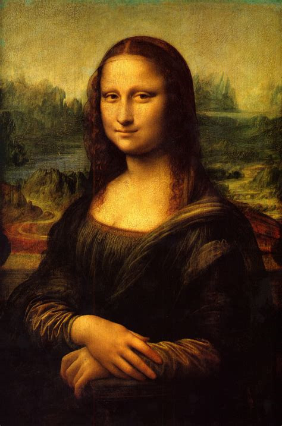
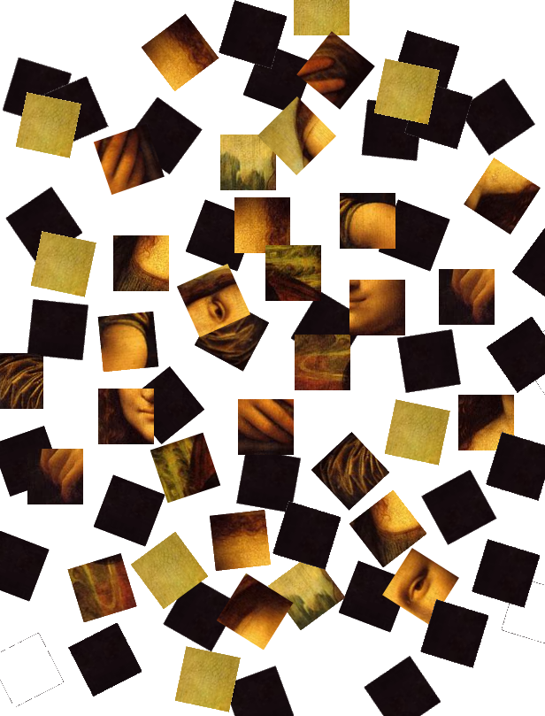

#  Morality, Like Beauty, Lies in Wholeness

Marcus Aurelius advises us to live a good and honorable life, and to act in a moral way in all situations. A reasonable request, but what really is morality? Clearly it is a set of rules to live by, but a very common mistake is to value those rules individually instead of as a complete set.

## Ethics

This happens every time we make a simple behest to follow a rule in absence of everything else. For example: don’t eat pork. I use this somewhat frivolous example not because it is meaningless, but because it is a short, easy to understand rule like so many of them. Another might be: don’t run with scissors. Another is: don’t steal. And: don’t lie.

The fallacy is thinking that these individual rules are good or bad all by themselves. The reality is that your actual answers are guided by thousands of such rules, and all that matters is that the final actions — after all rules have applied or ignored — is what matters. It is nonsense to burn down a building and claim it was good because you “didn’t steal anything.”

Morality is like beauty: it exists in the completeness, and not in the parts.

## Beauty

Consider the Mona Lisa, considered by some to be the best painting in the world. That is certainly exaggerated, however it is a picture that most people are familiar with. The Mona Lisa measures 30 inches by 20 inches.

Consider what happens if you were to cut the Mona Lisa up into 2-inch squares with some very sharp scissors. You would have 150 separate squares, and everything from the original picture is 100% preserved — it is all still there, nothing has been taken away. Casually toss the squares on a table letting them land where they do. (In researching this I found out that the Mona Lisa is painted on wood, not canvas,

Do you still have the Mona Lisa? You have everything that was in the original picture. Nothing has been lost. But as far as the beauty is concerned, everything has been lost. The picture no longer has any meaning. Consider an individual square. Is that square worth 1/150 of the value of the original painting? Certainly not. The individual squares are probably worth nothing by themselves.

So you have a pile of squares with no value on their own, but if you were to very carefully glue them back together so that the slices are imperceptible, and you have a beautiful painting back. Where did the beauty go while the pieces were rearranged? The point is that **the picture is more than the sum of its parts**. The parts have little or no value, and the value (and beauty) comes only by having all the parts together in the right relative positions. The beauty comes from the wholeness, and not simply the sum of beauty that exists in each of the parts.

## G. E. Moore

G. E. Moore make the same claim about ethics on page 28 in his “_Principia Ethica_.”

> “The value of the whole must not be assumed to be the same as the sum of the value of the parts.”

Moore refers the entire value as being attributed to the “organic unity.” I avoid this term because of the myriad of meaning that the term _organic_ takes today, and instead refer to this as “wholeness.” It means simply that the whole has an intrinsic value different from the sum of the value of the parts. (page 36)

What then can we say about a virtue? A virtue by itself is nothing. It is the wholeness of behavior that determines the ethics of the human. A given person might do many many good acts by themselves, but it matters not if there are many countervailing actions as well. Conversely, a good person might have very few virtuous acts, but on the balance have lived a good and virtuous life.

> “An engineer is entitled to assert that, if a bridge be built in a certain way, it will probably bear certain loads for a certain time; but he can never be absolutely certain that it has been built in the way required, nor that, even if it has, some accident will not intervene to falsify his prediction. With any ethical law, the same must be the case ; it can be no more than a generalisation : and here, owing to the comparative absence of accurate hypothetical knowledge, on which the prediction should be based, the probability is comparatively small.”

Moore goes on to explain that a duty is an action that always produces a better outcome than other options that might be available, and a virtue is a predilection to want to perform duties. Unfortunately, duties can not be reliably distinguished from alternatives. Sure there are actions that tend to be better than others, but there is absolutely no way to know for sure what the best course of actions will be. We simply can not foresee the future well enough to determine that.

> “In order that any action may be shewn to be a duty, it must be shewn to fulfil the above conditions; but the actions commonly called ‘duties’ do not fulfil them to any greater extent than ‘expedient’ or ‘interested’ actions: by calling them ‘duties’ we only mean that they have, in addition, certain non-ethical predicates. Similarly by ‘virtue’ is mainly meant a permanent disposition to perform ‘duties’ in this restricted sense: and accordingly a virtue, if it is really a virtue, must be good as a means, in the sense that it fulfils the above conditions; but it is not better as a means than non-virtuous dispositions; it generally has no value in itself; and, where it has, it is far from being the sole good or the best of goods. Accordingly ‘virtue’ is not, as is commonly implied, an unique ethical predicate”

## Conclusion

There are no simple answers. As much as we would wish, that ethical acts could be a simple rule, like ‘_always go to church on Sunday_‘ reality is quite the opposite. **We can never assign a pure goodness value to any simple action.** All actions must be considered in their context. The goodness is not in the action, but in the wholeness of the way that life is lived. So live well, and confident that the best you do, it probably the best anyone could figure out for you to do.