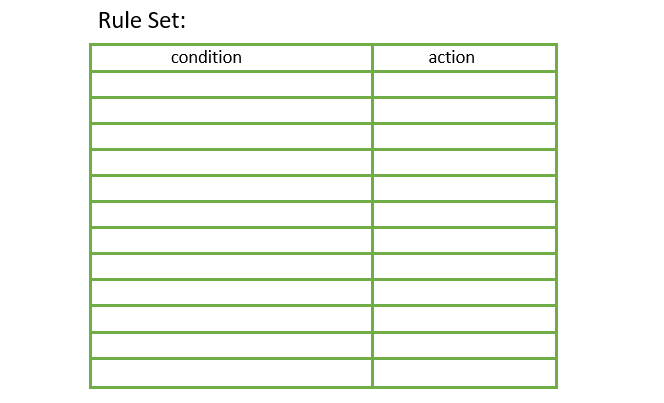
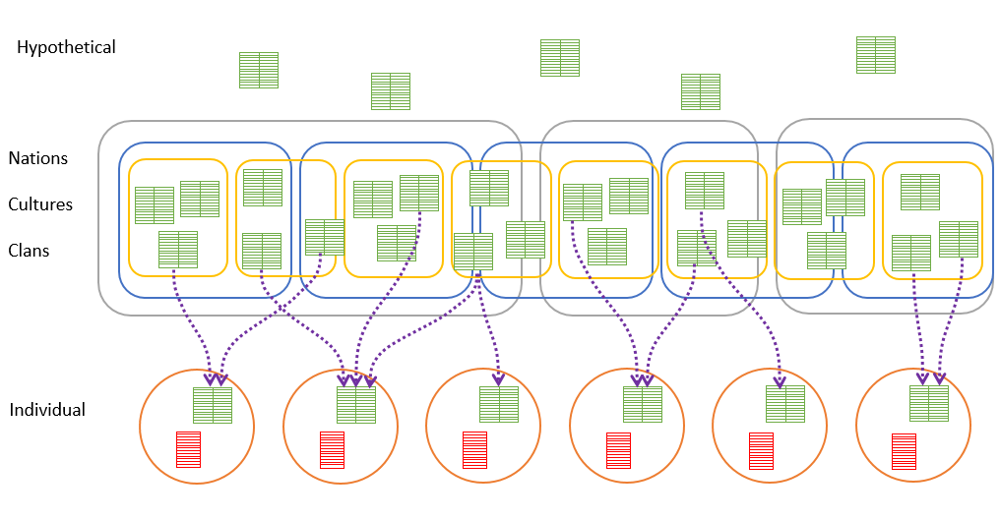
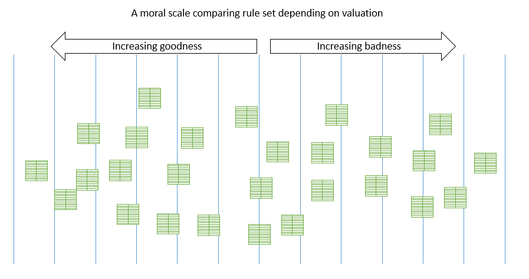

#  Metaethics: Rule Sets

When talking about morals, there are a lot of moving parts and different people use the same words different ways.  This post is an attempt to lay out some terminology that might be useful in discussing morals and ethics.This is the beginning of trying to describe morals and related to my earlier post Material Positivism which was clearly not well enough explained.  It will probably take a few more posts to get a clear picture of this understandably complex topic.

## Morals Are About Actions

It is clear that we can (and do) judge actions as being right or wrong.  That means the action was appropriate for the situation, or it was not.  The whole question of ethics is how we get to determining whether the action was good or not.

Sometimes people describe _things_ as good or bad.  I reject this concept.  A building is not morally good or bad, but a building might encourage good or bad actions: it is the actions that are good or bad.   An organization is not inherently good or bad, but the organization might typically cause good or bad actions.  Again, we look to the actions themselves in the situation that they occur.  Any description of a thing being good or bad is simply a way of saying that they typically perform or cause or encourage good or bad actions.   It is only the action that can be judged morally.

## Rules

A rule is simply a **condition** associated with a recommended **action**.

The condition can be very complex.  We often speak as if the rules are simply, but there is a huge network of assumed conditions.  “Don’t kill another human”  has obvious exceptions such as “except in self defense” or “except when they appear about to kill lots of other people” etc.

The conditions can be very specific about the context.  Nudity is not allowed in most public environment, but perfectly acceptable in the appropriate private environment.  Breaking a window is generally a bad action, but perfectly acceptable if doing so allows rescuing someone from a burning building.  The conditions might be arbitrary man-made distinctions:  acceptable clothing depends on the country or culture that you are in.  Some actions might be restricted to people of a certain age.  Some rules depend on the gender of the actor.  Some depend on educational qualifications: it is legal for a licensed doctor to prescribe drugs, for the rest of us it is illegal (and immoral).

A lot of discussion of morals get tied up in discussion about how one action is acceptable in one condition, and not acceptable in another.  This is seen as evidence that moral rules don’t exist, but this is just a failure to recognize that the condition is context specific.

## Rule Sets

Rules come in sets, and one has to consider the set as a whole.  In a give context, many rules might apply, and other rules might be employed to decide between the options.  We can talk about an individual rule, but they never actually exist on their own.  We might point to a particular action, and say that is evidence of one rule, however there many rules at play in isolating that one rule. 

Rule sets are abstract objects.  There is no physicality to them.  They are logical entities.  Rule sets are present in several different forms, as we shall see.

Rule sets can be combined to make a new rules set.  Rule sets can and often do have conflicting rules.

## Realms

There are different places that we find rules living.

**Individuals** – each of us has in our brains a representation of the rules that drive personal behavior.  This would be exactly the same as behavior, except that sometimes people do things they later think they should not have done.  Maybe this is because they are not able to access the complete rule set at all time, and so end up doing something contrary.  Or maybe it is because after they do something, they change the rule set realizing that they should have had a different rule.  But mostly the personal rules and the personal behavior align pretty well.

The rules for an individual will will call their **will**.  Because it is what they will do in a particular situation, and it represent their own choices about what they want to do.

**Nations, Cultures, and Clans** – Human social groups maintain sets of rules for behavior that are impressed upon the individual from others.  These can come from the political government of nations, states, cities, counties, and other political demarcations.  They can come from a person’s culture and the rules that are followed in that.  And it can come from the other family groups regardless of size that the person is a member of. We can call them **laws, customs, guidelines**.   Laws are formal versions, written down, saying what behavior is warranted in a give situation.  Customs are less formal, communicated verbally, but can be enforced just as harshly.  Religion is a big source of cultural customs.  Guidelines are less formal still, and are recommended as being better to do this, and worse to do that kind of thing.  Compliance is optional, however other will perceive you as a loser if you do something else.

**Hypothetical** – There are also rules that are the subject of discussions, which might not actually be a law or customer, and there might not be an individual that follows them, but they are the subject of conversation anyway.

these are depicted in the following diagram:

The circles represent individuals.  The red box represents the actions that the individual takes, and the green box is the rule set that the individual thinks they are following.  Actions almost often follow the rule set, but they might not if the person is drunk or otherwise not able to access the complete rule set.   Rule sets also change over time, so actions in the past might not match the current rule set.

Nations, Cultures, and Clans all overlap.  Obviously there should be a many-to-many relationship, and also some people are a mix of two or more cultures or clans.  The green boxes represent rule sets which are composed of all the laws, all the customs, and all the guidelines that these various overlapping organizations bring.

On the top there are hypothetical rules sets which we might speak of but which are not necessarily held by any given individual, and not necessarily impressed by any given nation, culture, or clan, but that can be seen as existing as well.

The purple dotted arrows represent the influence that laws, culture and clan have on an individual’s rule set.  We live in a culture, and so naturally we will see to align our rules with those of the culture around us.  But this is imperfect — people choose whether or not they want to adopt those rules.  And all of the choices of rules to adopt are so numerous and so conflicting that it would be impossible to adopt them all.

## Moral Valuation

Morals are how we value or compare the various rules sets.  A slovenly person has rules that act in ways that are more slovenly than another person in the same situation.  We can compare the rules of the slovenly person to that of someone else.

We can make a **subjective** comparison between rule sets.  Let’s say I just prefer classical music, then my rule set is probably going to cause playing classical music in more situations. Another rule might encourages the playing of hip-hop music in those same situation.  Because of my preference, I am going to think that my rules are more “good” and the other rules more “bad”.  This is a subjective valuation of a rule set because it depends on my own personal preference: I happen to like classical music.   It is my subjective experience of the music that makes me value classical over hip hop.

One can take all of the rule sets from above, and lay them out on a moral scale from really really good, to really really bad, and all the valuations between.

If you are valuing the rule set based on subjective criteria, then there could be as many moral scales as there are people.  Everyone has a slightly different view of the world, different experience, different preferences, and so on.   Laws, cultures, and clan influence the personal rule sets, but not perfectly.  It seem clear that any valuation of rules based on subjective measures will leave us with many many arbitrarily different valuations of rule sets.

However, it is possible to value all the rules based on an **objective** measure that has nothing to do with any one person’s subjective experience or opinion.  To be an objective measure, it need be something that that is not “just because I like it” or “because it tastes or sounds good to me.”  Instead the valuation has to depend ONLY on things that are externally measurable, that any two people might measure and always get the same answer.  If there are seven trees on the left side of the road, I can ask any number of people, and everyone will find seven trees.  That is the essence of an objective measure.  It does not matter in any way at all what the preferences of the person doing the counting are.

If the rule sets are values depending on the outcome of using the rule set, and if that outcome is measured in a way that does not depend on any subjective opinion, then you have an objective measure of the value of a set of rules.  For example, a rule set that obtains the outcome of more people surviving would be valued higher than a rule set that obtains fewer people surviving.   The number of people who survive is an objective measure.  You simply count them, and no matter whether you like classical music or you like hip hop the number of survivors that different people count _**are the same**_.  That is what we mean by an objective measure.

The utilitarians like Jeremy Bentham have proposed exactly this: see which rule set produces the best outcome for the most people.  You simply count them.  Clearly a rule set that results in everyone being in permanent coma would not be better than a fewer number of people who are normally alive.  So simply being alive is not enough.  A rule set that obtained more people, but everyone was in excruciating pain all the time, would not be better than a few less people and everyone is not in pain.  Generally a term like “happiness” is used to mean that not only do they have life, but their quality of life is also as good as possible.

A lot of people think that because pain is a subjective experience, that measuring the outcomes with fewer people in pain is a subjective measure.  It is not.  You can simply go to every person and ask them if they are in pain.   10 people walk through the same people and ask the same question will count the same number of people in pain.  Thus you have an objective measure of a subjective phenomenon.  The point is that the measure does not depend on the subjective experience _**of the person doing the counting**_.

## Is that all there is?

I am not done.  The purpose of this post is simply to lay out the terms, so we can discuss the nuances more carefully.  We are not done yet, but at least we understand what rules, rule sets, valuations, and how morals fit all together.