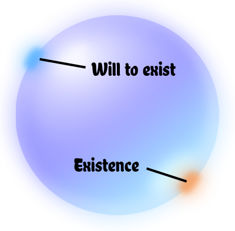
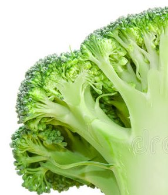

#  Immanence

First, there appeared a will to exist in its very simplest form. A single unit of will, so to speak. Thereafter, existence began and started a conflict that drives literally everything else. Existence proves the will to exist unnecessary, but the will to exist must continue to demand more existence, and that is creation: the formation of existence out of . . . nothing.

## Creation . . . Human Style

If you ask a human to create something, they will go about collecting resources and tools, form an idea of what they want, and go about putting the parts together into a whole. This is a very human-centric view of looking at things, but of course the human already exists in a fairly complex form, and the resources and tools are as well.

The naïve thinkers imagines that God might have done the same as a human: God, fully formed, somehow gathers some dirt, which was also fully formed, and puts Adam together, and only when finished gives Adam the breath of life. God in this sense is viewed like a kid with a pile of lego blocks: grab a few and put them together, but where did the lego blocks come from? This is nonsense.

A vastly intelligent being wanting to make an immense universe would not first create a huge pile of lego blocks, and then manually go about rearranging them into worlds and living beings. This is first-level creation. Doing this by hand would be an incredibly tedious for an obviously dim-witted agent and work not really befitting for anything one might call God.

Think for a bit out this. What if this god first creating (from lego blocks) robots. Those robots go about making creating the world for God. This is second-level creation: God creates the things that create the universe. It is still creation, but it far more intelligent and befitting of the smartest guy in the universe.

Think some more: God creates one robot, and that robot creates other robots. Then, in turn, those robots create the world. This is third-level creation. That is even better because God can in some sense watch the creation unfold (even though he already knows the plot and the ending).

Let’s consider for the rest of this writing, that God employs N-level creation: He creates things that create things that create things and so on. But we have not answered the question about where the loge block come from. Does he start by creating those, and if so, what does he create them out of? Quite simply, he creates them out of Himself.

## In the Beginning

Remember, there was the initial will to exist.  After, existence came about.  And think about this point in time when only a single unit of will and a single unit of existence was there.   The existence was both the answer and the obviation of the will.

What existed? Whatever it was, was all that existed.   It was everything.  So let’s call it God if you will. The will to exist is still a will and the actual existence fulfills the will obviating it.  This forms the initial conflict.  The will must either stop being a will, or it must continue creating.   It starts making more existence. That cycle is a process that is still going on today.

This is the most primitive dialectic possible.  The push and pull between willing and existing never quite resolved into synthesis because the very nature of will and existence are so opposite.

Existence starts. This is fashioned into more or less pure energy. That energy starts creating time and space and causes expansion. Through expansion, matter starts condensing out of the energy, and we get quarks, but it is still God that is at the center of them and defining the rules that control their behavior.

Quarks compose themselves into particles. Particles compose themselves into atoms. Atoms drift and clump and eventually form the first stars — but it is still essentially God at the core of all this experiencing every step (in a very primitive form of experiencing). Stars produce higher elements, which go on to form planets. Out of the billions and billions of planets, some find themselves in the right situation that from the atoms and molecules, life is created. God has never been separate from the matter, and the matter still is God.

The life goes on and through competition creates consciousness. God experiences for the first time consciousness, because He is the material, and he is the life, and now he is the consciousness. This consciousness, like matter, and everything else becomes part of God. Note the difference: he did not move existing matter around to form humans as separate entities. Instead, he is both the material and the efficient cause of humans (and everything else).

## Expansion and Stasis

As each layer of creation forms, it makes God bigger and bigger, more and more complex, more and more powerful, more and more . . . God. Everything has a continual unbroken connection to that first instance of creation.

I can’t help but think of this like a piece of broccoli. At the base there is a starting point, then then branches into two or three. Each of those branch, and branch again and branch again for uncountable levels. It is not like a fork that splits into small forks and smaller forks. Each layer of branching causes more than the previous, and the broccoli has to expand out, curving the branches below it. At the outer edge, you have a tremendous number of individual flowers, but they are all connected with an unbroken thread back to the original source.

Philosophers as far back as ancient Greece call this the immanent God. God does not appear as a kid that came along one day and decided to play with lego blocks, but instead God actually is the blocks themselves as well as everything built out of the blocks. God is also the guiding principles, but those principles are built into the material itself. Magnets attract (or repel) other magnets and there is no reason to imagine a God sitting around to push or pull them as needed. The matter does it itself, but again that is actually God doing it as well, because the material is God.

## Future

There is no reason to believe that God will stop with this sort of thing at this time. As humans build things, these are God’s creations as well. Our experiences are God’s experiences as well. Living together is a struggle, and as we find new ways to live together, we also add to God’s creation.

It seems to me that the creation is not finished.  While we humble human beings are both part of God and created by God, we are not the end product.  Humans will continue to exist as long as we don’t wipe ourselves out by bombs or diseases.  There is plenty of room in the universe for higher levels of existence.  What does 10 billion consciousnesses make?  I don’t know.  The pattern is clear: levels of existence emerge from levels of existence.  Human consciousness might be the highest level of existence for now, but there is no reason to believe we are the end of the entire process.