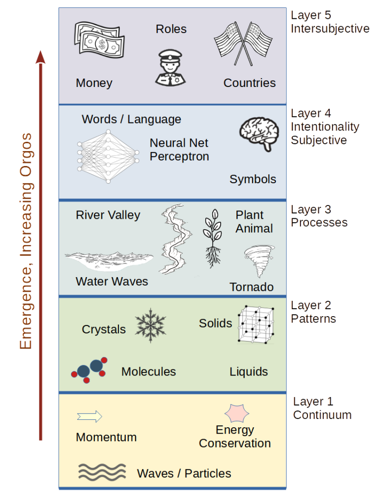

#  Structure of Reality

Here I’d like to explain a little bit about how to structure reality to help make sense of all the things that are around us. The way you structure you metaphysics either permits or impedes all discussion of the universe. It effects what you can and can not know. This is one of many posts to attempt to set out a clear and complete metaphysics of reality.

Nothing here should be controversial. This metaphysics should agree with accepted theories of current physicists and other sciences. (To the extent that such sciences agree.) It is not my intent to present anything that is new or unusual. I’m simply trying to make a picture that brings together what we know and shows how everything is related.

I base the structure around a number of different levels of emergence. This diagram has five levels. Let me stress from the beginning that there is no clear boundary between the levels. Reality spreads continuously across this spectrum at all points. Still, it is useful to break it into five different levels simply to help illustrate the kinds differences we see across the spectrum.

This diagram attempts to show the vertical direction as increasing “orgos.” The layers are of increasing emergence, but I am very purposefully associating emergence with increasing organization. When a new property emerges from a collection of things it is always a property associated with some form of macro scale organization that is not apparent at the micro scale. In no case does emergent properties appear to increase disorder. At the same time, emergence does not seem to change the amount of disorder at the micro scale. This is the surprising aspect of the universe that order can appear out of apparent disorder, which happens on many levels, and is a central theme of this metaphysics.

I put forth “orgos” as some kind of measure of this emergent / organizing effect, but let me stress that orgos is not is not measured linearly on a single dimension. As emergence appears, the kind of organization appears in different individual ways. Two different processes which both cause emergence can not be compared easily, if at all. I lay this out on a diagram in a linear way, with higher orgos higher on the chart, however you should not think that that two parallel advances in organization are in any way equivalent. Think of it more like the branching of a fractal broccoli, with each kind of emergence going in its own way. I use orgos as a label for the concept that emergence causes organization.

## Level 1

Very bottom level is the basic **substance** of the universe: matter, energy, charge, spin, and other quantized properties. Space and time appear at this level. This is where you find the fundamental principles, like conservation of energy and conservation of momentum. At this level we have a matter itself expressed as wave functions which satisfy the Schrodinger equation. Famously these appear to be a blend of both wave and particle.

I call this layer “the continuum” to remind one that everything is interacting with everything. The discrete objects that are made from matter don’t appear at this level, but are in fact emergent manifestations at a higher level. Quantum field theory states that reality is spread out as fields that appear at all points in space, and this world view is important at this level.

What interesting thing about level one is that everything is essentially eternal. Energy lasts forever, changing from one wave form to another but never disappearing completely. Momentum lasts forever. You can create neither energy nor momentum without the requisite negative values being created at the same time.

Higher levels are emergent from, and supervenient upon, levels lower than them. In higher levels, we see things that emerge from things in the lower levels, they demonstrate new properties, but they can not exist without the existence of the lower level things. Level 1 is the ground layer and required for everything that appears in higher levels.

## Level 2

We consider things that are **patterns** or arrangements of the material from level one. A proton for instance is a stable combination of three quarks. It is a distinct organization of these subparts, and exhibits properties that are not seen in the quarks themselves. Atoms are stable patterns that appear out of the fundamental particles that form reality. Molecules are stable patterns of atoms that bind together because of the electromagnetic force. These are the basic patterns of reality formed from the stuff in level 1.

So if it is the same stuff, why do I consider these to be separate things?  Consider the case of molecules. A water molecule is hydrogen and oxygen. The combined molecule acts in a distinct way that water does and not at all like separate hydrogen and oxygen. There is a thing-ness to a water molecule that gives it an existence beyond just the hydrogen and the oxygen. The molecule itself has properties which are seen in the atoms by themselves.

We see in this level the formation of liquids and gases. A gas has emergent properties of temperature and pressure which don’t exist in level 1. Liquids can have a property of wetness which emerges at later too. We also see a layer to the formation of solids which is the property of molecules to come together and to hold themselves in a rigid shape. Here we see emergence of property is like friction and hardness. And don’t forget crystals which are regular solid formations where the arrangement of the molecules constrain the macro level shape of the solid.

## Level 3

This consists of dynamic patterns which we can call **processes**. The process has some sort of flow within it. For example a river which has water flowing through it: the river is static and sits there but the water in the river is always moving through it. The simplest example is a planet orbiting a star. There are lots of these examples where the forces between the particles and the molecules are such that you have a dynamic pattern of flow that reinforces itself and forms itself as a pattern of cells. Consider wind as a basic dynamic flow pattern where air is moving from one point to another. Waves on the ocean are created by the interaction between air blowing over the water. Waves are persistent processes that can travel over large distances. Waves are really just water, but they are moving in a repetitive way that we recognize as a wave. Consider a hurricane or tornado which are stable weather patterns that persist from minutes to days as a specific form while the air flows through that form.

One of the most important processes that we see around us are those processes that we call life. Life is a process. The plant remains in one place while air, water and carbon dioxide flow through it and get converted into other molecules. Both plants and animals are processes. The cell is a process, and then the multicellular organism is another process built on the cells. Nerves then introduce yet another level of process.

When we think about level 2 & 3 together we can talk about these level as the “**form**” of matter corresponding roughly to what Aristotle called the form of objects, while the substance is accounted for in layer one. Everything in level 3 is a process that depends on patterns in level 2, which depend on material from level 1. While new properties emerge at the higher levels they are supervenient upon things in lower layers. That is if we removed the lower layers the properties in the upper layers could not exist.

Some processes make material more organized, and some make it more disorganized.  The former can be called **shapers.**  A shaper is simply a process that results in more organization.  Prigogine calls them dissipative structures or dissipative processes.  Shapers become a critical thing for producing the higher layers.

## Level 4

Leve 4 is the hardest to explain because it involves the things that emerge from a functioning nervous system. Level four is the level of **intentionality**. Level four is where concepts exist. Intentionality is the property that some thing can be about something else. To get intentionality you must have an information processing system such as you find in a central nervous system. (it potentially could be seen in simpler system, there is no clear boundary.) Senses pick up information about the world. Perception systems learn to recognize things about the world. Memory stores these patterns of recognized aboutness. And motor systems act on the world. It is the emergence of this aboutness that categorizes what we see emerge in level 4.

Eyes pick up the way light reflects off of objects and also encode the received information into colors, textures, edges, shapes, and volumes that tell us a lot about the nature of what we’re seeing. The nervous system is designed to recognize patterns that exist in the sensory input. Recognition is performed by a perceptron. Perceptron is a neural net inspired machine that is routinely used today in machine learning. it is abundantly clear that our brain uses neural nets to identify and perceive things around us.

The structured signals that come out of the perceptron have intentionality, they are about the things that you are seeing or smelling or tasting. Then we also have memory. Memory associates patterns that you have seen or sensed. For example the reddish color, the warm feeling on the skin, and the crackling sound all occur when you’re looking at a fire. Those detect and sensory patterns are associated in your brain, and the connections that associate them have intentionality about the concept of fire.

Objects, as we know them, exist at level 4. The material of a chair exists in levels 1 thru 3, but it is not until it is recognized as a chair, and found similar enough to the thing we collectively know as a chair, does it then become a chair. Every time someone sits on a chair, they knock millions of atoms off the chair, but that does not make it any less of a chair! (Until, of course, it breaks.) If you see three chairs, what you are seeing is three lumps of matter that are all distinct and different, but it is the mind that recognizes the chairs and decides that they are each examples of what we know as chairs. The lumps of matter might be different in an uncountable number of ways, and yet we say that they are all the same: chairs.

All objects exist a level 4 and above because they are concepts. When there is something that is about something else, we can call it a symbol. What is stored in memory is a symbol, and we we recognize something, we activate the symbol, as well as many more symbol that represent things we associate with that symbol.

Language — written, spoken, or otherwise — exists at level 4.  A spoken word is a pattern of sounds that are recognized much in the way a chair is. Once recognized, it causes the activation of the symbol in the brain that is about the chair. The symbol in the brain along with the associated symbols constitute the experience of the chair. Remembering is a kind of re-experiencing — some parts of the brain can not distinguish the activation of a symbol because of recognition or because of speech. When someone speaks of a chair, you re-experience the chair very much as if you just now saw a chair.

Concepts have no existence, instead symbol do.  The concept of fire does not have any material representation and it does not have any existence. But what does have existence is the memory patterns which represent fire. Those exist as connections among living neurons which are built out of life processes and from molecules which are constructed out of matter. The nerve structures themselves are symbols which are about the concept.

Symbols can be about things that have a material existence, like chairs, and they can be about things that don’t exist, like dragons, numbers, and perfect circles.  I know this is hard to grasp but an apple, the concept of an apple, exists only has connections between the sensory experiences that we have around apples.

To allow for a fully functioning mind we need to have for things: we need senses, we need perception ability to distinguish patterns from the sense data, we need memory to record patterns that have occurred at points in time, and we also need an ability to act upon the world. His last ability is often overlooked, but the ability to act on the world is how it is that we bootstrap meaning into these representations which form in the head. Using this basic apparatus we are able to communicate to each other because we associate a pattern of sounds with a symbol in the brain. we learn to utter the sounds and we learn to recognize the sound that others make. When we learn a new word we associate that word with other previously existing words that we understand or with sensory experiences.

All the basic subjective experience exists at level four. this is where we experience the warmth of sun on the face for the coolness of water as we get into the swimming pool. This is where we experience the smell of an apple pie. The experience of these things is the feeling of the senses as they come in to the mind. The meaning of these things I learned as we grow and build upon each other as metaphors within metaphors within metaphors.

## Level 5

This layer builds upon everything in the layers below it in the formation of shared concepts also known as intersubjective experience. Money for instance. Money is really an agreement between people to perform certain actions in relationship to money. We have an agreement to exchange money for goods or services, and it works if we pretend that money has values. We make agreements about imaginary lines on the surface of the earth that divide two states or countries. We give role titles to people, such as policeman or president, and give them certain permissions or responsibilities based on the title. These agreements are emergent from all of the thinking humans that exist and interaction. They form as new property independent of the individuals.

Level 5 can be described as **culture**. We have a sense that a culture exists separate from the people in that culture.

## Level 6

Is there a level 6? The more important question: if there were higher levels, would we (as thinking humans) recognize it for what it is? Thoughts exist primarily at level 4, culture and other things made out of thought is level 5, but what would those combine to form? Honestly, I am not sure, but there is no reason to believe that this emergent / organizing principle stops with what we know.

## Summary

This is a very quick overview of metaphysics is kept succinct on purpose, but I hope to expand on all these layers in the near future.  The higher levels _build on_ and _extend_ the lower levels, but do not exist without the lower levels. Culture is built of thoughts, which _are_ at the same time processes, which _are_ at the same time patterns, which _are_ at the same time material.  There is such a strong tendency to separate the different aspects of reality, that it is quite a challenge to see the real integrated nature of everything.

If you need a label, I am calling all this “**[Material Positivism](../Material-Positivism/)**“