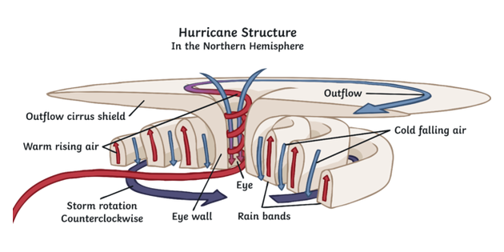
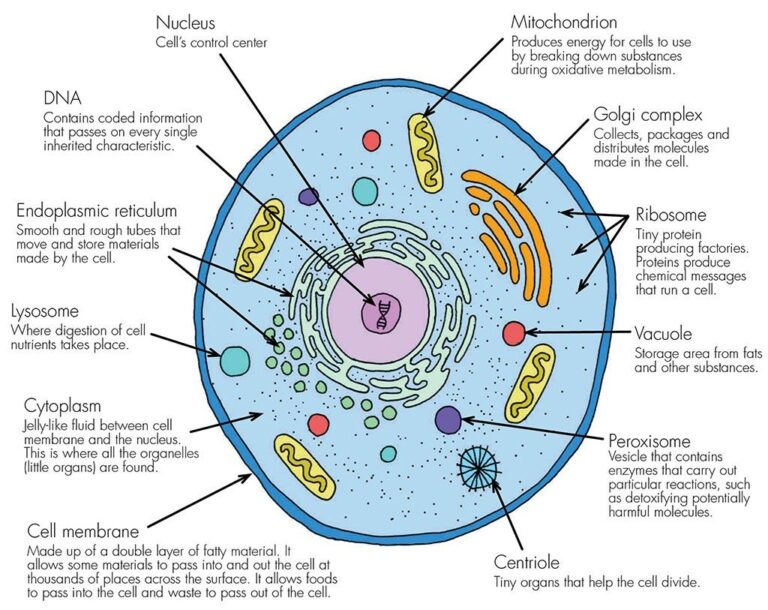

#  Understanding Orgos

Self organization produces increased organization, but what do we mean by organization?  Here I introduce the term “**orgos**” and explain what it means.  

## The Problem

Explaining exactly what organization is turns out to be a big challenge. The term often evokes an idea of a business or school; a bunch of people who are cooperating together by some kind of design. We don’t mean that in this case.

Using concepts from the book “[The Cathedral and the Bazaar](https://www.goodreads.com/book/show/134825.The_Cathedral_the_Bazaar?from_search=true&from_srp=true&qid=LX3psyhP3A&rank=1 "external link: The Cathedral and the Bazaar")” we don’t mean the kind of organization that you see in a cathedral. We mean the kind of organization found in a bazaar. Some people don’t find that very organized. They say the bazaar is chaotic and disorganized. That is true, but it also has a kind of organization that works, because actually bazaar are actually quite functional at what they do. They just don’t have a superficial appearance that implies organization. A bazaar has a kind of organization that grows on it’s own: it has orgos.

Self-organizing systems tend to move from a simpler form to a more complex form. Thus in some ways they increase “complexity” but that term also problematic. Few people have a intuitive grasp of complexity. It connotes a kind of overwhelmingness in general. An automobile is complicated, not complex. An aircraft carrier, assembled from millions of parts, is still complicated, not complex. The atmosphere and weather patterns are complex. But if anything feels random, it is the weather. Complex systems show chaotic behavior which seems the opposite of organization. So describing a self-organizing system as increasing complexity is not really the right idea either.

## A New Term: Orgos

In frustration at finding the exactly right term in English to describe this, I reach out to a neologism: orgos.

*   orgos: the quality that is increased by self-organizing system.

A self organizing system has the propensity to increase orgos as it operates. We can use this as a label to talk about self organizing systems, and the kinds of orgos that each produces, because each different system produces orgos in a different way. It is a label that we can use to describe the commonality between these various different systems.

Orgos is structured. By this, I mean that the opposite of orgos is smooth and uniform. Stir salt into water and the salt will tend to spread out evenly and fill each part of the water equally with salt. The distribution of salt is “even” or “flat” and this is low orgos. As orgos is increased, the evenness or flatness is replaced with unevenness of some kind. Instead of being flat, the contents will be organized in some way. The fully dissipated salt water will be smooth and even, all part essentially the same. If the solution gets too strong, then the dissolved element can start to precipitate out, and that causes unevenness. Either the precipitate collects on the bottom, or else it forms into a crystal, either way the system is no longer smooth and even. It is differentiated or structured.

The term “structured” does not really work because structure implies something that is hard. A hurricane is structured in the sense that I mean for orgos, but this sense of structure conflicts with the every-day meaning of a solid building of some sort.

The salt in the water spreads to a smooth even solution because of entropy. In some sense orgos is the opposite of entropy, but not always. It is true that orgos is a trend towards a kind of organization that seems to be against entropy. At least, we can say that the end state with high entropy where everything is fully dissipated is low orgos, but at the same time, the beginning state can be low orgos as well. Consider a box with two halves, one half holds a gas and the other a vacuum. The barrier between the halves is suddenly removed, and the gas does what gas does: it flows to the other half. On a description of entropy, the system started in lower entropy, and ended in higher entropy with the gas spread into the entire box. Orgos is concerned with the turbulence that occurred while all this was happening. The gas does not just smoothly expand to fill the box, but instead there are eddies and currents. The gas closest to the barrier starts moving first, but then it slams into the other side of the box, and swirls back and around in a complex dance with the rest of the fluid. This period of non-smoothness is higher orgos than you started with, because the gas is not smooth and not even. Instead, the gas has a kind of structure, a kind of non-smooth differentiation across the area. Eventually this orgos dissipates again as the system enters the final configuration which is smooth again.

## Examples From Nature

Orgos is the kind of organization that you find in a hurricane. The atmosphere could be nice and smooth and still. If the earth was a cold dark planet away from any source of heat, the atmosphere would become very still. But the earth has a sun, and that causes the atmosphere to move around and form active patterns. Wind is a kind of orgos, but orgos is really seen when the movement combines to create a persistent structure, such as a hurricane or a tornado. Most people would not describe a hurricane as organized. Instead it feels like the worst kind of chaos. Look at a hurricane and you will clearly see that there is some structure there: winds whirling around with an eye in the center. That is elevated orgos. It is not simply smooth air, but instead something that has large pressure gradients.

Orgos is the kind of organization that you see in a crystal, such as a snowflake. This is a lot more obvious. Molecules are gathered in a way that keeps them ordered at a molecular level all the way up to human visible size. For the crystal building process, orgos is simply the regimented orderliness of the molecules in the crystal. Put a snowflake in a blender (or melt it) and you have all the same material that you had before, but the structure, the organization, has been eliminated.

Orgos is the kind of organization that you see in a river valley. The river cuts the valley. The valley channels the river. Both forces act on each other to create deeper valleys, and to concentrate the river over its course. This is orgos. People may point out that the river meanders in a chaotic way. That is true. It is not organized like a cathedral. It is organized in the sense that a bazaar is.

Self organizing systems are recognized because they create some differentiation in matter, some structure, in a medium that would otherwise be smooth. The water on the ocean is not smooth, but instead water waves form all by themselves as an interaction with the wind. Water wave might not seem very organized, but they certainly have patterns and structure beyond flat water, and that is orgos.

Plants and trees that grow also increase orgos. A still gas is in some sense the lowest orgos that you can have, and when a tree pulls CO2 out of the air, and makes a structure, it is increasing orgos of the system. In this case, the structure really is a structure. Life is a self organizing system that can make copies of itself, raising the orgos created to a new level, that of replication.

Animals have organs. Orgos is being made out of organs that are differentiated from each other and perform specific functions. Animals are not filled with a simple smooth “soup” of ingredients. A liver is different from the stomach which his different from the kidneys. This differentiation is orgos. (Orgos borrows from the same Latin and Greek root that organ, organization, and organelle come from.)

Nervous systems then create a different kind of orgos. A functioning central nervous system — a brain — is able to gather information about the surrounding environment and to use this to guide action. Those memories that are formed in this process contain a structure that is differentiated from the flat, smooth, non-memory that was there before.

Villages, towns, and cities also self-organize and tend to develop patterns, such as residential districts, neighborhood schools, and centralized business districts. This differentiation is also a kind of orgos. This is similar to the bazaar mentioned earlier that organizes without any real central authority.

## Orgos and Intuition

In the course of discussion we will discuss all the different ways that orgos can be increased by self-organizing systems. Each different system is different, and orgos is developed differently. It is NOT my goal to define what exactly orgos is, and then to show that all self-organizing systems have it. Instead, orgos is the quality that we recognize being produced by such systems, and this allows us to talk about it and see the similarity and the differences between such systems. We can talk about orgos without the hangups that “organized” and “complexity” bring along, and we can discuss how orgos is produced differently in every system.

The tendency to increase orgos is very non-intuitive to the human mind. Our day to day experience is that things that people make fall apart, and become always less organized. Our regular experience with self organizing systems, like plants and animals, we tend to intuit that this comes from some supernatural source. Sure, we know plants grow all by themselves, but this seems to be a special case, and growing by itself seems impossible in other domains. My goal is to show that we are surrounded on all levels by self-organizing systems that create things all the time, and there is every indication that there are new self-organizing systems to be discovered in the future.