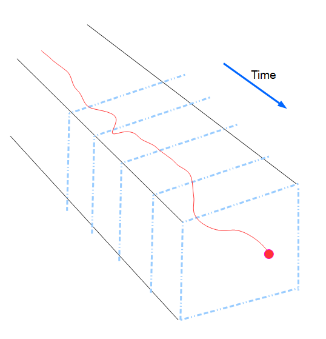
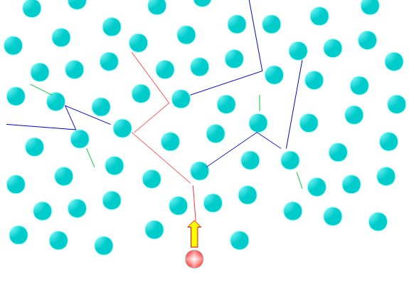
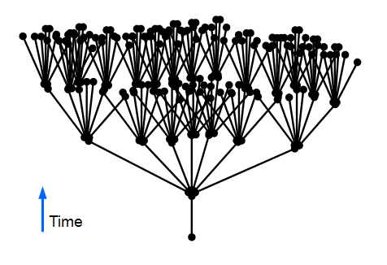
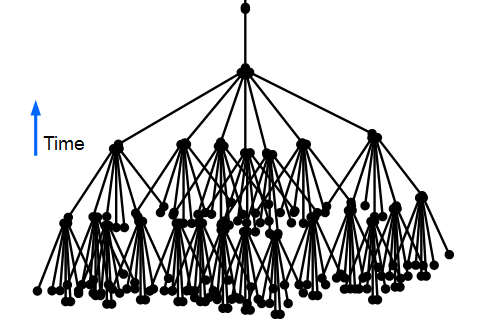
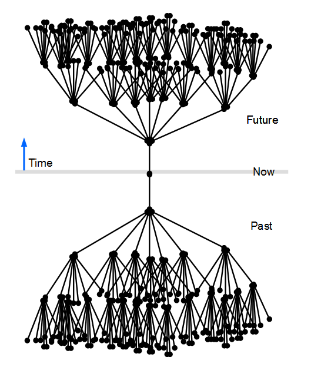
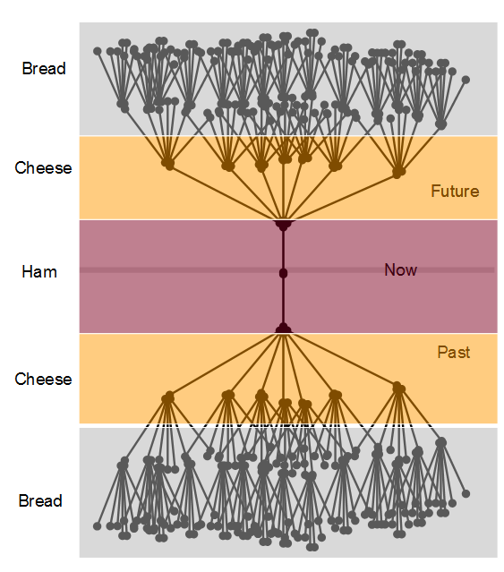
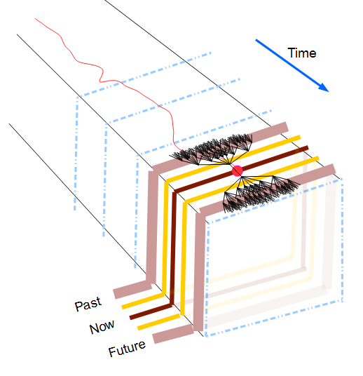

#  Ham-Sandwich Universe

The block universe is a name for thinking about the universe as a 4 dimensional space with time as one dimension.   I would like to talk a little about that view, and introduce a modified concept which might not represent reality, it does say something about predictability and free will.

## Review of Block Universe

Follow this link to a some [better presentations on the block universe](https://www.abc.net.au/news/science/2018-09-02/block-universe-theory-time-past-present-future-travel/10178386).  I will assume that you understand how the four dimensions define a space, and that each particle in the universe follows a world line into the time dimension.  Every interaction is precisely defined by the conditions coming into that interaction, and every departing particle has a well defined, predictable path.

The block universe is criticized for this predictability.  It seems that there would be no room for free will.  Everything we do could have been predicted millions of years ago — if we had all the knowledge of the initial conditions:   how fast and what direction every particle in the universe is moving.  There are a couple of problem with this off the bat:  you can’t know the values to infinite precision due to Heisenberg uncertainty principle, and also quite obviously because a computer to record all these values would need to be many times bigger than the universe.  Still, the block universe represents the idea that it could in principle be done.

This depiction shows “slices” of time, and the world line of a red particle through time.

## Perturbation

Thing for a moment about a universe filled with an uncountable number of billiard balls.  Hit one into the mix, and it might hit 3 or 4 others.  Each of those hits 3 or 4 others, so now we have at least nine balls in motion.  Those each hit 3 to 4 balls, and we have at least 27, and so on.  This is a geometric progression, and the number will rise very quickly to a large number.

Except in the very thinnest of interstellar space, matter is always jostling and bumping off matter around it.  And it does not slow down and stop like a real billiard ball, but keeps bouncing forever.  In every bounce all energy is conserved, and all momentum as well.  And, the typical molecule bumps into billions of other molecules per second.  The first hits a billion molecules, each of those hits a billion molecules, and so on.  The number can rise quickly.

Not only is the universe hard to measure, physicists tells us that there is a fundamental random aspect to the universe and the quantum level.  A particular nucleus might suddenly decay (explode) or not based simply on a completely random decision which is not predictable.  For the most part this does not matter because the experience at our levels requires clumps of 10^23 molecules and a few decays don’t matter right away.

Consider this: the effect of that decay or non-decay actually increases.  That is, within two universes, one where the nucleus decays and one where it does not like the multiple universe theory would predict.  Those two universes will only be slightly different at first.  The nucleus might or might not exist, then the billion or so neighboring molecules will be set on a slightly different course.  Those different courses effect billions more molecules in the next second.   This diagram depicts this idea that there is one event that might or might not happen, and there is a chain reaction of differences that appear in the universe.

So the perturbation caused by a single event grows and grows effecting more are more molecules.  The influence of this small change growing to be bigger is called sensitive dependence on initial conditions;  a very small change to the system grows and grows to to effect more and more to the point where your outcome many iterations later is completely different.  This butterfly effect is explained in terms of a butterfly deciding to flap its wings (or not) might eventually determine whether a hurricane forms (or not) several months later.  The small change is not just propagated, but it is amplified.  Where is this amplifier?  It is the sun which is pumping in the energy to drive the storm, but in the same way a small rudder can steer a ship, a tiny change in the wind currents get amplified to a big change in how the storm evolves.

All we have considered here is a single perturbation and the things it effected.  This same perturbation tree is growing in parallel by the billions.  There is, after all, millions of butterflies deciding whether or not to flap their wings, and they **all** contribute to changing the weather.  Consider an event in the top row above:  what contributed to that molecule’s position and velocity?  There were billions of overlapping trees, but if we isolate only the events the contribute to single molecule in the present, it looks just like the other tree upside down:

If we want to know the position and velocity of the end product of all these interactions, we need to consider billions and billions of molecules in the seconds before the desired moment.  And every measurement of every event coming into and effecting it is limited by the Heisenberg uncertainty principle.

## Future and Past

But these together, and you have a picture of now:   The events in the past that all need to be considered for the current state of the particle in question, followed by all the events that it will influence in the future depending on how the decision is made.

(I am well aware this is extremely simplified, and particularly out concept of “now” is considerably more complicated.  Relativity means that whether events happen at the same time “now” depends strongly on your frame of reference.  Different inertial reference frames may not agree on what “now” is, and there is certainly no large scale agreement on simultaneity.  However there is good reason to believe that now is consistent enough across the light cone.  All these interactions happen slower than (or at) the speed of light.  Our concept of now only needs to be a very localized, and different frames of reference will see the same chain of events leading up to and occurring after the event in question.  This model is very simplified, but the principles I am trying to explain can be seen operating here.)

As you look back in time, because the effect of a change gets amplified.  That is, because the effects get bigger, then events further in history could be smaller and have the same resulting effect.  This means you need to be concerned about finer and finer measurements in order to predict what happens at time T.  Eventually, as you look further back in history, you reach the Heisenberg limit:  in order to predict what will happen today, you will need to know the conditions better than the Heisenberg limit will allow.  When you look at events that far back in history, very very small changes are being amplified to have significant effects.   The uncertainly caused by Heisenberg become amplified over time to be large enough to fundamentally change the outcome.   Looking further back in time is pointless.  Uncertainty in the measurement will have an overwhelming effect.

So one can predict according to Newton’s and Einstein’s for only a certain period of time.  Events before that time in history can not be traced predictably to what they cause.   Similarly, you event at time T will have influence on thing further and further into the future, but the noise created by the quantum foam will build and build to the point were the event’s predictive power is overwhelmed by the noise.

## Layers of Predictability

So I visualize this as a bunch of layers around time T (now).  Everything we know now can be quite reliably predicted from the few seconds before, and the current interactions predict quite accurately a few seconds into the future.   The few seconds around now are very predictable and determined.  This is the slice of ham that exists at now.

If we go further into the past, the events back then have less predictive effects on now, but uncertainty at that time overwhelms.  Also, further into the future the events we can predict from the events now become less and less predictable.  This is the slice of cheese that occurs just before the ham in the past, and right after the ham in the future.

Going further still into the past the event matter less and less to determine the time T, and further into the future again things are less and less predictable.   This is bread, which is less dense than the cheese which is itself less dense than the ham.

Now, for a short period of time is entirely predictable.  The small quantum variations don’t effect the world of now very much.   Events within the ham layer are very clearly related to each other.   But events in the cheese layers are less coherent with now.  There will be a larger amount of unpredictable states.  Further away still is the bread, for which a given event has a far smaller role in predicting an event now, and the event now has a smaller role to play in the events that far in the future.  Note that large objects are predictable for longer periods of time than smaller objects.  The orbit of a planet can be calculated for centuries, where a piece of dust floating in the air is jostled around constantly by the air molecules hitting it making a precise position hard to predict for more than a few seconds.

Of course, there are no distinct layers.   The effect would vary continuously from now into the future, and from the past to now.  And don’t forget that relativity tells us that the slant of each slice of time depends on your frame of reference.

## What Does This Mean?

The world is deterministic in the current time right around now.  However, this does not mean that everything in the future is completely determined.  The interactions of matter with itself tend to magnify differences, and becuase of a low level of uncertainty in everything, this builds over time such that even though everything is predictable within a short time period, it is impossible to predict for more than an amount of time.

Or slice of “now” behave entirely coherently and predictable.  But you can’t take single world line and calculate the entire path from far past to far future.  The slices of “now” moves through the time and things within current slice behave coherently.  But coherence outside of that time frame can never be guaranteed.   A butterfly wing wing flap today might change your complete course of events in the future.

This has implications for consciousness.  The brain operates in a purely predictable way, but even so it is not possible to predict at all what someone will be thinking tomorrow.  We are determined, but not predetermined.

We live in a slice of “now” that has a certain amount of coherence, but the time dimension gets fuzzier and fuzzier the further into the future or the past you get.  The thickness of that slice — the coherence duration —  depends on the scale of the thing you are talking about.  Very large solid things may have a coherence duration of millions or billions of years.   But if you look closely at the internal structure of those big things, and they are less coherent over time.  Weather, for example, may only have a coherence duration of a couple weeks.   Very small things, microscopic, might have a coherence duration much smaller than that, possibly only a few seconds or minutes.

The coherence duration depends not only on scale, but on how chaotic a system might be.  Remember that weather is so chaotic because the energy from the sun is driving it in such a way that small changes are amplified.  This amplification of deviation makes the weather far more chaotic than, say, an equally massive rocky asteroid.  The atmosphere is a fluid, and this allows for high pressure zones, low pressure zones, breezes, winds, cold fronts, hot fronts, and all manner of interactions between these.  These are driven by the power of the sun, and a small deviation gets amplified into a larger effect.  Water dripping from a faucet can be chaotic.    Ecosystems similarly exhibit chaotic tendencies.  And I dare say that the nervous system in your brain loops back on itself in a self-similar way and causes chaotic behavior: the brain is also a chaos engine.

## Summary

We live on the edge of chaos, on a boundary between very solid and predictable things, and the chaotic zones were almost nothing is predictable.  Below our feet are are 13,000 km of solid (and slightly liquid) rock.   The breathable atmosphere is only a few km thick.  All of history occurred in this very thin layer around the planet.  This zone on the edge of chaos is special in another way: it frees us from the very predictable interactions of Newtonian mechanics.  Small changes are amplified into large changes, and the sum total of all these amplified changes is that they drown out the predictable world lines.  Our interactions are determined, but they are not predetermined more than a certain amount of time into the past/future.

In the block universe, the entire history of everything is completely clear.  Every interaction is determined, and every world line can be calculated for all history.  BLock universe ignores the effect of quantum perturbations which get amplified over time.  In the real universe, we live in a slice of now that is very clear and determined, but around us, further into the future, and further into the past, things get fuzzy and less distinct, to the point where the future and the past disappear into the unpredictable mists.

> Our actions are determined, but they are not pre-determined.