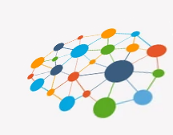

#  The Illusion of Universals

This is the culmination of the last couple of posts all designed to support this one to show that universals are not existing.  We don’t actually need to them to explain anything, and there are serious problems with universals anyway.  

:::tip[Key Takeaway]

Universals form the foundation of how we think about the world, but they are ultimately illusions brought on by the way we perceive the world, existing only in the mind of the observer.

:::

## TL;DR

Our perceptual system present to us a world full of objects from recognized classes.  We perceive those objects directly, and interact with them.  We predict their behavior because of past experience with the class.

Because of the way the perceptual system works, we feel as if we perceive object classes directly.  An apple is an apple, and it feels to us like it has a special essence of apple.  That essence is just the features we know about an apple: it is small, red, round, hard, and smells sweet.

We learn about the world by learning the features of classes of things.   When we see enough features such that an object could only be from one class, we recognize the object as being that class.  It is presented directly to us, and what we know about the class is activated together with it.

Perception decodes the objects subconsciously.  We are not aware of how we map features to classes. This makes object classes to just appear in the world.  See two identical particulars, and they appear to “have something in common.”  The same neural frame is activated for both, but in the act of perceiving, the associations of the frames in the mind appear projected out onto the object in the real world.   This produces the illusion of universals.   It looks like the two objects out there actually have something part that is the same between them, but what is really happening is that the same frame in your head is being activated for both.   The sameness is in your head.

## Background

Background material from prior blog posts:

*   [Classes and Perceptions](https://meta.purplehillsbooks.com/2022/03/14/classes-and-perceptions/) gives background to understand how perception works at a basic level.  We need to understand how thinking works.
*   [What is a Universal?](https://meta.purplehillsbooks.com/2022/02/27/what-are-universals/) explains some necessary background on what a universal is and how some philosopher feel they are real.
*   [What is Nominalism?](https://meta.purplehillsbooks.com/2022/03/13/what-is-nominalism/) explains the basics of the philosophical position against universal realism.

## Ancient Mistakes

It is clear to me that ancient Greeks and in fact most people up to very recently had such a naive view of how perceptions works that they felt there must be a real universal abstract object operating in order that two things might be similar.  Ancient Greeks thought that thoughts were visitations from the thing itself.   Plato felt that when you see a tree, your mind reaches out into the realm of forms, and actually touches the platonic pure form of a tree.   This mental reach into forms is how you know it is a tree rather than say a fish or a cow.

Sympathetically, I know the feeling of why they thought this.  When you look at a tree, there appears to be something distinct about a tree.  It appears to have some essence that separates it from the things that are not trees.  It is not just a shape that mimics a tree.  It appears to actually _**BE**_ a tree.  One seems to experience the treeness directly.

## What is Really Happening

That is because everything we know, and everything that we can think, is represented in the brain as frames of neurons.  A frame can represent a real thing, imaginary thing, or anything in between.

When we know about a certain class of object, that knowledge is represented as connections between frames.  See an apple, and the word “apple” appears in the brain.  That is because the frame that represents apple is connected to the frame that knows how to pronounce the word “apple”.   If someone mentions apple to you, you immediately see an round, red image of an apple, and maybe even you think of the sweet smell.   Again, hearing the word “apple” spoken activated the frame for that, which activated the apple frame, which activated the red frame, the round-shape frame, and the sweet smell frame.

The rules that identify an apple are coded directly into the connections of your neurons.  When the sensory system identifies features, like small, round, red the presence of the connections between these frames acts like a rule that identifies the apple.  Because you have learned the features of an apple, those features allow you to see an apple when it is in front of you.  This classification of objects, this recognition of the classes, happens subconsciously.   We just instantly “see” an apple with no effort at all in recognizing it.

Consider what is happening when you read this.  You eyes see light and park patches.  This is decoded into colors and edges.   The edges are used to detect shapes.  The shapes are identified as being certain letters.  The combinations of letters together form words.  The recognition of a word causes the frame for that word to be activated, and it will activate other frames around it.   Some words depend on words around them for meaning, and so that frames are connected in way that enhance or suppress each other.  Associated with the frame the word is other details that you know about the concept: the smell of an apple, the color, etc.   All of this is happening 20 to 50 times a second.  And what you receive is a flow of concepts represented as a stream of frames that are activated in the pattern of a story.

## Information Science

It is amazing how the perceptual system works, and we have a huge advantage over the ancients:   information technology is barely 100 years old.  People like Claude Shannon, Allan Turing, Kurt Godel, Von Neumann, and many more have shaped our understanding far beyond what existed before.

We now have computers that can look at a picture and recognize things.  We have machines that learn.  You set up a neural network, and you simply train the system on what you want it to recognize.  We know how this works, and we also know that the brain works pretty much the same way.

Therefor it is no longer a mystery about how we recognize an apple.  It is not because there is a universal apple with the essence of apple in it, that we somehow see through the particular apple.  Computer vision recognizes features, and because of its memory of what features belong to what object classes, it can easily recognize an object for what it is.  We know for a fact that no universal is needed for this.   It is not a big stretch at all to suggest that the brain is doing the same thing.

## Nominalism and Conceptualism

Nominalism is the idea that all we actually have for classes is a name.   Thus we name the class “apple” and we recognize the apple, but there is no universal abstract apple.  The name “apple” is just used when we see enough features that we recognize an apple.  Of course, nominalism gives the class a name, but there are also other things we know about a class, such as its color and smell.  I don’t think nominalism denies that we can know these things, but somehow conceptualism is treated as a different category.

Conceptualism is nominalism but with the idea that there is a concept in the brain.  That concept might be a universal.  If you think this concept is a universal, then this is just a form of universal realism where the universal is in the brain.  If the concept is just referring to all the things we know about a class, such as an apple being small, round, red and hard, then seems reasonable.  It is reasonable to say that the frame in the brain that represents apple is pretty much the same thing as a concept, but keep in mind that my concept in my brain is a different thing from your concept for apple in your brain.

## Consistency

The question always comes: how do we know that your concept for apple matches my concept for apple.   Well, it is obvious isn’t it?   I point to an apple and say “would you like that apple” and either you agree that you see an apple, or you raise a question.   “No, that is a pear” you say.   We might then get into a discussion about what is an apple, and what is a pear.  It is discussions like these that allow us to learn the proper names for things.

Learning about a class means simply that we learn the features that are associated with that class.  For example, most pears have a shape different from an apple that we might not have been aware of.   Once it is pointed out, and once we learn to distinguish the shape, once our frames are wired appropriately, we will have the same concept for the class.  This is what it means to learn.

It happens all the time that people have different meanings for things.  I am reminded of Crocodile Dundee facing some street hoodlums saying: “Oh you think that is a knife?   THIS is a knife.”   Of course, people with different backgrounds will have differences in what they know about a topic, and what they think about it.  Yet we communicate with what common meaning we have.   At some level, we have a common experience, that gives us frames that are wired similarly, and that allows us to communicate.

## Problems with Universal Realism

The most well known problem with thinking that universals are real is known as the Third Man Argument.   If you have a set of all things that are red, you then also have the universal for red which is the essence of red itself.  Thus it should be included in the set of all red things, but this makes a new set, and requires a new universal.  That can be included in the set and so on ad infinitum.

The main argument against universals being real is that of Ockham’s Razor: we simply don’t need them.  All other things being equal, the fewer types or kinds of entities in one’s ontology, the better.   We should only believe in something if there is a clear need to believe in them.

## Summary

Once you understand neural frames, once you understand how we think and remember things, it become easy to understand that perception, and classification of the objects around us, work simply by associating features with classes.  The rules to recognize a class are wired directly into the connections between neurons.  We can easily recognize particulars of a class.

The universal as a real entity is unnecessary.  It provides no additional explanation.  Perception alone can explain our ability to recognize sameness in two things, because we can categorize them into the same class based on their features.   As Ockham’s Razor persuades us, we should choose the theory with the fewest assumptions, and assuming that there is a universal is simply unnecessary.   Universal explain nothing, and so there is no reason to believe they have any ontological being at all.

_**What we see is just the illusion of universals.**_

## Questions?
