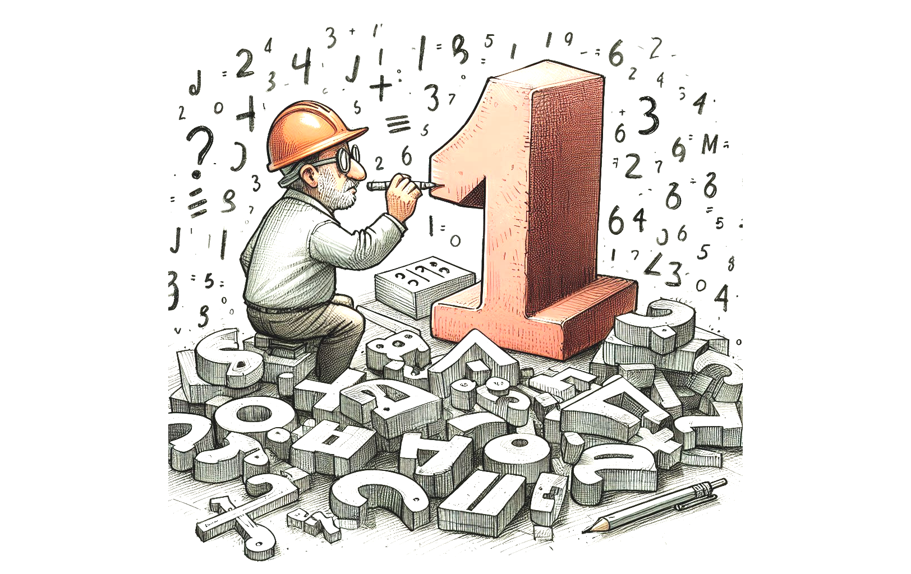

#  Numbers were Invented

Here I will deal with the metaphysical disposition of abstract objects using numbers as an example, and I will show that numbers do not exist for any meaning of existence. What does happen is a little trickier, but perfectly logical.

Consider the number 2. What is it? The number two is simply one more than one. It is defined as `1 + 1`. Every number is defined as one more than the number that precedes it. Starting with 1, we can then define every number by repeatedly adding one to whatever we got before.

The number does not materially exist. The numeral “2” and the word “two” are symbols that represent and refer to the number, but the number does not exist in any way. The only thing that exists is the _definition of the number_. The definition is a rule that tells you how it differs from the other numbers. Two is a number that is one more than one. Three is a number that is one more than two. And so on.

There is no actual thing that is a two. We can talk about two, and we seem to be referring to an object, but this is a trick of the mind. We can have words which are symbols for things that do not exist. Harry Potter and Spiderman for example are names for people _who do not exist_. These names are symbols, just like all other words. All words are metaphors in that they are something that stands for something else.

## Universals

The word “tree” stands for the concept of a tree. The concept is a set of rules that allows you to classify things around you as either tree or not tree. Some trees fit easily into the classification, like a pine tree, or a sycamore tree. We delight at finding things at the boundary of the set, that is things that satisfy some of the rules but not all of them. Is a seedling a tree? Is a banzai a tree? Is a giant kelp a tree? Arguing whether these are trees is one way we refine the rule set that defines tree. Our discussion about what is and is not a tree helps to bring the rules that I have more in line with the rules you have for tree. I can “learn” from an arborist what is and is not a tree, and that learning consists in the end of refining the rule I have to recognize a tree.

For a number, we have names for the (smaller) numbers. This name is a symbol for something that does not exist. But what does exist is the rule that define the number. When I say “two” or “zwei” or “dos” anyone who understands me understands that this symbol is referring to the number that is “one more than one.” _That is all there is for 2._ Really. It is just a rule that defines how to find the number.

Numbers are universals. A universal is a concept that is well enough known that is has its own name. A universal is a concept that can and will be shared between people. A universal is a concept that usually describes a quality of something. For example, standing in front of a real tree, because it fits the rules you have for tree, you say that it is “a” tree. An instance of a tree. “Treeness” is the universal quality which the real instance has. Remember, tree and treeness do not exist as objects, but they have names and our minds treat them like objects.

It seems that not all abstract objects are universals. Harry Potter and Spiderman for instance are not universals, but instead these seem to be singleton abstract objects. We never expect to run into an instance of Harry Potter, although we might run into someone dressed like or appearing like Harry Potter.

## Realists and Nominalists

The “realist” believes that universals are real objects some place. To be clear, they don’t believe they are material objects, nor that they exist at some place in the material universe, but they do exist _somewhere_. Plato suggests a special realm, the realm of forms, where the universals exist. Descartes believes that universals exist as objects in the Res Cogitans.  The realist believes that the universal has to exist some place, because you are talking about something, and so there has to be something about which you are talking.  The only evidence for abstract objects existing is the belief that a symbol has to be about _something_.

The “nominalist” says that the universal, which is an abstract object, does not exist in any form of existence. The numeral “2” and the word “two” (along with the sound you make when you pronounce this) are symbols to represent two, but the thing that they represent, the 2, does not exist.

It does seem kind of amazing that multiple people can have the same idea in their heads, a symbol for something that does not exist, and more curiously, the symbol represents the “same” thing that does not exist. If it does not exist, how can multiple people refer to it?  how can we be sure they are not referring to different things if they don’t exist?  The answer quite simply is that along with the name, we store rules for identifying a thing. We have the definition of 2: one more than one. That rule is “real” in that symbols are real: a rule is a concrete set of symbols with relationships between them. Representing relationship is what the brain does, and it does it with symbols, those symbols can stand for real or imaginary things.

So when I say the word “two” to you, you recognize the sound and activate the neuron that is a symbol for two. These symbols will be associated with many things. One association is with the definition: one more than one. You learned this when you were taught to count: 1, 2, 3, 4, … by learning the order, you learned that 2 is one more than one, and you learned that 3 is one more than 2, etc.

## Necessity

It turns out that even though they don’t exist, numbers are necessary. There absolutely must be a number that is one more than one. In fact, there must be a number that is one more than ANY number. These abstract numbers are necessary, but they don’t exist. They are necessary because I can define them. Give me any number, and I can give you the definition for the number that is one more than it. For any given number, there is a definition, but the number does not exist.  The only thing “there” is the definition.

What about 4 billion years ago? Or what about at the big bang? Did numbers exist?  No they didn’t, because numbers never exist. What about the definition? There was nobody there to define the number two, however 2 is still necessary. At the big bang, there had to BE a number that was one more than one. Nothing has to “come into existence” for there to be a two according to the definition.  But still, though there were no humans there to define it, the definition of 2 being one more than one is still valid for all time, for all space, and for all universes.

The concept of two can not be defined as anything other than one more than one. That is, for example, it can not be one more than four. Because that is not two.  Nobody has to make sure that 2 is not one more than 4, it simply is a truth that falls out of the definition.

Of course, there can be multiple definitions, for example: two is the first even number; it is one less than three; it is half of four.  These aren’t really distinct definitions since you can use logic to translate between them. All of these definitions are _equivalent_, and it does not matter which you have internalized. Two people can have different definitions for the same concept as long as the definition — the rule — identifies all the same real world things.

What if every human died, and every recorded instance of “2” and “two” were erased, would this cause the number two to disappear? No, because it never existed in the first place, it can’t disappear. A number is just the definition of that number. All the instances of a definition can be deleted, but there is always the possibility for that definition, and the number that it represents is a necessary abstract object even though it does not exist.

If two different people on two different planets make a symbol that represents “one more than one” how can we know that they are referring to the same abstract object 2?  Because the definitions are the same.   
`1 + 1`

Two independent people who hit upon the same definition for any reason are necessarily referring to the same necessary abstract object (which does not exist).  If the definition is the same, then the universal abstract object is the same, because there is nothing more to an abstract object than the definition.

The perfect circle does not exist, but we have a definition of it. I can explain the definition to you, and you can relate this to the word “circle.” Then we can talk about circles. We can learn what circular things look like, and how to recognize them. But the abstract circle object does not exist. Not anywhere. Not anytime. We simply associate the word with a definition, and the definition — as a relationship of symbols — exists as that: a relationship between other combinations of symbols.

## Symbols

Symbols exist. A word is a symbol. We have locations in our brain that are symbols and those symbols become part of our thoughts when activated. We create in the brain associations between symbols. That forms our model of the world. We talk about these models by using symbols. We have symbols for symbols: e.g. the word “word”.  There are literally patterns of neural firings that act as symbols and represent things.   Those patterns can be associated in the brain with other patterns that represent other things.  _Thus, literally, the brain is a map of associations between symbols._  All human behavior can be explained as outcomes from these patterns of symbols, some symbols representing real object, and some represent abstract objects that don’t exist.

Given this understand of how we think, how we talk, I just can’t understand why a realist believes that a universal has to _exist some place_. Well, I can because the mind realizes abstract objects AS IF they were real object.   We treat the symbols of real things the same way we treat symbols of fictional things.   This similarity creates an illusion that abstract objects must be real.   Yet the story about symbols and their manipulation explain everything in our common experience. Nobody as ever located or proven that universals exist any place.  No evidence of a place for these universals has been found.   There is no proof for them, and no real evidence.  Just the “illusion” that they must exist.

Christians have long claimed that universals exist because God exists. (slightly circular there)  William of Ockham — a very pious Christian I might add —  was credited with creating nominalism.  Theistic philosophers have pilloried him for centuries. Some Christians call nominalism the _worst idea in all history_.\[[1](http://medievalmind.blogspot.com/2017/05/nominalism-worst-idea-ever.html),[2](https://www.patheos.com/blogs/rogereolson/2017/05/worst-idea-ever/),[3](https://en.wikipedia.org/wiki/Ideas_Have_Consequences)\] This is apparently a very emotional issue. I am hoping to find someone who can explain the reason they believe in realism without getting emotional.  Since the explanation that symbols are associated with definitions is enough to explain all of human behavior, there is no reason to propose that there is a magic realm (i.e. God’s mind) where abstract objects exist.  Using Occam’s Razor: there is no need to propose that universal are real since the world is perfectly well explained by a simpler explanation.

## Representation in the Brain

Consider the expression: "2 + 2"

There is a concept of a 2, and a concept of addition.  Those concepts are realized as real places in the brain.  

For example, the concept of [Jennifer Aniston](https://www.ynetnews.com/health_science/article/b1v5hrv0c) is represented as a pattern of connections in the brain.  Concepts are not always a single neuron, and instead a pattern, but for ease of discussion lets call it a neuron.  When that neuron is activated, you can be said to be thinking of Jennifer Aniston. This nerve functions as symbol that represents the actress.

All concepts then are nerves that act as symbols that represent things.  Your car, your house, your dog, etc.  Connections between these symbols in the brain allow you to associate things:  your dog nerve is connected to your house nerve, so when you think of your dog for any reason, there is a chance you will be reminded of the house.  So concepts can be associated.

Language then works by creating language level symbols (think: words) which refer to the concepts.  Once again these symbol appear as patterns in the brain.  The eyes see the printed numeral 2, and the circuitry that "recognizes" the 2 is connected to the nerve that represents the concept of 2.  Therefor when you see a numeral 2, it activates the nerve that represents the concept of 2.  Similarly for the written word "two" and for spoken equivalent.  The language level symbols refer to the concept level symbol.

What is special about the concept 2 is that it is a symbol, but there NOTHING that it refers to.  It simply exists as a concept in the brain.  

Traditionally any symbol has two parts, the "name" and the "object it refers to".  The idea that you can have a symbol, and the object is points to is null -- there is no object it refers to.  It is a symbol in name only.  That is why this is called "nominalism."

So numbers are concepts, and all concepts are symbols, but the numbers are symbols that have no object they refer to.  There are lots of such things: fictional characters (Harry Potter), the price of something ($4.99), an honorific title (Meistro), etc.

The concept of 2 is a symbol with the name part only, but that is all you need.  The name part gives us something to hang other properties on.  For example 2 is one more than 1 is a property we "know" about the concept 2.  We know that if we add 1+3 we get 5, yet another symbol which does not point to anything.  Mathematics is then the a large collection of these symbols, along with some elaborate rules around how they relate to each other.

Furthermore, the symbols allow us to talk to each other about the concepts.  I can ask you "What is 2+2?" and that is a meaningful question, even though 2 does not actually exist.

There is no need for an actual 2 that exist in the world.  It is ONLY in your head.

## Summary

I remain convinced that numbers were invented.  Symbols exist.  Definitions exist; they are a set of symbols related by their associations.  This map of symbols and their associations are realized in the brain.  Some symbols represent real objects, and some represent abstract objects that do not exist.  One person can teach another about an abstract object by explaining its definition.  The association of a symbol with the definition is all you need in order to discuss the abstract object that does not exist.  This explains some important human behavior.

------------------------------------------

## Resources

*   [What do you mean numbers don’t exist?!](https://blogs.glowscotland.org.uk/glowblogs/cznewtonuodep/2018/10/08/what-do-you-mean-numbers-dont-exist/) – Blog post from Chloe Newton – Apparently, numbers do not exist. My mind is still trying to process how such a concept could even be possible after believing all my life that numbers are the fundamental basis of mathematics. After much time pondering and challenging this, it appears to be true…
*   Collins, A.W. (1998) [On the Question ‘Do Numbers Exist?’](https://www.jstor.org/stable/2660370?seq=1#page_scan_tab_contents), The Philosophical Quarterly, 48 (190), pp. 23-36
*   Fine, K (2009) The question of ontology, Metametaphysics: New Essays on the Foundations of Ontology, pp. 157-177.
*   [Do Numbers Exist?](https://www.welovephilosophy.com/2012/12/17/do-numbers-exist/) – Blog post by Alec – If you’re a nominalist, you’d probably answer “no, numbers do not exist”. However, now you have the unenviable job of explaining why mathematics seems so indispensable to science, while science is perhaps our best tool for saying which things exist. The two best nominalist answers to this conundrum seem untenable.

## Counterpoint: Mathematical Platonists

Famous mathematical Platonists—those who believe that mathematical entities exist independently of human minds and are discovered rather than invented—include:

 1. Plato: The ancient Greek philosopher who first articulated the idea that abstract forms, including mathematical objects, exist in a timeless realm of Forms or Ideas.

 2. René Descartes: Though not exclusively a mathematical Platonist, Descartes held views that supported the existence of mathematical truths independent of human thought.

 3. Gottlob Frege: A pioneer in logic and the philosophy of mathematics, Frege believed numbers and other mathematical entities had an objective, abstract existence.

 4. Kurt Gödel: Known for his incompleteness theorems, Gödel was a strong advocate of Platonism, suggesting that mathematical truths are discovered in an objective reality beyond physical space.

 5. Roger Penrose: A contemporary mathematical physicist, Penrose argues for the objective existence of mathematical objects and suggests that mathematics exists in a Platonic realm that we can access through intuition and reasoning.

 6. W. V. O. Quine: Although his views evolved, Quine defended a kind of Platonism for mathematical entities, suggesting that they must exist objectively because of their indispensability to scientific theories.

 7. Alonzo Church: Known for his work in logic and the lambda calculus, Church held views consistent with Platonism, especially regarding abstract logical and mathematical structures.

 8. Ian Hacking: A philosopher of science, Hacking supported a form of Platonism concerning mathematical structures and their role in explaining the physical world.

These figures contributed significantly to the development and defense of mathematical Platonism, each with their own nuances and reasons for believing in the independent existence of mathematical entities.  I include them here for reference, however their arguments have not convinced me.

## Questions for Platonists

* If Platonism were true, what empirical consequences should we expect? 
* What would distinguish a universe where Platonism is true from one where it isn’t? 
* If mathematical truths exist independently of cognition, why does mathematics track human perception so precisely? Wouldn’t we expect at least some divergence? 
* If you require empirical evidence to refute Platonism, you should also require empirical evidence to support it. 
* If mathematical objects exist independently of minds, how do minds access them? 
* If mathematical truths are “discovered” rather than “constructed,” what is the mechanism of access? 
* Do human beings have an innate cognitive faculty that allows them to perceive a realm of mathematical objects? If so, what is the evidence for such a faculty? This is the Achilles’ heel of Platonism. If mathematical objects exist in a non-physical, non-mental realm, and we somehow “perceive” them, then you’re positing an unexplained cognitive ability. Without an account of how mathematical knowledge is accessed, Platonism remains an assertion, not an explanation. If you reject Platonism as an empirical claim but insist it is epistemically necessary, then you owe an account of how that knowledge gets into minds.
* How does it function in beings with different cognitive architectures? 
* The argument that mathematical truths are universal suggests mind-independence. But this assumes objectivity must mean ontological realism. Why does the objectivity of mathematics imply mind-independence rather than structural inevitability? 
* Could mathematics instead emerge from cognitive and environmental constraints, meaning a necessary structural reality rather than an independent metaphysical one? 
* Consider the analogy of language structure. Human languages have objective rules (grammar, syntax) but are still species-specific constructs. Could mathematics function similarly, as an emergent, convergent system that reflects our interactions with reality rather than an external platonic realm? If you reject this possibility, you need to explain why objectivity necessarily entails external existence rather than arising from deep cognitive and structural constraints.
*  If Platonism is merely an explanatory preference, why treat it as ontologically necessary?

## Questions and Answers

> Because they were invented does that mean numbers are not real?

I struggled to find the right word to describe the ontological status of these things.  I want to say that numbers _do not exist_ because they have no presence in our material world.  This hinges on the meaning of _existence_ and the question of whether "the dollar" or "The city of New York" exists or not.  We have a shared agreement about these things, so I find it hard to agree with the phrase "New York does not exist."  

The same struggle was around calling them _real_ or not.  Money acts and we talk about it as if it was real, even though it has no material existence.  So does the word "real" refer to both things with a material existence and those without that.

Things like pain are real, even pain is not represented in a physical form. (The nerves and the signals behind pain are materially existing, but the sensation appear to be separate from that.)  So I settled on "being invented" as the distinction between those and things that are naturally existing materially.  It is not perfect.  Need another word, I think.

> Who cares whether numbers are invented or not?

The reason I think this is important is because it changes the way we think about it.  We know we can think about imaginary things, somehow we do this without any real examples.  We can talk about Spiderman.  We have seen pictures of Spiderman, but there is no real existing Spiderman.  How do we accomplish this?  Because associated with the symbol-tokens we keep facts about that token that both allow for identifying other copies of the symbol-token and also for important properties about them.  This says something important about the way the brain works.

> Do symbols really exist in the brain?

There is plenty of evidence that real-world objects are symbolized as specific location in the brain:  [https://www.sciencedirect.com/science/article/abs/pii/S0303264701001083](https://www.sciencedirect.com/science/article/abs/pii/S0303264701001083)

Another experiment has been done is activating specific neurons, and the people report having specific memories occur to them.  (During brain surgery the patient is awake and you can talk to them.)  This was 15 years ago, and more brain research happened in the last 15 years than all of history before that.

> Can we see these symbols in the brain?  Can we look and know what they mean?

Nobody has equipment to “extract” this semantics of the symbols because you would have to be sensitive to the individual neuron level.   One neuron might symbolize Brad Pitt, and the next neuron over might symbolize Tsar Peter the Great, or the Spanish Revolution.  Because it is a network.  The location does not matter at all, only the connections matter.  All FMRI equipment so far is sensitive only to regions of the brain, and indeed there is no semantics at that level.  (I find it frustrating when people talk about “brain states” and then somehow equate this to FMRI scans — FMRI does not actually show any meaningful states of your current thinking.)

> Say that Bob has a symbol: CSGFS.   Sam has a symbol: HFHHG.   Do they refer to the same or different things? How would you ever begin to answer without going beyond the symbols themselves to that which they represent?

If they are symbols for something real, then we see if they both point to the same real thing.

If the symbols are for something abstract, then there is a definition. The definition for “five” is “one more than four”. if the definitions are the same, then the symbol is representing the same abstract thing. We can do this because we don’t need to consider context: they are universal. Thus my “one more than four” has to be the same abstract object as your “one more than four”. Note that we don’t need any instance of 5 to make this happen.

> Bob has 3 symbols: SSDSD, FFGDD, HDTHF and Bob thinks that all 3 of these belong to type BGFDY. What is it that makes it true or false that this is the case?

Again, we look at the definition. An abstract objects MUST have a definition. (Can anyone think of one that does not?)

> It’s not even in principle possible to simply take a symbol and understand its meaning without introducing a mind to bridge the gap.  I’ll refer you to: https://en.wikipedia.org/wiki/Indeterminacy\_of\_translation

I am sure I need to read more on “Indeterminacy of translation”, but on quick glance it looks compatible to what I am suggesting.

I tend to get confused between Tom Selleck and Burt Reynolds, and I suspect the same neurons are used in remembering them, although there is some slight difference.  They both have mustaches.  There is another nerve pattern that represents “mustacheness”.  For the outside, we can NEVER KNOW what a particular nerve means!  The individual nerve could mean anything, but it is connected into a network of nerves that gets activated when I see a mustache.  This is the same with words.   There is no definite preassigned meaning to a nerve, however meaning does fall out of the entire network.  The nerve pattern that represents having a mustache is normal nerves just like any other.  What is special about it, is that pattern is connected to sensory circuitry that happens to pick out mustacheness.  And that network happens also to be connected to the nerves that symbolize Tom Selleck and Burt Reynolds.  The meaning only comes from the connections, and you would have to follow the complete operational patterns to figure that out.

However, your meanings ARE the pattern of connections.   Think of it as “repeatability”.   I have no idea what nerves motivate me to feed the dog, but I don’t need to.  When the dog starts whining, there are nerves that recognize that, which are connected to nerves that track dog feeding (when I last fed, where the food is, etc), that ultimately connect to nerves that move the muscles that make it happen.  Look at the nerves, and there is no encoding of meaning other than these connections.

There are no absolute meanings of any nerve (or word) only associations.  But again, the purpose of the brain is to produce appropriate responses to sensory input, and these are learned by trial and error.  The brain only has to repeat successful patterns, and “meaning” emerges.

> Also, when you say “pattern of neurons” – what makes it a pattern? If there is a pattern for Dog and a pattern for Cat, they are different patterns, but what makes it the case that both the patterns are patterns? Why isn’t one a pattern and the other a not-pattern, whatever that is?

The only thing that matters is if the pattern is connected to something else. Let’s say that Tom Selleck is represented by the mustache pattern at 90% and the thin person pattern at 50%. Bert Reynolds on the other hand is 90% mustache and only 40% thin. Obviously in reality there is a lot more, but just for discussion. The follow on circuitry that calls up the name can be sensitive to these partial patterns. Thus the Bert Reynolds response is not triggered by 50% thin, but it is for 40% thin. The only meaning is the input routes that activate the pattern, and the output routes that are triggered by the pattern. I am just trying to say that there is no binary “Bert Reynolds” neuron and there need not be since triggering can be sensitive to partial activation of groups. I get confused between them because the patterns are not quite distinct enough to always get it right. I am not a big fan of either, so that is “good enough” but if I did, say, work with one of them, the pattern of neurons would adjust to be distinct enough so I would not make any mistakes.

Think about how you learn this. The first movie with one of them you just see a dark mustached man. You have probably seen many movies with dark mustached men, so you recognize it as such. But then so a few more scenes and start to notice something distinct. What does that mean? I means that the pattern that is invoked by seeing the actor is changing and becoming distinct from the earlier pattern. Pretty soon there is a patter that is distinct and fires ONLY for Tom or Bert. They look the same to you. But if you watch enough movies, you will “notice” a difference between them. This means that the patterns for Tom is shifting slightly, and the follow on circuitry is being wired so that different things happen when you see the two different actors.

Patterns of neurons solve two problems. The first is that you would not have enough neurons to represent everything. The second is that “learning” can be incremental. If you had exactly one neuron for all mustached men, and then later separate neurons for Tom and Burt, there is a quantum change that has to happen to spread from one neuron into two. That quantum leap can not be done incrementally. But neuron patterns allow for gradual, incremental learning.

> We are just arguing about definitions anyway, which is a waste of time if you are interested in philosophy.

It is important to know the common meanings of a word if we are going to communicate, so definitions is certainly not a waste of time. But I have a deeper purpose to this line of discussion. There is a funny idea out there that suggests that in order for us to understand each other, there has to be a singleton object somewhere, otherwise we can’t be talking about the same thing. That is, there has to be a singleton “thing” of which we are speaking.

For example, a **tree**. I look at a tree and then another. I recognize them both as trees. I think it is obvious that interior to me, I have to have a singleton concept for “tree” which unifies my perception of tree. What about when you see those trees (or other trees) what happens then? The funny theory suggests that there must be, in some form, a singleton abstract object somewhere or someplace. The theory goes: if I have an abstract object for tree, and you have a different abstract object for tree, then we mean different things, and we can’t possibly communicate. We are talking about different things. I reject this idea.

Instead, I have a symbol for tree, and you have a symbol for tree. There is also the word “tree” both written and pronounced and these are both symbols as well. These are all token, and there is no type. The symbol is a collecting point for knowledge, which is itself collections of symbols. All we really have is symbols associated/connected in complex ways with other symbols. (Curiously, there is no real difference between the way any symbol exists in the mind. The symbols for bird, tree, or octopus are realized the same way; the difference lies ONLY in the connections to/from that symbol to other symbols.)

This appears obvious in some cases. Consider talking to a friend across the country about “bad weather”. Bad weather in New York right now is freezing rain. Here one might consider a foggy morning bad weather. We can talk on the phone about how the weather has been good or bad here, and have an intelligible conversation even though our meanings are entirely different.

In other cases it is harder to see. For example, we both have a symbol for “beauty” but it is quite likely that the meaning of beauty is different between us. There will be some common aspects of course, but also different ones, and one might say that is “personal taste” however what I am going to suggest is that EVERY symbol suffers from the same problem.

To this, many people object saying that if every symbol is different for every person it would be impossible to communication. The answer is, of course, that communications does NOT rely on having the exact same meaning for symbols, but in fact is far more forgiving that you might expect. This is the crux of the matter.

One day I was discussing a particular tree with a friend, and she looked at me surprised and said “that is not a tree, that is a bush.” It was about 30 ft tall, so in my book it was a tree. Here we had existed all our lives with different definitions of “tree” but really did not get in the way of conversation.

Along with our symbols, we remember some specific details about what other people mean by a symbol, and we will use that in communicating. If we had delved into the topic, she might have explained the difference, and I might have changed what I associate with my tree symbol. We didn’t take the time, but now, if I ever get onto the topic of trees with her, I will remember to be careful about the use of the word “tree” because I know she has some difference of meaning.

We can still talk about abstract objects, because symbols must be ABOUT something. Sometimes they are about real things, but sometimes they are about abstract objects. I believe that abstract objects don’t exist and they aren’t real and in fact they are not singletons either.

I carry this same idea to numbers. There is no number 2. Anywhere. I have a symbol for 2, and you have a symbol for 2, and there is the numeral 2, and the spoken and written word “two” however there is no real object that gives these meanings. My symbol for two MIGHT represent a different meaning from your symbol two. There is no realistic concern that we have different meanings for two, because the concept is simple and extremely well defined, so our meanings will be the same. Because they have a formal definition and that definition causes them to be the same meaning. But there is nothing that forces the symbol that I have to have the same meaning and the symbol you have.

> Exchange on Symbols

We agree that the stop sign itself (the one standing on a corner closest to your home) is a symbol token.  There are hundreds of these symbol tokens spread around your town.  You say also that there is a real symbol type.  You said that in order for them to be “similar” and in order to recognize them there has to be a symbol-type.   (You said “re-cognize” to emphasize that this is about repetition.)

_Any time you spoke of symbols being recognized or repeated, you had to mean symbol-type. Tokens are never repeated, and so never re-cognized._

I would say that I can recognize them by simply noting their features (octagonal sign, red color, word “STOP” on the front) and without any need for an abstract symbol-type.  To this you said:

_So, you think. But there is no “them” without it. There isn’t similarity without it. In fact, similarity alone would not explain repeated recognition because it cannot account for mistaken recognitions._

I pressed this concept on a long number giving a symbol-token and claiming that I don’t need an abstract symbol type at all.   You admitted that I could do math without knowing they are there, but in fact:

_My claim is that they are there, figuratively speaking, and that accounting for what you do practically cannot be done without them. It’s a meta-necessity._

I am trying to understand the nature of this necessity.  I admit that there could be an imaginary number 12.  We both imagine it, and can talk about it.  If there is a 12 and then another 12 in a sentence, I can recognize this without needing a real abstract number 12 that is really there.  You have made clear that that is not good enough.  “Harry Potter” is not real, however the number 12 is real, and there must be there in order to recognize it.  Did I get everything right so far?

Here is my point:  if you insist that to recognize 12 and 12 in a sentence, there must be a real 12 out there, then what about a sentence that has Harry Potter and another Harry Potter in it?  Does there have to be a real symbol-type for Harry Potter, even though Harry Potter does not exist?   That is, there are real symbol-types for everything, even imaginary things that don’t exist?  How does that work?