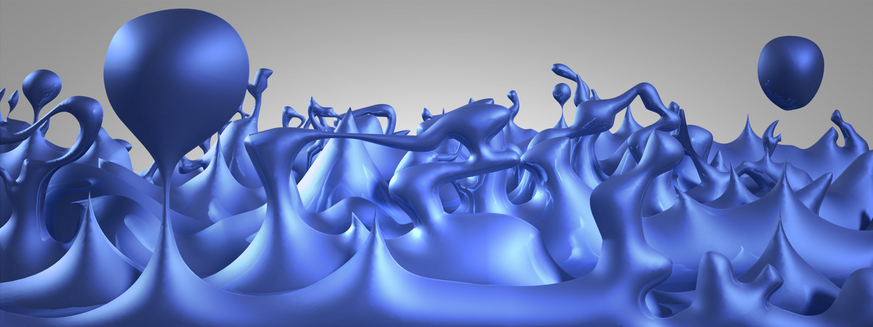

#  Particle Creation without Causation

Many theological debates involve the claim that things simply don’t just pop into existence all on their own. Seems very common sense, but it is wrong. There is ample evidence, both theoretical and experimental that some things really do pop into existence all on their own.

:::tip[Key Takeaway]

The scientific consensus is that virtual particles come into existence without any efficient cause.

:::

## Claims About Causing Existence

The claims are phrased in a number of ways, but in this case we refer explicitly to the Aristotelian notion of efficient cause. Aristotle recognized four different kinds of causes:  The material cause which is stuff something is made from which has to exist, the formal cause which is the design or shape that gives something its unique existence, the final cause which is the cultural setting which brings about things like the things in question.  The fourth is the efficient cause which is summarized in the Stanford Encyclopedia of Philosophy as “[the primary source of the change or rest](https://plato.stanford.edu/entries/aristotle-causality/).”  The efficient cause comes from something that can act on the thing in question, and causes the result through that action.  So for the efficient cause, you need to have something there which is doing the acting. My apologist friend claims that it is a general, scientifically accepted principle that:

*   **Nothing comes into existence without having an** _**efficient**_ **cause.**

This blog post is to provide a counter example of a few things that appear without any efficient cause, that is, without any external thing acting and causing them, in order to show that this statement is false in at least some cases.  Not only can we find some spurious cases, but instead we will consider only cases that are in fact the current scientific consensus. The term “spontaneous” means exactly this: “[developing or occurring without apparent external influence, force, cause, or treatment](https://www.merriam-webster.com/dictionary/spontaneous).” A spontaneous event is an event that happens all on its own, possibly with an internal cause, but without any external cause.

## One Spontaneous Example is Enough

While there are many potential counter examples to disprove that “**Nothing comes into existence without having an** _**efficient**_ **cause,**” we only need one. A single example, no matter how small, of something spontaneous will be enough to show that there is no general principle that everything has an efficient cause. We need to find only one thing that appears without any prior event that could be used to stop the appearance of the thing in question.  The simplest, clearest example is production of virtual particles.

## Virtual Particles

Virtual particles are a necessary prediction of quantum mechanics, and there is ample experimental evidence. There is a broad consensus across physics that virtual particles are real and are a part of everyday experience.

Virtual particles appear for a very short amount of time, but they exist for long enough to interact with other particles. The trace of these virtual particles can be easily seen on particle detectors. They appear generally in pairs so it is referred to as _pair production_. A particle and its antiparticle will materialize out of nothing, and then a fraction of a second later disappear.

For a small amount of time, they actually violate conservation of energy. Heisenberg proposed that such violations would exist because the precision that you can know how much energy there is depends on how long you claim it exists. As you start looking at smaller and smaller time spans, the amount of error in how much energy is there grows larger. The problem is that zero is a very precise quantity, and so you simply can not find exactly zero energy for very short amounts of time, and the Heisenberg uncertainty principle says that the energy can be nonzero at any point of time.

The particles usually disappear, but they occasionally last for much longer. Hawking radiation is an example of this. Virtual particles will materialize very close to the event horizon of a black hole. One particle streams away from the black hole, while the other is captured. Since the antiparticle is missing, it is not possible for the other half to disappear, and so it go on to life a full, happy life as a full fledged particle indistinguishable from any other particle.

It is important to note that this pair production is spontaneous: it is not caused or correlated with anything else in the universe. It simply happens. One moment there is nothing there, and the next there are a pair of particle that materialized out of nothing.  There is no event before this which if prevented would prevent the materialization of the particles!  This is not intuitive at all.  There is nothing in our daily experience that prepares us to understand how the particles simply appear without any cause. It is worth adding that this is not a trick or a technicality.  This is not a play on words.  These virtual particles are not waiting “in another dimension” in order to suddenly transfer into ours.  To the best of our understanding, in a region of space where nothing exists, these particles simply pop into existence from nothing.  Most of them then disappear and go back to being nothing, but in certain situations they escape their fate and exist for a long time as a perfectly normal particle.

Solving the Schrödinger Equation is beyond the scope of this article.  The actual research papers supporting these conclusions require years of study to be able to understand them.  Instead below are listed a number of readily accessible articles written for public consumption explaining the phenomenon according to the general consensus of the scientists in the field.

## How Do We Know This is True?

Many experiments have demonstrated the virtual particles are constantly being created around us:

**Lamb Shift:** The first successful demonstration was measurement of the Lamb Shift in the late 1940s. In a hydrogen atom an electron and a proton are bound together by photons (the quanta of the electromagnetic field). Every photon will spend some time as a virtual electron plus its antiparticle, the virtual positron, since this is allowed by quantum mechanics as described above. The hydrogen atom has two energy levels that coincidentally seem to have the same energy. But when the atom is in one of those levels it interacts differently with the virtual electron and positron than when it is in the other, so their energies _are shifted a tiny bit because of those interactions_.  The Lamb shift was first measured in 1947 by Willis Lamb in the Lamb–Retherford experiment for which a Nobel Prize was eventually awarded.

**The Casimir effect**:  in 1948 Dutch physicist Hendrik Casimir predicted that forces between metal plates would appear in empty space because of the presence of virtual particle. The typical experiment is that of two [uncharged](https://en.wikipedia.org/wiki/Electric_charge "Electric charge") conductive plates in a [vacuum](https://en.wikipedia.org/wiki/Vacuum "Vacuum"), placed a few nanometers apart.  In a [classical](https://en.wikipedia.org/wiki/Classical_electromagnetism "Classical electromagnetism") description there would be no force  measured between them.  In reality the plates do affect the [virtual photons](https://en.wikipedia.org/wiki/Virtual_particle "Virtual particle") which constitute the field, and generate a net force.   See “[The Force of Empty Space](https://physics.aps.org/story/v2/st28)” in _[Physical Review Focus](https://en.wikipedia.org/wiki/Physical_Review_Focus "Physical Review Focus")_, 3 December 1998.  The Casimir effect was measured more accurately in 1997 by Steve K. Lamoreaux of Los Alamos National Laboratory, and by Umar Mohideen and Anushree Roy of the University of California, Riverside.

There are hundreds more experiments big and small which all depend on these virtual particles appearing and disappearing.  It would be impossible to list them all here.

## Other Examples of Spontaneous Creation

A second well understood phenomenon is called spontaneous emission of radiation. The most common example is an atom, where one electron will suddenly and without prompting change the shell it occupies, and create a photon out of nothing and send it on its way. The energy in the photon will exactly equal the difference in the energy of the electron shells.  These two occurrences are tied together (coincident), and you might say that one causes the other, but there is nothing external that causes whichever you think is first.  There is no prior event that could be used to prevent this from happening.

A third case is radioactive decay. Radioactive materials decay at a given rate. What causes a particular nucleus to decay, and emit particles, is considered to be unknowable. It is spontaneous in the purest sense of spontaneous: there is absolutely no prior event which could be stopped in order to prevent the decay. We use radioactive decay as a perfect random number generation because nothing can and nothing does influence the decay of individual atoms.

## References & Articles

I have given three examples of things that happen without a cause. Virtual particles come into existence from nothing and usually disappear back into nothing. I gave to more examples of things that happen without any external cause of the action at all. Now I provide some references and further reading to support this.

*   **[Are virtual particles really constantly popping in and out of existence?](https://www.scientificamerican.com/article/are-virtual-particles-rea/)** – Scientific American, October 9, 2006
    *   ” Virtual particles are indeed real particles. Quantum theory predicts that every particle spends some time as a combination of other particles in all possible ways. These predictions are very well understood and tested.”
    *   “The first test was understood in the late 1940s. In a hydrogen atom an electron and a proton are bound together by photons (the quanta of the electromagnetic field). Every photon will spend some time as a virtual electron plus its antiparticle, the virtual positron, since this is allowed by quantum mechanics as described above. The hydrogen atom has two energy levels that coincidentally seem to have the same energy. But when the atom is in one of those levels it interacts differently with the virtual electron and positron than when it is in the other, so their energies are shifted a tiny bit because of those interactions. That shift was measured by Willis Lamb and the Lamb shift was born, for which a Nobel Prize was eventually awarded.”
    *   “the Casimir effect, where forces between metal plates in empty space are modified by the presence of virtual particles “
    *   ” Thus virtual particles are indeed real and have observable effects that physicists have devised ways of measuring. Their properties and consequences are well established and well understood consequences of quantum mechanics. “
*   [**Virtual Particles – Spontaneous Particle Creation**](https://louisdelmonte.com/virtual-particles-spontaneous-particle-creation/) – First chapter of the book “Unraveling the Universe’s Mysteries” by Louis A Del Monte
    *   “Spontaneous particle creation is the phenomenon of particles appearing from apparently nothing (i.e., a vacuum), hence their name “virtual particles.” However, they appear real, and cause real changes to their environment. “
    *   “However, to the best of science’s knowledge, virtual particles come from empty space.”
*   **[Something from Nothing? A Vacuum Can Yield Flashes of Light](https://www.scientificamerican.com/article/something-from-nothing-vacuum-can-yield-flashes-of-light/)** – Scientific American By Charles Q. Choi on February 12, 2013
    *   “Virtual particles” can become real photons–under the right conditions
    *   “These virtual particles often appear in pairs that near-instantaneously cancel themselves out. Still, before they vanish, they can have very real effects on their surroundings. For instance, photons—packets of light—can pop in and out of a vacuum.”
    *   “Now quantum physicist Pasi Lähteenmäki at Aalto University in Finland and his colleagues reveal that by varying the speed at which light can travel, they can make light appear from nothing. “
*   [**Virtual Particles and Hawking radiation**](https://www.physicsforums.com/threads/virtual-particles-and-hawking-radiation.463479/) – Physics Discussion Forum
    *   “Hawking radiation is caused by virtual particles coming into existence near the event horizon of a black hole.”
*   **[Are virtual particles for real?](https://io9.gizmodo.com/are-virtual-particles-for-real-5731463)** – Gizmodo, Dr. Dave Goldberg – 1/13/11 12:00PM from [A User’s Guide to the Universe: Surviving the Perils of Black Holes, Time Paradoxes, and Quantum Uncertainty](https://www.amazon.com/dp/0470496517?ascsubtag=923629062ba32a5cbce8c449fcfb8d34dabcec7a&linkCode=ogi&psc=1&smid=A2MZI0F3QUENRU&tag=gizmodoamzn-20&th=1)
    *   “One of the most famous measurements supporting the idea that virtual particles really are real is the so-called Casimir Effect. “
    *   “A variant of this may also have happened in the very early universe. In the tiny fraction of a second after the big bang, particles pairs were created constantly. But during the period of “Inflation” (which I’d love to talk about in a future column, if only somebody would ask), the universe exploded in size, and particles which were initially near one another quickly became separated by such huge distances that they couldn’t possibly recombine. These particles, too, went from virtual to real, and are, incidentally, the origin of all structure today.”
*   **[Yes, Virtual Particles Can Have Real, Observable Effects](https://www.forbes.com/sites/startswithabang/2019/07/12/yes-virtual-particles-can-have-real-observable-effects/#636faa58357b)** – Forbes – Science – Ethan Siegel
    *   “Although our intuition is an incredibly useful tool for navigating daily life, developed from a lifetime of experience in our own bodies on Earth, it’s often horrid for providing guidance outside of that realm.”
    *   “Discovering that our Universe was quantum in nature brought with it a lot of un-intuitive consequences.”
    *   “if you apply a strong magnetic field to a space filled with particle/antiparticle pairs, suddenly a real, observable effect arises”
*   [Everything and Nothing: What is Nothing?](https://www.youtube.com/watch?v=rKPv8zApee0) (Jim Al-Khalili) | Science Documentary
    *   At 43:40 to 45:00 is a good depiction of virtual particles.

Also, here are some references for the equally uncaused spontaneous emission of radiation and radioactivity:

*   [Spontaneous emission](https://en.wikipedia.org/wiki/Spontaneous_emission) – Wikipedia
*   **Principle of Spontaneous and Stimulated emission** – Einstein’s Quantum theory of radiation – Chapter: Physics – Photonics and fibre Optics –
    *   ” This process is known as spontaneous emission. Such an emission is random and is independent of incident radiation. “
*   **[Why Does Radioactive Decay Occur?](https://www.thoughtco.com/why-radioactive-decay-occurs-608649)** – By Anne Marie Helmenstine, Ph.D. Updated December 04, 2019
    *   “One final note: Whether any one nucleus undergoes decay or not is a completely random event. The half-life of an isotope is the best prediction for a sufficiently large sample of the elements. It can’t be used to make any sort of prediction on the behavior of one nucleus or a few nuclei.”

A depiction of quantum fluctuations that cause particles to appear out of nothing

## Why Is This So Unbelievable?

Quantum Mechanics does not seem intuitive to anyone. We live and experience the world at the level of millimeters, meters, and kilometers. We can peer out into space, and use instruments to probe very small, but our experience is is almost exclusively about one particular size domain.

The human mind formed around building a model of the world that allows us to survive. Plants and animals are objects that can be treated as distinct things. Things like chairs and tables don’t just pop into existence.

Things happen according to patterns, and we desperately want to know the pattern, so that we can predict what will happen in the future. Predicting what will happen keeps us fed and safe. We survive. If we were not able to make predictions, we would not be here.

It is a mistake to think that our understanding of the world at our level applies to all levels of existence, and that is exactly the flaw in thinking that nothing pops into and out of existence on its own. We are assuming that the QM level is the same as ours. We imagine photons as little balls, much like marbles whizzing through space. It is wrong to do so, but it is a natural limitation of the human mind: we can only imagine things in terms of things we know. Since we really don’t know what an electron is like, since we can’t experience an electron directly, we have to imagine it as something we do know: a marble. But they are not marbles.

## A Long History of Misunderstanding

*   Greek: οὐδὲν ἕξ οὐδενός;
*   Latin: ex nihilo nihil fit.
*   English: out of nothing nothing comes

This matches our experience at our level of existence. Many philosophers have long argued that everything must have a cause. Ancient sheepherders and farmers certainly can be forgiven for not understanding quantum mechanics. Long ago philosophers thought that thinking was a kind of magic power that can magic access to infinite wisdom. The truth for anything was considered to be accessible if you simply thought about it long enough.  As a consequence, there are many many historical arguments given which are based on intuition and common sense, but intuition and common sense are based only on the experience we have at our specific level.  We have no intuition about quantum mechanics, and intuition is an unreliable guide for understanding reality at other levels.  Much of the ancient wisdom from before the age of enlightenment is simply wrong.  The consensus of science has transformed substantially in the last 100 years.

The [Kalam cosmological argument](https://en.wikipedia.org/wiki/Kalam_cosmological_argument) for the existence of God starts with the premise: “Whatever begins to exist has a cause.” Like all [syllogisms](https://en.wikipedia.org/wiki/Syllogism), the first premise must be simply taken as true for the argument to work. Unfortunately, once we realize that there are things that begin to exist without a cause, the entire argument falls apart. The fact is that virtual particle begin to exist without any cause, so we can not make a universal claim that all things are caused. Most annoying is how apologetic groups just keep echoing the same misinformation back and forth to each other, without ever bothering to eliminate the statements that have been shown to be false.  I am quite sure that the apologist who claims everything has a cause will continue to claim that everything has a cause, no matter how much concrete evidence is shown to him.

## Counter:  Universe Causes Virtual Particles

This is the argument that the Christian apologists usually go next. They say that the mere existence of the universe is cause for virtual particles. Ok. Since we have no experience with a complete absence of universe, it is true that we just don’t know if virtual particles would appear if there was not a universe. In fact, nobody has any experience without a universe, so nobody can say anything about what happens when there is no universe.

The mere presence of the universe would never be an efficient cause, because that implies that some action is taken to cause the thing in question.  The universe is universally present, but it does not act on the particular thing as it would have to to be considered to be an efficient cause. 

Even if the presence of the universe causes virtual particles to appear, the point is that there is no specific event within the universe that causes any particular instance of those particles to appear. It simply is a completely random chance for a pair to appear at any given spot. There is no way to isolate any spot in the universe and prevent the virtual particles from appearing at that spot, because there is no incoming event that causes them. They are, in the truest sense of the word, completely random and completely uncaused by anything within the universe.

One depiction of “quantum foam” that exists in empty space

## Counter: Virtual Particles are caused by Vacuum Energy

The argument is that virtual particles don’t come from anything because there is vacuum energy that they are created “from.”   Phrasing it this way confuses things.  It makes you think that there is some storehouse of energy waiting to be used, some “substructure” under the vacuum, some hidden basement that exists in a vacuum and can hold stuff.  But that is not what the physicist means when saying there is vacuum energy. The energy of the quantum vacuum is actually the virtual particles appearing and disappearing.  That is, saying that the vacuum has energy is exactly the same thing as saying that virtual particles are being created and annihilated. 

That energy is not manifest in any other way.  There is no “battery” behind the vacuum that is holding the energy for use in creating the virtual particles.  The energy actually comes from the uncertainty principle.  As you know, there is a trade-off between time and energy.  For very short amounts of time, the uncertainty in the energy can be large.   For short enough time, the energy is large enough to create particles.   That energy is not manifest in any other way.  The “quantum foam” is actually another way of saying that virtual particles are constantly being created and annihilated. A similar argument is that virtual particles are not “from nothing” because there exists in vacuum energy and so a vacuum is not “nothing”.   But again, the vacuum energy IS the virtual particles, probably explained best by the snip from [Wikipedia](https://en.wikipedia.org/wiki/Vacuum_energy).  Furthermore, even if vacuum energy somehow explained the energy of the particles, it does not change the fact that the creation of the particles is not _caused by any other event_.  There is no event that could be stopped that would stop the creation of a particular set of particles.  It remains spontaneous.

## Counter: It Hasn’t Been Proven That They are Spontaneous

This argument is that since we don’t know exactly why virtual particles appears, nor why a particular nucleus decays, we can’t rule out that there is a cause we have not discovered.

First, physics never proves anything.  In Math you can have proofs mainly because Math is abstract and is a pure logic system with no physical existence.  But in physics you have theories that match reality to a certain approximation.  The quality of a theory is measured by how precise a prediction it can make.  Currently QM theory has predicted 14-digits of precision in certain results, and by that measure QM is the most precise theory that we have.  But still, there might be a future theory that replaces it.

Second, the question was about generally accepted scientific principles which is naturally limited to science as we know it today.  There is always the possibility that something new might be discovered tomorrow that changes our understanding.  If tomorrow a new theory is discovered and a majority of physicists agree that the new theory replaces the old, then I will have to reconsider my position.  But until that happens, the current consensus is that virtual particles are completely spontaneous.

Third, QM is quite a bit stronger on this point than simply “we don’t know.”  The equations imply that the events MUST be spontaneous without any correlation of any kind with any external event.  The requirement for complete randomness comes as a requirement from the equations, and not simply because we don’t know what causes it.  The scientific consensus at this time is that spontaneous events are _entirely_ random.

## Ridicule Based on Intuition

It is common then for apologists to transition to ridicule. “It is preposterous to suggest that something can come from nothing.” “Everyone know that something can’t be created from nothing.”

Any argument starting with “everyone knows . . . ” is drawing upon native intuition and preconceived notions. Science has repeated showed over time that our intuition and preconceived notions are faulty. 2000 years ago “everybody knew” that the sun went around the earth. Honestly, it looks like it. The mountains and the sea look like they sit still, and it looks like the sun passes overhead. It takes careful observation to see something that does not match the preconceived notions. In fact scientific findings that go against preconceived notions are often met with violence from the populace, just like Galileo who was thrown in jail and forced to renounce the idea that the sun was the center of the solar system. Old ideas die hard, and the scientist who brings the light is often derided and ridiculed.

Be aware, that if you talk about virtual particles to Christian apologists, you are likely to get some pretty aggressive responses from them.

## Questions to Ask

When someone insists that everything has a cause:

*   Are you familiar with virtual particles, pair production, and spontaneous emission of radiation?
*   Do you what causes radioactivity, or what causes the decay of a particular particle?
*   How much direct experience do you have with with subatomic particles?
*   Is there any reason to believe that atoms and electrons act like marbles or anything else we have experience with?
*   What realms are intuition and common sense applicable to?  To what extent is intuition tied to the experiences you personally experience?
*   What can one do to avoid applying your intuition about marbles to your thinking about subatomic particles?
*   Is there any aspect of vacuum energy that is not the virtual particles being created and annihilated?