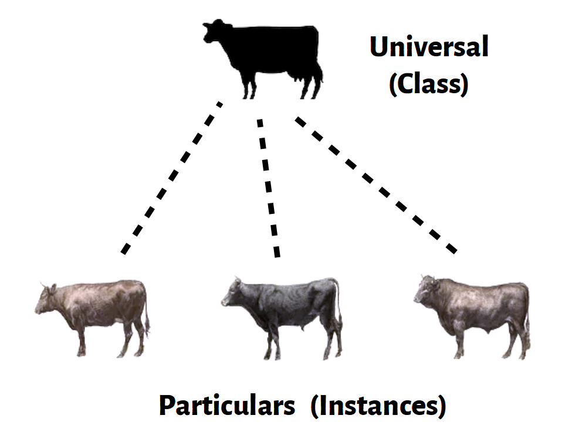

#  What are Universals?

This is part of a set of posts to establish that universals do not have any real ontological being, but before we can get there, we need to be completely clear on what a universal is and that is the purpose of this post.

## TL;DR

In the world around us, we recognize objects: books, cows, professors, and cities.

There are individual cows, and they are each a “particular” of a cow.  (a.k.a. “instance”)

We can talk about the category of objects, such as “all cows have four legs.”    The “cows” in this statement is the universal.  (a.k.a. “class”)

When we see two instance of a given kind, there appears that we are seeing two of something.  We say they “share something in common” but what is that thing they have in common?   The ancients had a beliefs that for us to recognize a cow as a cow, there had to be a real universal for the cow.  When looking at the particular, we sense the universal.

A given particular object might participate in multiple universals.

## Definitions

Encyclopedia Britannica: _**Universal**, in philosophy, an entity used in a certain type of metaphysical explanation of what it is for things to share a feature, attribute, or quality or to fall under the same type or natural kind.[\[1\]](https://www.britannica.com/topic/universal)_

Internet Encyclopedia of Philosophy: _**Universals** are a class of mind-independent entities, usually contrasted with individuals (or so-called “particulars”), postulated to ground and explain relations of qualitative identity and resemblance among individuals. Individuals are said to be similar in virtue of sharing universals.[\[2\]](https://iep.utm.edu/universa/)_

Wikipedia: _In metaphysics, a **universal** is what particular things have in common, namely characteristics or qualities. In other words, universals are repeatable or recurrent entities that can be instantiated or exemplified by many particular things._ [\[3\]](https://en.wikipedia.org/wiki/Universal_(metaphysics))

A **Metaphysical Realist** is someone who believes that universals are real objects, and the opposite is a nominalist.  There is another kind of realist that believes that objective reality is real, and the opposite of this is an idealist.  Seems like the former should be called “universalist” but we don’t get to choose the terms for a debate going back 2500 years.

## Plain Speaking

When we talk about things around us, we talk about things, but we also talk about categories of things.  What we are doing is classifying or categorizing things around us, but it feels like so much more.  When someone speaks of “a cow” what does that mean?  Do they mean the last cow they happened to see?  More likely they are referring the a general concept of “cow” which represents properties found on the typical cow.  The universal for cow seems like a real object we are taking about.  People talk intelligently about universals, and others understand what they mean.   When you say “a cow has four legs” you are talking about all cows, but form of the sentence is about one thing: the universal cow.

Philosophers have called the objects that we see in the real world “particulars.”   If there are a number of particulars that are essentially the same — that is they have the same essence — then we can name and talk about the universal.   Modern information science calls the individuals “instances” and the category a “class” and you might be more familiar with these terms but I will try to stick with the traditional terms.

**Universals as essence:**  The universal contains all the things that are the essence of what make a thing that category.   You look at an animal, and if you see it well enough, you can tell it is a cow, or a horse, or a goat.  There are certain things that cows have, that goats don’t.  Those essential qualities are the properties of the universal.   There are other properties that distinguish one particular from another, and these are called accidental properties which are not part of the universal property.  A cow can be brown or black or many other hues and patterns.  The exact color does not matter for recognizing a cow.  (However a purple cow would violate our expectations, so the universal does have some conditions on color.)

**Universals as sets:** Sometimes the universal is described in terms of there being a set of all things of a given class, and the universal is then everything that the members of that set have in common.  This seems either circular or tautological to me:  someone had to decides whether some particular is in the set, and obviously that criteria placing a particular the set is important.  The set is secondary.  Find the selection criteria, and you already know the common characteristics.

**Ubiquity:** While a particular can only be one place at a time, universals are seen to have a magical quality of being many places at once.  The universal cow is seen in every cow, and not part of the universal, but the entire universal cow is there in everyone one of them cows.   The mechanism that makes this work is never spelled out. This is just another aspect that makes universals different from particulars.

**Metaphysical Tropes:** Another variant is thinking that particulars themselves are abstract, and these abstract particulars are called tropes.  In this case there is nothing shared between the cows standing in the field, but instead they each have their own instance of the abstract cow universal.  Each trope is a particular of the abstract and is instantiated in only a single particular.   I am not sure what this is supposed to solve or how this is different than simply saying each cow has features of a cow.

## Examples

**Circle, Triangle:** Universal include many kinds of abstract objects.  The ideal circle and triangle we all learn in geometry.  The top of a cup is circular, and you can easily see that it is like a circle, but what is that circle that it is like?  Windows are rectangular, but what is that rectangle that the window is like?  We can talk about what a rectangle is, and in doing so we are describing an abstract universal rectangle, and what we say about that also applies to all the concrete particular rectangles as well.

**Numbers:** Numbers are another example of universals.  If we agree that 5 + 7 = 12, then what exactly have we agreed on.  (The 5 you see in the equation is a particular 5; it is a symbol for the number 5 which is a universal.)  Some philosophers say these numbers have to be real in order that the equation can be true.  And there are many other abstract concepts, like color, beauty, kindness, liquid, solid, hot, cold, etc.   Some can be seen visually, and others must be sensed other ways.

**Cognition:** It is undeniable that universals are central to how our cognition works.  An animal is hiding in the under brush, is it a tiger or is it a deer.   It is really important to know the difference, and in knowing the different, we then can now how to anticipate how it might behave.  I need only mention “tiger” and you understand immediately you don’t want to meet one in the wild.  We associate things with the general concept of tiger, and we talk about a tiger this or a tiger that as if there was a real thing as a universal tiger.  Clearly language works in a way to treat the universal the same way as concrete objects are treated.

**Illusion of Universals:** I believe this is an illusion, the _illusion of universals_.  A very strong illusion.  The illusion exists because of the way the mind works, but that will be covered in a future blog post.  First, let look at specific theories about universals.

## Parmenides & Thought

Not much is known about Parmenides, but there is a famous argument attributed to him that negative statements are illogical.   You example, it is nonsense to say the sentence: “there is no such thing as a purple unicorn.”  The reasoning for this is that if you say this sentence, then you are clearly thinking about a purple unicorn.  _If you are thinking about a purple unicorn, then it must exist._

It is that last point that is of interest.  Parmenides — and most likely many others at the time — clearly believed that to think of something was to be visited in some way by the real thing.  Bertrand Russel interpreted Parmenides this way:

> When you think, you think _of_ something; when you use a name, it must be the name _of_ something. Therefore both thought and language require objects outside themselves. And since you can think of a thing or speak of it at one time as well as another, whatever can be thought of or spoken of must exist at all times.

Imagine for a moment the profound effect this mindset would have on listening to Homer.  There mere fact that you can say the epic poem means it really must exist.  All stories actually had to be histories.  They certainly could not understand how the brain might process signals from the eyes and ears and to produce an understanding of this as a set of signals.  In fact, I would say it is still hard for people today to conceive of the idea that their own conceptions are really just signals running through nerves in the brain. But for the ancients, thoughts were real things that somehow float around from person to person.

## Plato’s Realism

**Realm of Forms** – Plato suggests that our experience here in the imperfect material world of the senses is just a shadow of what is happening in the perfect world of the gods.  In the realm of forms, there is a perfect cow, just the essence of cow which includes everything about the cow that is essential to make it a cow.

Plato believes that your senses give you a clue about what is there, but it is your mind that reaches into the realm of forms and touches the essence of cow, only once you recognize it.  The senses are not to be trusted, but instead the mind and pure logic can reach into this perfect realm and understand the truth.

Plato believes that universals are real object in that domain of forms, and this is the origin of the term “metaphysical realist.”  They really exist, exactly as you or I exist, but they are not in the material world, and accessible only to the mind.  I might even say the only purpose of the mind is to access this perfect realm of forms which is where you find the truth.  There is a real perfect cow, a real perfect circle, a real number 6, all in that realm of forms.

## Aristotle’s Realism

**Hylomorphism:** Aristotle rejected this idea that universals are separate objects that exist in a realm of forms, but instead saw the universal was actually part of the object. Hylomorphism is the idea that all substance consists of matter and form, the latter is the universal.  Thus the cow had within it an essence of pure cow, and this essence is shared across all cows.  The form of the cow is the essential thing that makes it a cow instead of, say, a horse or a pile of hay.

To Aristotle, this essence, this form, has a real existence in the object.  The form actualizes the matter, which can really exist without form.  Matter is pure existence, while form is pure action, you need both to be a substance.  The universal exists, but it is part of the substance itself.  It is important to note that the form is not the properties of the object, but instead the essence of the object.  Properties might be determined by the essence.

## Thomas Aquinas’s Realism

For 1000 years people argued over Plato and Aristotle view. St. Thomas Aquinas tried to revitalize the Aristotle view through a theory which was influenced by the Arabic philosopher Avicenna. Aquinas held that universals had real existence only in God as creative ideas.  Substances were “actualized” into existence, such as cows from the pure form that exists because of the mind of God.  These universals as essences can in turn be experienced by us in the actual particulars of real cows that we perceive in everyday life.  The natures are abstracted from the particulars, the universals exist in our mind as mental entities or ideas through which we know these real things.

It was at this time that William of Ockham raised a concern that such entities can not exist, even as the form part of the substance, and this anti-realist position kicks off the idea of conceptual nominalism, but more on that in a different post.

## Champeaux’s Realism

another example

## ??Conceptual Realism

The idea that universal is a real thing that represents the bundle of property values which define the essence of a set of things.  A universal is this bundle of properties, a distinct bundle of properties that represent the essence of particulars you are referring to.  The universal does not have any material existence, nor is it at any particular place, however it is the thing we talk about when talking about the essence of certain particulars.  It has to be real because we can talk about “it” and there has to be an “it” otherwise we would find ourselves talking about different things.

_(Not Finished)_