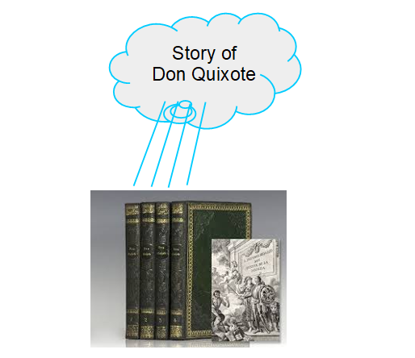

#  Where is the Novel?

Books clearly exist in concrete form, but where, metaphysically speaking, is the story that the book contains? We explore that in this post.

## TL;DR

The book is bound paper with symbols on it. Each symbol has meaning to the reader, and this allows the reader to construct the story in their mind. The story itself hos no existence. Instead, we have a memory of the sequence of events, so we have a memory of the story, but the story itself does not exist as an entity.

If all copies of Don Quixote was eliminated, and everyone who had ever read it died, then the story of Don Quixote would not exist anywhere. Someone might then pick up the one remaining book and read it, and after that moment, there would be a memory of the story in that person’s head. But the story simply has no metaphysical being as an abstract object or any kind of entity.

A story is just an objectification of the sequence of experiences that form the story. We talk about a story has if it had existence, as if there was just one actual Don Quixote novel, but in fact this entity does not exist.

## Discussion

A book is a concrete object made of paper. On the paper is patterns of ink that form words and sentences. Consider the story of “Don Quixote.” There are many copies of the book, but it is generally considered that there is only one novel named Don Quixote by Cervantes. This is the conundrum: how does the single novel get attached to each copy of the book?

Is the story in the book?   Is the story in the ink?  The ink by itself is meaningless, it is only the shape of the ink on the page that is a symbol.  Letters form words which form a story.  does this copy of the book contain one story, and that copy of the same book contain another copy of the story, or is the story the same shared by both books?

Furthermore, once you have read the book, a person might be able to recount the story to another. Is the story then in the reader’s head? Does the head contain a copy of the novel, or does it reference a metaphysical universal for the novel?

## Stories

**What is a story?** It is a sequence of experiences. It can be a sequence of experiences that you actually live through, or it can be a sequence of experiences that you are told about. Usually the latter.

**Experiences:** The book does not contain experiences, but instead symbols (or metaphors) for experiences. When the story says “Don Quxote mounted his trusty steed Rosinante.” we understand these words and picture the motion of a man getting on a horse. One has to understand already what a horse is, what horse riding it, and a background of details that pertain to Spanish and other human culture. These details are called up from our associations we already have with the symbols (words) of the book.

**Memory:** Once pictured, this story can be remembered. The brain has a natural facility for remembering sequences of experiences, and the vicarious experience from the book is remembered in exactly the same way.

**Language:** A person who does not understand the language that the book is written in will get nothing from the book. But if you can read the book, the process of reading involves seeing the words, recognizing them, and thereby activating the frame in the brain that is relevant for the word. In the way that language normally works, the sequence of words chain together meanings into stories, and those stories are remembered in much the same way that your experience of walking through the world is remembered.

## Objectifying Experience

**Objectifying:** the way that the mind will take sensory experience, recognize it, and treat it as an object in the world.  The eye sees patches of red furriness, the mind recognizes the squirrel as an object.  Once recognized as a squirrel, we can understand the movements we are seeing, and we can make predictions about what this squirrel will do.  The mind objectifies the world in order to make sense of what is going on at least in order to predict what might be coming next.

**Stories:** Objectifying an experience as a story allows us to talk about it.  I can say “it is a long walk to the market” and in this case ‘long walk’ refers to the story of actually walking that road.  We speak about the walk as if it was itself an object.  I might have done the walk today, you might have done _that same walk_ yesterday.

Objectifying stories plays in important role in human interaction with the world.  If you have done the walk many times, you can recall and anticipate what is going to happen this time.  One can easily imagine primitive humans experiencing many hunts, and identifying common episodes as part of the standard hunt.  One would want to talk about “a hunt” as if there was an abstract story that represented the common elements of all hunts.

## Existence

(I will use the word existence here as any kind of metaphysical being.  Sometimes existence only means something in space and time.  Abstract objects are not in space and time, they can not affect anything in space/time, and they can not be affected by anything in space time.  But still the metaphysical realist take the position that they have some “being” nevertheless.  The verb “being” is just too hard to use in this sense, so I will talk about “abstract existence” as that kind of being that might be outside space and time, but is otherwise still “real” whatever that means.)

The novel simply does not exist in the way that particulars exist. We talk about the story of Don Quixote existing, but this is an illusion. I might walk on a particular road to the market, and you might walk the same road.  But there is no _real thing_ that is the experience of walking the road.  We have memory of it, and can compare these memories of the experiences.  We can then talk about the experience of walking that road.  We even talk about the same thing happening many times:  I could compare the five times that I walked that road.

The mind has objectified something that does not exist: the story. Yet, treating it as an object that exists is necessary for communication. The book is a sequence of symbols that cause the story to be instantiated in your mind. You must understand the language, and that means that you have frames that represent the meanings of the individual words, and they are activated upon the reading of the words, and this activation is in fact the story. The book causes the story in your mind.

## In Your Head?

Do you end up with a copy of the novel in your head? Not really. You have a memory of the story, and that memory is imperfect. More importantly, it is composed from your understanding of the meanings of the words. A horse riding enthusiast probably has a very different understanding of “Don Quxote mounted his trusty steed Rosinante” than someone who had never been on a horse before. If Rocinante is described as “lumbering down the road” we all probably have a slightly different view of a typical road that might be there. I might see maple trees lining the road, while you might see saguaro cacti, but the story does not depend on these differences.

How do we know that what you read is the same as what I read? We don’t. Clearly, if we both speak English, and both have lived a few years in the world, we should both have a pretty good idea what a horse is. We know that our concept for horse is the same because when we speak about horses, where we saw one, what it was doing, etc. we identify and correct any misunderstandings. Thus we can be confident that anyone with a command of English will have proper knowledge of enough words that the story in the book will make sense to you in the same way that it makes sense to me. Obviously, we will still understand things differently. If I had a terrifying experience with a horse when I was young, that might color my understanding of the story. You might have a better understanding of the Spanish countryside and so have an understanding that I miss because I visualized New England countryside when reading. These differences are normally not significant, but sometimes we will find that two people get a very different understanding from reading the same story.

## Writing

Say a person remembers the story well enough to write down a reasonable copy of the original.  We talk about the story being in their mind, and that they wrote it down.  That is, they took the story from their mind, and put it into the ink marks on the paper.

What really happens is different.  The person has memory of the sequence of experiences and a clear memory allows you to think through the story again and again.  In a sense, you can play back the memory of the experiences in order.

The writer then composes a series of symbols with the aim of producing the memory of a sequence of events in the mind. The reader is expected to recall the meaning of the symbol in such a way, and in such an order, that the story is told.  Property crafted, the story will unfold in a way that keeps the interest of the reader in anticipating what comes next, and then satisfying that anticipation.  It is not just a matter of taking a story and putting it directly into ink.

It is worth remembering that not all stories are told in chronological order.  The flashback is a literary device which fills in details of a story out of order.  This works because ultimately we are just constructing a memory of the story, and not actually playing the story.  Memories can be constructed out of order.

## What happens when Language changes?

The book is written and is concrete.  The words are on the page, however reading the book depends on understanding what a word is about.  Languages change over time.  Let’s propose a hypothetical change and see how this effects the reality of the Don Quixote novel.  Imagine that the word for “horse” changed to mean a motorcycle.  This is far fetched, but consider what happens when a word in the language changes.

The new reader reads the old novel, but every place where the horse appears, the reader imagines a motorcycle.  Is the story the same as it was?  I would say not.  When the language changes, the reader actually reads from the book a different story.  Where did the old story about the horse go?   How did the new story about the motorcycle get fabricated?  Or how did the old story get modified?

The answer is that the story of Don Quixote has no existence, no being.  It is the reader that instantiates the story as a series of experiences.  Those experiences depend on language.  The fact that the user now reads a new story is further evidence that the story does not exist separate from the book.   What we have is a book filled with symbols, and only by reading and understanding the symbols can we retrieve the story.  If the language changes, the story can change as well.

## Summary

The story of Don Quixote as an entity has no being.  The book exists as a string of symbols. The author has placed those symbols in that order so that you instantiate the story in your head as you read it, assuming you understand the language. You experience the story vicariously, and you remember it using the same episodic memory that you use for remembering real life experiences.