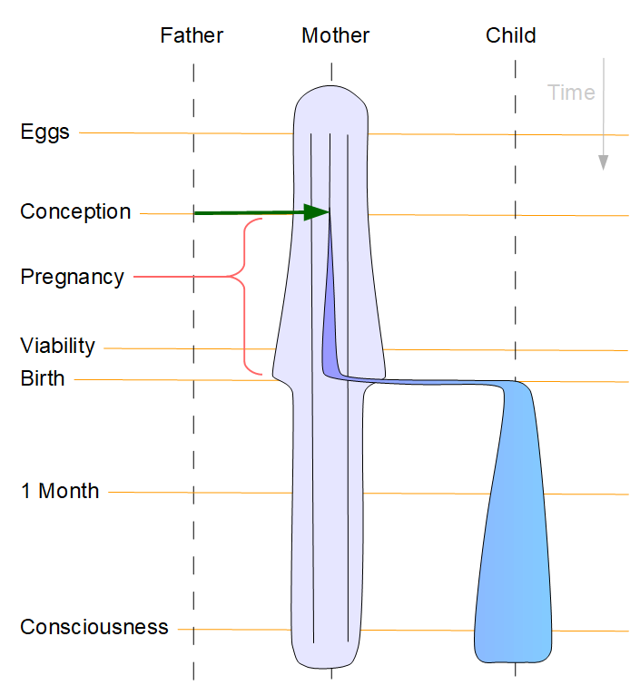

#  Life and Personhood

Since the supreme court has rolled back the clock 50 years, we need once again to talk about abortion, life, and babies.  Here is a clear rational for the idea that life and personhood begins at birth.

## TL;DR

The point of this post is to support the idea that human beings breathe.  That a baby becomes a person when it takes it’s first breath.  Only then does it become a fully functional life form separate from the mother.  This systems-oriented view of life makes the most sense, and is compatible with all of the various exceptional cases that occur.

The idea that a fertilized egg is a person is a logical, but misguided view of how life really works, leaving us with a few rare but unexplained conundrums.

## Life

Life is not a thing.   It is a process.  A process is a dynamic interaction with and around matter.  Life is what Progogine would call a dissipative system: a system that forms within the flow of energy.  While the energy is flowing, the system can organize to be more organized than it was previously.

We are not surprised that life spontaneously organizes things.  A tree starts as a small seed, and as the seed grows, it gathers carbon from the air, and constructs the body of the tree.  The air is ultimately disorganized as any gas is.  The result of a tree growing is a large amount of carbon that has been converted from gas into a solid which is of a tree-like shape.

Life is the situation when that process is running.  Chop a limb off a tree.  Is that limb alive?   Well, it is until it runs out of nutrients it needs from the roots.  For some plants, you can simply plant the clippings, and they will sprout new roots and go on living.  Others lack that ability and the process of life stops when the supplies run out.  It is not the cutting from the tree that determines death, but the loss of necessary materials.  The plant you chopped from will generally continue living until there is a critical interruption in the process.

For animals, life is a lot more integral.  Animals move about, and have to carry everything with them.  Many functional organs in an animal are unique, so loss of a stomach, or a heart, or a brain, is a fatal event.  Even a simple critical loss of blood can be fatal.  The reason it is fatal is because all these parts are needed in order to support the process of life.

## Personhood

The abortion debate revolves around one question: is a fetus a person?  To me it is abundantly clear: a fetus is not a person, because a fetus is not a self-sustaining process.

What is a person?  Clearly a person is an animal, and an animal is a complete, self-sustaining process that is persistent over time.  A person exists independent of other people.  Simply put: a person breathes.  And eats.  And poops.  The concept of a self-sustaining system is paramount, and I will show you why below.

## Not the Material

The material of a person does not constitute a person.  This is clearly, if somewhat gruesomely, explained if you take the material of a person and chop them into little pieces.  Keep all the original material together.  What remains is not a person, instead it is a pile of flesh.  It is a person only if everything is connected and arranged in a way that the process of life continues.

In the case of normal death, the body stops functioning.  There is usually some failure to blame, but it does not matter.  When the body stop functioning, the person is dead, even though all the same material is there.

Consider brain-death.  People will go comatose, completely immobile, fed intravenously.  When there is no more sign of brain function, we consider them brain dead, even if the heart is still pumping.

The critical essence of a person is that a person is a system that is functioning and maintaining itself.

## Not the DNA

Some point to the DNA as a unique indicator of a person.  I understand the argument, and if you are persuaded by it, then please respond to the situations below.  There are a number of cases where the DNA simply does not indicate a person.

TWINS:  Identical twins have identical DNA.  This is a case of a single egg fertilized with a single sperm, and then splitting into two.  The two babies that form came from a single conception.  There are those that claim that the soul enters the body at conception will have to explain how these two adults, that came from a single conception, are different people with their own soul.  Alternately, the concept that a person is a self-sustaining system has no problem identifying the two individuals as separate people.

CHIMERA: There is another situation that happens occasionally, and that is two eggs get fertilized individually, and then they get stuck together and form a single person.  That person has two different sets of DNA, part of the body one DNA, and part of the body another.  Again, because there are two different DNA patterns, this does not mean there are two people.   There is only one self-sustaining system and there is only one person, even though there are multiple types of DNA.

AGE: as you age, the DNA in your cells change.  The immune systems works by making alterations in the DNA.  Within a single individual, there are many versions of your DNA that are not identical.  This does not mean you are multiple people, because you are still a single functioning system with a single stomach and a single set of lungs.

FLORA: within your body there are trillions of cells that are not human.  In fact, 90% of the cells in your body are bacteria.  These are necessary for life.  You must retain these bacteria in order to digest food, and there is some evidence that the bacteria affect your thinking.  A human can not exist without this bacteria, and it is part of the complete functioning system, even though it has radically different DNA.

## Body Parts

Bodies have many parts, most needed but not all necessary.  The appendix, for example, appears to be a body part that is unnecessary for normal life.  People have their appendix removed.  The appendix has the same DNA as the person.  The appendix is “living” in the same way that all tissue in the body is living (as long as it is connected to the body).   Removing the appendix obviously causes it to stop living, because it is not a self-sustaining system that can live on its own.

Skin is constantly losing cells that contain the person’s DNA.  Hair is similar.  The fact that the body loses parts is a natural part of life.  The body is not a set of material, but is instead a process that is constantly taking in new material, and losing old material. Again, life is a process, not a thing.

## The Mother

The mother is a single functioning system: an adult with a fetus within her.  There is only one person eating.  There is only one person breathing.

One has to state the obvious: if you take a pre-vital fetus out of the mother, it simply can not function as a system.  It is exactly the same as taking out the appendix.  The appendix can not function as a self-sustaining system, and the fetus can not function as a self-sustaining system.

Without the mother, the fetus simply is not a functioning system.  It can not breath.  It can not eat.  It has the potential to become a human, but it is not yet a human.

## Potential Humans

There are many things that can be considered potential humans.  The fact is that we are in an unbroken chain back to the origins of life.  If your grandfather had been killed as a young boy, you would not exist.  Killing a person always kills potential offspring that they might have.

Human eggs form in the a female baby before birth.  Any one of those eggs might become a full fledged human one day.  If it is lucky enough to travel down the fallopian tube and lucky enough to be fertilized and lucky enough to have the genetics to be born and lucky enough to survive birth.  But we don’t consider an egg to be a human.  It is a potential human.  It would be entirely nonsense to claim that hundreds of humans were killed when a baby dies unexpectedly.

A fertilized egg is similarly a potential human.  It is an egg that has accepted a sperm.  It has the set of DNA that the potential human will have, but this alone does not make it a person.  Life is a process, not a collection of material.  Until the fetus breaks free of the mother, it can not be considered a person.

About half of all fertilized eggs are miscarried (a.k.a. spontaneously aborted).  Those who believe that a fertilized egg is a person is observing God killing people on a fairly massive scale.  On the other had, maybe God does not view them as people until they live a month after birth.  I don’t know, see below what the bible says.

## Consciousness

Some claim that a person is a person when it becomes conscious of what is going on around it.  Only then can it feel the loss of life dues to death.  Consciousness does not occur until well after birth.  Somewhere 12 to 18 months after birth, the brain is formed well enough to be conscious.

I don’t think anyone is seriously proposing that a baby be considered a person only when it is conscious, but for those that do consider consciousness a factor, rest assured that a fetus is not conscious.

Sentience: sentience is the ability to feel things.   All mammals are sentient, cow, goats, lambs, and many fine food items are sentient.   Frogs and fish are sentient.  Anyone’s claim that everything sentient is a person can not be taken seriously.

## Biblical Wisdom

The bible never suggest at any point that an unborn fetus is a person.   In fact quite the opposite.  Five places in the bible says that a baby is not considered a person until 1 month after birth.   A population census was never to include babies under one month, because so often they would not survive.  Christening is a practice of naming the baby well after birth because it is pointless to name a baby before you are sure it will survive.

So don’t turn the bible for guidance on how to be anti-abortion.  The modern world is far more supportive of young babies than the bible ever was.

## What This Means

In simple terms, a baby is not a baby (not a person) until it is breathing.  In Genesis God did not consider Adam to be alive until he was breathing.   The baby is not independently functioning as a system until it is breathing.   And eating.  And pooping.

A fetus that is still within the mother, is simply a part of the mother.  It is not a baby.  It is not a human.   It is not a person.   It is simply a part of the mother.

The mother should have full right to do whatever she want to with her body.  If she wants to carry the fetus to term, nobody should stop her.  If she does not want to, she has full right to remove the fetus.  Nobody has the right to use another person without their express permission.

## It is Not Murder

Anti-abortion vigilantes like to say that an abortion is “murder”.   It simply isn’t.  I can understand the persuasive rhetoric.  They want to fool as many people as they can into their point of view.  But murder is the “unlawful killing of a person.”   An abortion does not fit this for two reasons:

1) the fetus is not a person, it is not an independent human being

2) it is not unlawful.  At least in most states, and that might change.  We will see.

## Visual Systemic Representation

Here is a chart symbolizing the Father, Mother, and Child along with a number of identified time spots.

There are clearly three entities: father, mother, child.

Eggs: eggs are formed in the mother’s childhood.  Clearly those eggs are not people.

Conception: some consider live beginning at conception, however this is not alive in the sense that it is a system that can sustain itself.

Pregnancy: while the fetus is in the mother, it is part of the mother.  You can not, for instance, jail the fetus without jailing the mother.  You can not starve the fetus without starving the mother.  During this period, the fetus is clearly part of the mother.

Viability: the point where a fetus might be induced and still survive.  After the point of viability, a fetus could simply be induced, and by breathing become a person.  Most reasonable people consider this to be the latest point for a legal abortion.

Birth: this is the point that is the clearest about considering personhood.  It is only at birth that the baby becomes a separate functioning system from the mother.   I believe as a society, we should use the first breath of a baby, as the first thing that a baby does.  Birth might be any time after the point of viability.

1 Month: ancient biblical societies considered one month as the beginning of personhood, but we live in a much more enlightened time now, and can I think consider birth to be the beginning of personhood.  I might be wrong, because some babies are born and simply don’t survive.  A mother should not be put in prison because the baby dies within the first month.

Consciousness: Some claim that the baby will somehow experience the loss if aborted, however the fetus and even the newborn are not conscious in any way.  Consciousness occurs later, at around 12 to 18 months, and only then can I imagine that any soul would experience loss.

The child simply does not become a separate person until it is born.  Yes, there is a fetus with the DNA that will be in the person, but it is not a person until it breathes.  This is a consistent view of the world that takes into consideration twins and chimera and has no exceptional situations to speak of.

## Not a Trivial Matter

No pregnant female that I know has ever considered abortion lightly.  Some conservatives like to claim that there are females that simply abort whenever they feel like it.  I can assure you that it is not so for almost all women.   It is a very serious, very considered matter.

Most women who have an abortion go on to have other children.  Teenage women who are forced to carry to term often do not have more children.  Forcing a woman to carry a fetus to term often denies other potential humans, and that is just as egregious as this one fertilized egg you care so much about.  However, women who are not ready to have kids, generally have kids later when they are ready, and those kids turn out healthy, happy, and productive.

**61% of U.S. adults** say abortion should be legal all or most of the time ([PEW Research](https://www.pewresearch.org/religion/2022/05/06/americas-abortion-quandary/), 2022).  Less than 1% of US Adults say that murder should be legal.  The reason that a **majority** find abortion acceptable is because a fetus is simply not a person.  Abortion simply is not murder.  It is the mother removing something from her body that could grow into a person if the conditions were right.

## Conclusion

I understand that people have other theories, and I can respect that for their behaviors as _long as they can respect mine_.  It is a fact that the fetus does not and can not live as an independent system.   It is not a person.   It is a part of the mother, which like any other part stops living if removed.  It must be a decision of the mother, and anyone forcing their opinions on the mother is a violation of fundamental freedoms.

It would be great to see better prenatal and neonatal support from society.  With proper support, the anti-abortion crowd might be able to win some women over to carry to term.  But there is little likelihood for that.  USA still has 4x more maternal deaths than Europe. But currently the anti-abortion crowd is more interested in punishing women for their primitive unsubstantiated beliefs.

There are many many opportunities for future humans.  There is no reason to obsess over the few the potential humans that are in bad circumstances.  Lets focus on the living.  Life begins at birth, and a baby becomes a person at birth.  Simple as that.