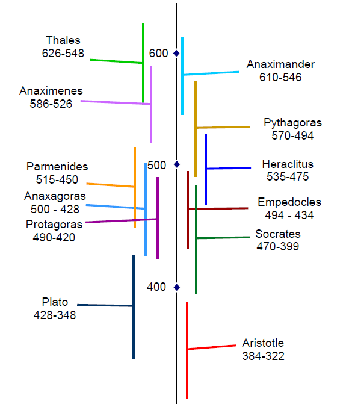

---
  tags:
  - Greek Timeline
  - Philosophers
  - Socrates
---
#  Pre-Socratic Philosopher Timeline

In studying ancient philosophers I like to get a visual impression of how close they were in time, and which were alive at the same time, so I made this timeline to help visualize it.

Click the link to get a [PDF version.](pre-socratic-philosopher-timeline.pdf)
