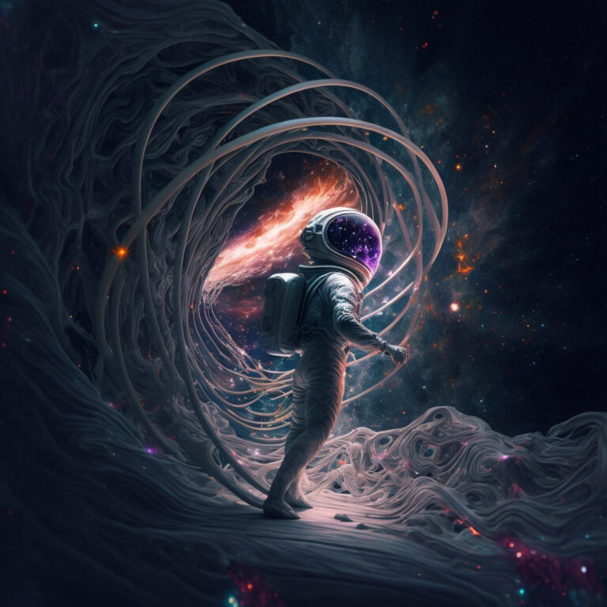

#  Science allows Humans to Experience the Transcendent

No other system constructed by humans has had a greater effect than science on improving the lives of the people we love.   Science is the ultimate expression of love for our fellow humans and for our descendants.  It is normally not expressed in this poetic way, but there is a lot of supporting evidence. 

## Definition of Transcendent

1a : exceeding usual limits : surpassing  
1b : extending or lying beyond the limits of ordinary experience  
1c in Kantian philosophy : being beyond the limits of all possible experience and knowledge  
2 : being beyond comprehension  
3 : transcending the universe or material existence — compare immanent sense 2  
4 : universally applicable or significant the antislavery movement … recognized the transcendent importance of liberty— L. H. Tribe

Science is a system that allows humans to go beyond what is possible without science.

## Love

Humans have an innate ability to love one another, and particularly to love their children. Love is that desire to do more for someone else that you get in return, more than anyone can expect to get in return. The religious will say that humans get love from Gods, while the materialists will show that love is a product of evolution: while there is a range of amounts of tendency to love that a particular person might have, people with stronger love have survived better. Humans as a whole survive because we help each other selflessly. Whichever source you see for love, it is undeniable that humans have the ability to love, and that this love is one of the things that distinguishes humans from the rest of life on the planet.

Because we love each other, and because we love our children, we want them to survive. Survival is increased the more you know true things about the world. We want to know things in order to keep our children safe. We want to make a world where our loved one are safer. When we see dangerous patterns around us, we want to recognize and codify those dangers in a way that our friends and our ancestors can avoid that danger in the future, because we love them. Love for our fellow humans, and most importantly our offspring, is the motivation behind science.

## Individuals vs. Collective

The desire to know true things about the world can be satisfied to some degree by observing carefully, recognizing a pattern, and then telling others about it. This was done for thousands of years. But individuals are very poor at recognizing patterns on our own. Our lifespans are limited. Our ability to experience all the variety of situations that would be needed to come to an accurate conclusions is limited. To put is simply: individuals can be wrong, and we are wrong a lot. Limited lifespan means we have to pass on imperfect conclusions. When passed on in this form, the related specific supporting observations are not included, so it is impossible for a human to make further observations and know whether it should alter the conclusion or not.

Science is a system that does one thing: selects and preserves true concepts from a field of mostly false ideas. Science takes as the starting point that most individuals will come to the wrong conclusion. But science employs a method to systematically distinguish truer ideas from falser ideas. For example “peer review”. An individual makes observations, and puts the actual measurements together with the conclusions from those into a paper. Others in the field check that paper for flaws. Was the set of data selected purposefully to support the conclusions. Such cherry picking can lead to conclusions which are false, because important information was excluded. Papers are checked that the math is correct, and that formulae actually produce the claimed results. At any point along the guantlet of checks, if any flaw is found, the paper can be rejected.

It is a little like Adam Smiths’s pin factory: by working together, people can achieve far more than is possible separately. In the pin factory different workers performed different specific tasks, and they could perform those tasks more efficiently because they had specialized. While each person does only a small part of the job, the system constructed that allows them all to work together, passing pine from person to person allows more pins to be produced than any single person could. It is important to recognize the synergistic effect of the system, and how that plays a role in allowing individuals to achieve more than they could without the system.

## Acting at a higher level

Science is a system for distinguishing true ideas from false ones. It operates above the level of any individual scientist. Individual scientists often fall prey to being overly enamored of their own particular theory. This is a flaw of the human ego which we all have. This can lead individuals to be blinded to mistakes, and it can even lead groups of scientists to be similarly blinded. But the system put in place to achieve science can be ruthless. Every scientist knows the rules: you have to show actual evidence, the evidence must be collected properly, you have to show all the work that leads to the conclusion, and any mistake along the way can be exposed.

No single scientist gets it right all by themselves. Science works as a system to select the true from the false. The individual scientists are like factory workers who play a role, but in no way can claim full responsibility for any completed product coming out the end. Major discoveries, like Einstein’s theory of Relativity was based completely on equations written by Maxwell some 30 years earlier. At each state, the system of science is working to discard ideas that can not stand the test of science, but preserves those that do.

## Not Just a Belief System

Many people misunderstand what science is, and think of it as a collection of ideas. Some say it is a “way of viewing the world”. The collection of ideas that science has selected from all the possible ideas is the product of science. It should not be confused with science itself. Ideas are created in the same way they always were: a creative individual. Science is a system that selects and promotes verified true ideas, from ones demonstrated false. This yields a body of knowledge which adherents use to interpret the world, but that body of knowledge is not science. Science is also not the actions of individual scientists. It is system that can only be put in place by an advanced society that works independently form any individual to achieve a results that would be unreachable by individuals.

## Order Emerges from Chaos

Many many individual scientists will be wrong. In fact, most of them are wrong. Discovering a new principle of nature requires some creativity and imagination. Science is not a matter of just writing down what you see, but instead of proposing and testing theories about things that can not be seen except as result of interactions. “Genes” were proposed 50 to 100 years before DNA was discovered, because the concept of a gene explained certain behaviors in the world. Gregor Mendel famously made a series of careful observations that were best explained by something he called genes even though he had no idea what they were, and had never observed an individual gene directly. He could have been wrong. Other proposed things like ether and phlogiston as ways to explain observations of light and heat. These were ultimately shown to be false ideas.

It is important to note that a large collection of wrong ideas is necessary to proper working of science. Science is a system that selects true ideas from false ideas, but someone has to provide a pool of ideas to select from.

Scientists who have promoted wrong ideas are often held up by critics as an indication of a flaw in science. Nothing could be further from the truth. The great variety of ideas, in a spectrum from completely crazy to completely sane are needed as input to the system that selects. Individuals might believe and promote their specific ideas — as humans with egos tend to do — but the system of science works above the individual level, to allow people to work collaboratively to achieve results that are transcendent.

## Unparalleled Success

Science has worked beyond our wildest dreams, and allows humans to transcend our primitive past into the world we experience today. Today, we live like Gods! I use that term loosely, however it is worth reflecting on just how much better science has made our lives. Horrible diseases like polio and measles and many more have been virtually eradicated from the population. Diseases of nutrition have been identified and eradicated. Machines have been built that allow us to travel around, and to build shelters that keep us more protected than ever before in history. We continue to make advances in understanding how weather and earthquakes effect our structures, to keep us and our children safe against those. And uncountable millions of individual improvements.

Love has no greater product than science. By putting science in place, to systematically weed the true idea from the false, we have shown greater love for our friends, our neighbors, and our descendants than any other single action in all of history. Our kids live better than any generation in history. We expect to avoid pain and suffering in many ways that were common 50, 100, 400, or 2000 years ago. We want to keep our kids safe, and science is a system that helps us do it.

And we are not done. We can expect that the system of science will continue to work in the future. Cancer is a disease that is currently studied with great fervor, and we don’t know how long it will take, but systematic separation of true ideas from false ones will eventually lead to improvements in the care, if not eradication of cancer. We will probably never be done, because love will always motivate us to do more. Autism is a disease that was unknown when I was a child — mostly because we knew so little that it was impossible to distinguish from all the other dominating diseases. Having identified and eradicated so many other problems, science can now turn its attention to autism and many other newly discovered diseases.

## Transcendence

Perhaps you think I am being too fanciful when I call science transcendent. Humans are limited in our ability to understand the world, and science transcends these limits. No single humans is responsible fully for any given scientific result. Science works independently of any given individual. People get things wrong all the time, but science is the system that leads us on the true path. With science, we really do achieve transcendence, because we reach a better planes of existence as a product of the working of the system of science. It is not the case that science can be done individually, because of the limitation of human ego, human intelligence, and human lifespan. Science transcends these boundaries, allowing humanity as a whole to achieve things that no single human could. It is not just a bunch of individual scientists “doing science” but instead a completely different thing: science is a system that we are part of, but that achieves things that are qualitatively different than any individual could ever do.

No other system constructed by humans has had as great an effect on improving the lives of the people we love. Science is the ultimate expression of love for our fellow humans and for our descendants.

Disagree? Ponder this: try to think of one single action by humans in the past that has a greater effect on the care of our loved ones.
