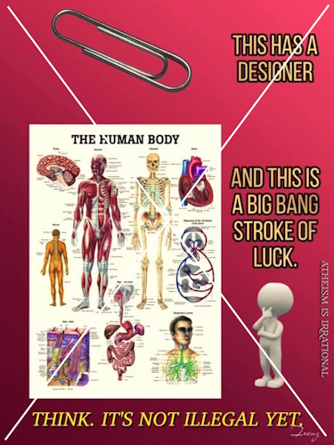

# Bad Analogy

paper clips don't reproduce. They don't mate with other paper clips, produce baby paper clips that then grow up to be adult paper clips.

Of course paper clips don't evolve. They are completely unlike life, which reproduces and evolves.  Saying that a paper clip is designed says nothing about life.

Why do Christians use this ridiculous example of a paper clip being designed? There are millions of things that don't evolve, but that says nothing about life evolving. Is everyone here so blind as to be unable to see how things that don't reproduce don't evolve?

