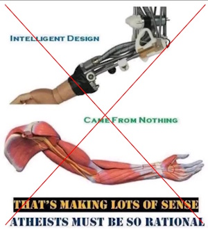
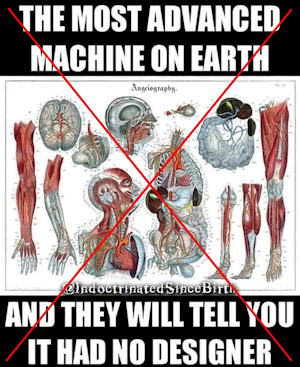

# False Analogy Trick

One of the most common tricks is for creationists to point to two things: one made by man and another from life, and say that one was designed and therefor the other must have been designed.

in all cases an inanimate object is held up and compared to living object, and the claim is that both must have the same construction method. Because the final product looks or acts somewhat similar, that means that both came into being the same way.  

In all cases we know that life is constructed in an entirely different way than the man-made item.  Humans construct from the outside, creating smaller parts in a final form which are then assembled into the finished product.  Living things never develop this way. Instead they start from a single cell growing and differentiating into the final adult unit.  One would think this difference is obvious enough to see that once can not take conclusions from one and have them honestly apply to the other.

:::tip [Key Takeaway]

The deception depends on the audience thinking that because the final form of two things are similar in some way, that the genesis of that form must be the same in all ways, and that is simply not true.  This is a false analogy, and the conclusion is not supported.

:::

## Paper Clips

Paper clips don't reproduce. They don't mate with other paper clips, produce baby paper clips that then grow up to be adult paper clips.

Of course paper clips don't evolve. They are completely unlike life, which reproduces and evolves.  Saying that a paper clip is designed says nothing about life.

Why do Christians use this ridiculous example of a paper clip being designed? There are millions of things that don't evolve, but that says nothing about life evolving. Is everyone here so blind as to be unable to see how things that don't reproduce don't evolve?

# Mechanical Arm

This shows a mechanical arm and a human biological arm.  The argument is that these two things can **do** similar things: they both look like they can lift things.  However their construction is obviously completely different.

The mechanical arm was constructed of complete components that were purpose built separately from the arm, and then assembled as a complete final process.  The arm was manufactured using a standard human manufacturing process.

The human arm grew from a microscopic cell.  It started from a single cell that split and grew and eventually differentiated into different part.  There was no manufacturing of the muscle and bones separately, and then assembled in a final step.  The difference in how these were made could not be more striking.  The human arm "makes itself" while the mechanical arm was entirely created as separate parts and then assembled by external efforts.

More importantly, the living arm was made as part of a baby that was produced by sharing the genes of the parents.  The parents mated, and the baby was produced.  The genes that make the arm are inheritable.  Small changes in the arm design would be passed down to the next generation, while nothing like that happens for the manufactured arm.

The entire deception depends on the audience believing because the final form of the two look a bit similar and seem to fit a similar purpose, that that implies that the form of construction must also be the same.  The amazing thing is that everyone knows that arm grow as part of a baby, but mechanical arms don't do anything like that.  The gullible are fooled into thinking that final function is all the matters in the construction of something.

## Airplane Evolution 

The reason that evolution is mentioned is because this is actually an attempt to show how evolution in general can't produce things.  It uses the false analogy of a jet evolving from a paper airplane to mocking evolution claims that more complex animals came from simpler animals.  Both the jet and the paper plane were designed by humans and they know that.  

Both the jet and the paper plane are not alive.  Neither the jet nor the paper plane reproduce.  They are not capable of making copies of themselves. Evolution applies to living thing that reproduce. Neither paper planes nor jets are alive, and neither reproduce, so evolution simply does not apply. It says nothing about living things and their ability to evolve.

It is the application of evolution to things that are not living that is false about this analogy.  You intuition about non-living things is being invoked here to apply to living things.  Non-living things like paper airplanes and jets can't evolve, therefor evolution of living animals could not have happened.

## Body is not a Machine

This meme perpetrates the false narrative that a body and a machine are essentially the same kind of thing that is build the same way.  Bodies are complex.  Machines might be complex. Therefor they are built the same way, and have the same requirement.   At least the requirement that a machine must be designed is then inappropriately transferred to the claim that the body must be designed.

Machines are built one way, by man.

Bodies are living and grow from a single cell (machines can't) and they are able to reproduce themselves (machines cant) and there is simply no reason to think that bodies are manufactured the way that machines are.

The claim that a body is a machine is a dishonest (or ignorant) statement.

## Not All Complexity is the Same

:::tip [Key Takeaway]

The deception depends on the false idea that everything that is _complex_ must be made the same way.  That is, if one complex thing was designed, then all complex things must be designed.  If one complex thing was assembled from completed parts, all complex things must be as well.

:::

This is based on the fundamental belief that anything complex must have been created by a human style intelligence.  A snowflake, for instance, because it is complex in form can not happen naturally but instead the hand of God must be involved in the formation of snowflakes.  The Grand Canyon is a complex network of valleys and waterways that all flow together must have been designed by God.  A bee's honey comb because of its complexity is a miracle of God's making.  Plants obviously grow on their own and grow in incredibly complex forms, but once again this is a miracle from the hand of God and not a natural process.

The creationist believes that complexity can only come from intelligence as if intelligence was some kind of super powerful magic that is applied like frosting on a cake.  The creationist denies that complexity can arise on its own, even though in computer science we have algorithms that routinely and completely automatically construct extremely complex output.  Creationists say that computer programs don't count because intelligence was used in their constructions, and therefor the complexity is somehow due to the spreading of intelligence at the start.  

## Intuition Come From The Home

Once again, the apologist is leveraging the intuition of the audience to make this deception stick.  While sitting around the house, there are no complex things that pop into existence.  My lawn mower breaks down, it does not just suddenly get more complex and more powerful.  Appliances break and have to be replaced.  Paintings don't paint themselves, but someone must do that.

This household experience forms the intuition of most creationists, and they believe their own intuition is relevant for all formation at all levels including  biologically grown items.  They start with the fundamental belief that nothing complex can form on its own, and the apologist makes ready use of this to weave the deception.

The entire play is an `argument from incredulity` as you will see statements making fun of the idea that something could form on its own without intelligence.  It is always a strawman argument so that the intuition about household things can be applied to things that are not household in nature.

