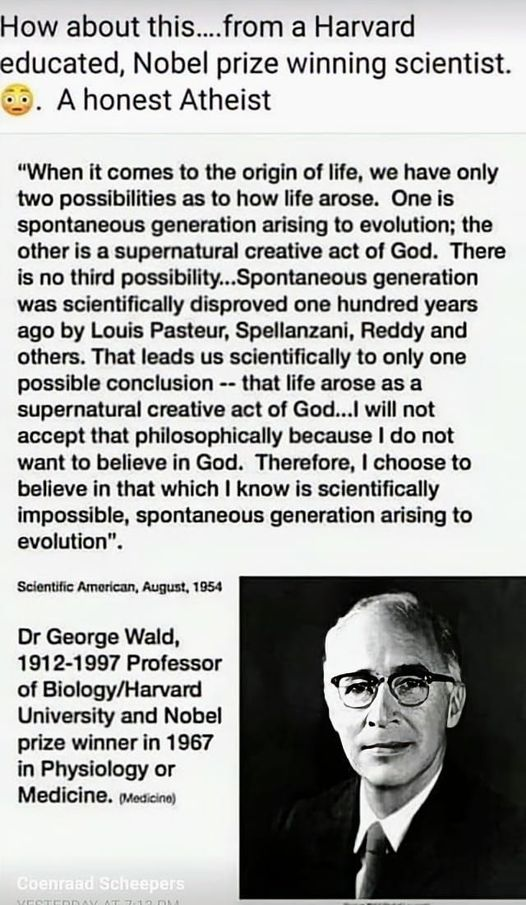

# Christian Quote Mines

Christians will often take quotes out of context, and make it appear that people are saying something they are not.  Once a meme gets started, other Christians just forward it without questioning it, essentially spreading lies.  As they say, a lie can spread around the world before the truth can get its running shoes on.

## George Wald

George Wald was a notable biologist wining the Nobel prize in 1967.  Christians have fabricated the following quote.

Some of the memes cite the Sept 1958 article, and others like the one above cite the August 1954 article.  Both articles are title "The Origin of Life".  What did he really say?  Here is an [article from Talk Origins about it](http://www.talkorigins.org/faqs/quotes/mine/part1-4.html) which includes the actual text of both articles.  

> There are only two possible explanations as to how life arose: Spontaneous generation arising to evolution or a supernatural creative act of God. There is no other possibility.

He never says this exact statement.  He does talk about the biblical creation of life.  Also about the ancient believe of "spontaneous generation" of life which was believed before Louis Pasteur, but that is not to be confused with abiogenesis.

> Spontaneous generation was scientifically disproved 120 years ago by Louis Pasteur and others, 

He never says this sentence.  He does talk about how this was disproven, but spontaneous generation of life was about some forms of life coming from others.  Meat was just supposed to spontaneously produce maggots, and that the maggots came from the meat. He talks about how this belief was related to statements in the bible as well.

> but that just leaves us with only one other possibility that life came as a supernatural act of creation by God,

Absolutely does not say this, quite the opposite.

> but I can't accept that philosophy because I do not want to believe in God. 

He does not say this either.  This is a Christian pretending to hear these words from a cartoon of an atheist.

> Therefore I choose to believe in that which I know is scientifically impossible, spontaneous generation leading to evolution.

He never says this.  none of these are direct quotes from either article, and they do not reflect his position on the origin of life.  This quote is a straight out fabrication.