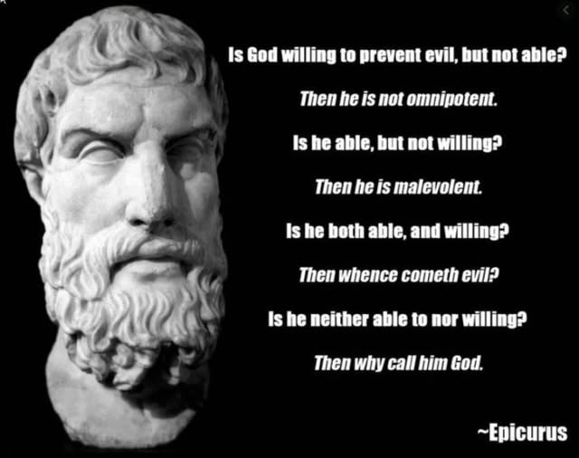

# Epicurus & God

I find the logic of Epicurus unassailable: if there is all-knowing, all-powerful, and all-loving God the way that the Bible insists that there is, then the world would look different.

:::tip [Quote]

* Is God willing to prevent evil, but not able? 
   * Then he is not omnipotent.
* Is he able, but not willing? 
   * Then he is malevolent.
* Is he both able and willing? 
   * Then whence cometh evil?
* Is he neither able nor willing?
   * Then why call him God?

:::

## Problem of Evil

In its basic form this is described as the problem of evil.  that is, if there is a God that loves us, why do bad things happen to good people.  

The word evil is problematic because the connotation implies _intentional wrong doing_, which can easily be explained away by the selfish motives of the person doing the act.  The bank robber shooting an innocent person is because the robber greedily wanted to get the money from the bank.

The problem of evil is about things that are out of anyone's control, and therefor referred to as being in God's hands.  Why are there landslides the bury towns full of people?  Why did Uncle Harry get cancer?  These are bad things that happen in the world around us without any real explanation.

## Christian Response

In person stated the following response, which I believe is well written if misguided.  This quote represents the standard Christians response as I have heard it many times.

> It’s a powerful meme, but not a strong argument.
It frames the discussion as if only four options exist.

> The argument assumes that an all-good God cannot possibly have morally sufficient reasons for allowing _temporary evil_. But that assumption is never demonstrated, it is simply inserted into the dilemma.

> A fifth option exists: God is able to prevent evil, willing to ultimately defeat evil, but temporarily permits evil because doing so serves a greater purpose involving free will, love, moral responsibility, character formation, justice, or redemption.

> You may disagree with that explanation, but once that possibility exists, the logical force of the dilemma collapses.

> The real debate is not whether evil exists. Everyone agrees it does.  The real question is whether an all-knowing God could have morally sufficient reasons for allowing it.

This response accomplished three things which depend on a fourth:

* Trivialize the Evil
* Claim it is Temporary
* Exaggerate the Reward
* Blame the Victim

## Trivialize Evil

For example, the analogy a lot of Christians use is that of the dentist: it may hurt to drill a cavity in a tooth, but the filling will actually save a lot of pain in the long run.  God allows a little pain now, saves a lot of pain later.  It would be stupid to cite avoidance of the drilling pain as a good reason to skip getting a filling.

Similarly, there is the work-out analogy: you might find the exercise painful today, but you will be healthier tomorrow for it.  no pain no gain.  Short term avoidance of pain would prevent longer term healthy life.

Putting the example in this way trivializes the meaning of evil.  It is a put down to imply that anyone who can't put up with a little pain for a better purpose is weak or lazy.  It implies that the people looking for an evil-free life are selfish babies we can justly criticize.

However, there are forms of harm that can not be trivialized.  

* How about the rape of a 5 year old girl?  That is not just a small pain to be endured, but that will leave a permanent emotional scar that will afflict that girl the rest of her life.
* How about a baby born without a brain?  It is hard to argue that this is just a trivial temporary phase, and there is some redeeming benefit that comes from it.
* How about a parasite with a lifecycle that causes permanent blindness in children.
* How about conjoined twins, maybe sharing a brain but otherwise separate bodies.  Scan a list of deforming birth defects and you can come to understand that such a situation can not be for the good of anything -- not even building character.

These are the kinds of things Epicurus is asking why God does not prevent.  If I knew that a 5-year-old was about to be raped, I would do **anything** I could to prevent it;  there is no moral compensation for such a heinous act.

## Claim it is Temporary

The second way to trivialize is to emphasize that many forms of harm don't last long and so can be outlived.  I have even heard the 5-year-old rape described as something that the girl will get over a be better for the experience -- which is a naive misrepresentation of what has happened.

Many of the examples above are life long afflictions, but the Christian still claims the pain is temporary even it if lasts a lifetime and even if it causes death.  Everything is temporary when you believe in an eternity of heaven to look forward to.

The same people who claim heaven, also claim an eternal hell as well, and the "you will be compensated" argument falls apart. Those brainwashed into being a suicide bomber have no chance to accept Jesus into their hearts, and get eternal torment piled on top of a short life.  This is not a loving God.

## Exaggerate the Reward

The Christian claims (without any evidence) that no matter how evil your experience on earth, there is an eternity of heaven ahead, and all pain experienced on earth will be compensated by acts of God in heaven.  The more you suffer on earth, the better it will be in heaven.

The Christian then twists the situation around: you should be jealous of those with horrible life afflictions, because in the fullness of time those individuals will actually be better off than you or me.  Even people killed are "in a better place".

You don't even need to worry about horrible acts you do.  If you torture an individual, then you are setting them up for a better place in heaven.  This kind of thinking justifies some of the worst atrocities on history.

## Blame the Victim

Not mentioned explicitly in this particular response, but underlying it, is the idea that God allows evil so that mankind can have free will.  Known as the **free will theodicy**, this is a way of saying God does all the good stuff, and then mankind causes all the evil to exist.  We each have a choice, and if we choose well, nobody is hurt.  If we choose poorly, then bad things come about as the necessary consequence, not because God did anything.

In short: God loves mankind to have free will and that is more important than death or being raped.  Evil is then a sign of the love that God has for us, because God could prevent evil, but we would then be mindless robots.

Love means acting beyond to the fullest of your power to benefit someone.  It means stopping someone, even when they _will_ to do harm to themselves.  A mother who stops a child about to walk into a busy street does not mean the child is a robot for the rest of the child's life.  Selective use to prevent extreme situations does **not** eliminate free will.

This is not a matter of free will causing the problem.  No amount of God loving humans to have free will, will ever compensate for the harm done to one raped little girl.  So if God has any love, there would be no rape.  There would be no parasites to blind and mutilate people.

## The Reasonable Response

The reasonable person recognizes that the universe is somewhat arbitrary.  Nobody is guaranteed a good life, and we all are going to die.  Some are born with birth defects, and it sucks, but there is no guarantee of equality or justice.  While we work together to make our world as safe as we can, some will still encounter parasites and diseases that are debilitating and disfiguring.  Some will just be unlucky to be at the wrong place at the wrong time when a tornado or a bomb bast occurs.

Our value as individuals lies only in what we can accomplish during our lifetimes.  Random and unfair things happen.  We must work together to help each other to avoid these random acts of God, or to help each other recover when they do occur.

Epicurus lays out in simple terms why an omniscient, omnipotent, and all-loving God is simply not apparent in the world.  The key is the all-loving part.  If it was my daughter lined up as the potential rape victim, I might even give my life to prevent it -- the absolute most I could do.  For God to actually love a person, it would have to be willing to use all its power to prevent such things.  Rape would simply not exist in the world.

Epicurus was not under the delusion that there is a heaven and that all will be made right AFTER we die. These delusions are the result of a long line of books and writing around wish fulfillment: wow, wouldn't it be great if there was a big father figure in the sky, and after death I spend eternity in a wonderful heaven. Without these delusions, your response that it is temporary and that there is a higher moral purpose can not stand up.

The realist sees the universe as it is: capricious and arbitrary, but that goodness comes from humans working together, because of real love, by either making living situations that avoid the worst evils, or by coming together and helping those afflicted by bad events. Frankly, I find the Christian argument that evil is fine because God is going to make it all better as a cop-out that ultimately allows more humans to be harmed out of inaction and blind faith that things are not the way they seem.

:::tip [In Short] 

God knows about the rape because it is all-knowing.  God could stop the rape because it is all-powerful.  But God decides to let the rape proceed, demonstrating that it is not all-loving.

:::