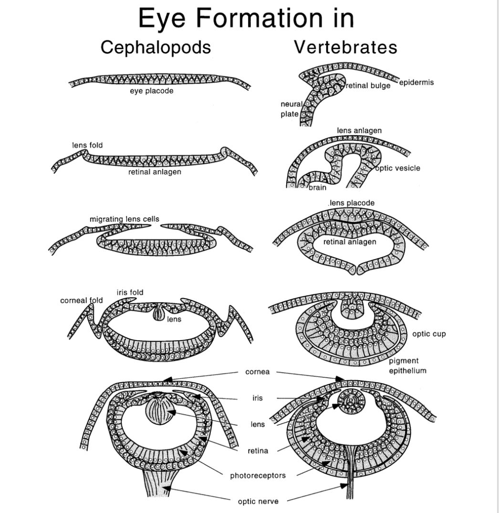
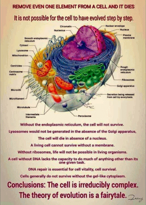

# Irreducible Complexity Trick

One trick the Christian apologists use is to describe the evolution in a way that makes it seem like a human constructing a car (or something).  humans design parts to fit together with other parts.  The fully completed parts and then assembled into the car.  But nature does not construct animals this way.  Not individuals, and species.  The hapless follower is then duped into believing that evolution can't work, because it can't work the way the humans construct things.

## Evolution of the Eye

The evolution of the eye is one of the best understood evolutions of complex organs.  This is because eyes have evolved several times, and twice the process took a similar path and produced similar results. Yes, cephalopods have better eyes than vertebrates because they don't have our blind spot,  but we both ended up with fluid filled eyes with most of the same parts.

What helped us piece together eye evolution is the fact that there are organisms alive today that have examples of everything you see below. This means that each "step" in the evolution of eyes was also a destination.   Organisms with just a patch of light sensitive material are every bit as complete as those with an optical cup. They aren't fumbling around waiting for full eyes to form. Whatever stage of eye development their DNA produces,  that's what they use for the rest of their life. But if they have a mutation in the code for their optic cells, their descendants can be born with the next step.

Wikipedia has a decent treatment of the [Evolution of the eye](https://en.wikipedia.org/wiki/Evolution_of_the_eye?fbclid=IwY2xjawIe6CNleHRuA2FlbQIxMAABHcQdo9HRuj7GywBmJwVe7B68ziuv3K6lzlGFvtgJaDXagBlkOhQCvS-9yw_aem_SDgpUJtP-X0_C4aU3rRd1A).

## Books About the Eye

Here are some highly recommended books that delve into the evolution of the eye:

* "The Eye: A Natural History" by Simon Ings - This book explores the intricate world of vision, covering the evolution, anatomy, and capabilities of eyes.
* "The Mind’s Eye" by Oliver Sacks - Sacks investigates the extraordinary abilities of the human mind in visual perception and the complexities of vision.
* "The Eye Book: A Complete Guide to Eye Disorders and Health" by Gary H. Cassel - A comprehensive guide to eye health, covering common disorders and preventive care.
* "Evolution's Witness: How Eyes Evolved" by Michael F. Land - This book provides a detailed account of the evolutionary history of eyes.
* "Eyes to See: The Evolution of Vision in Nature" by Andrew Parker - Parker discusses how vision has evolved across different species.
* "Vision: A Computational Investigation into the Human Visual System" by David Marr - A deep dive into the computational aspects of vision and its evolution.
* "The Evolution of Vision in Nature" by Andrew Parker - Parker explores the evolution of vision in various species and its impact on survival.
* "The Origin of Species" by Charles Darwin - While not solely focused on the eye, Darwin's seminal work discusses the broader principles of evolution that apply to the eye.
* "The Ancestor's Tale: A Pilgrimage to the Dawn of Evolution" by Richard Dawkins - Dawkins' book touches on the evolution of various traits, including vision.
* "The Blind Watchmaker: Why the Evidence of Evolution Reveals a Universe Without Design" by Richard Dawkins - Dawkins explains how natural selection can lead to complex structures like the eye.

These books should provide a comprehensive understanding of how the eye has evolved over time. Happy reading! 

## Cell Structure

This irreducibility argument is based on the idea that a cell (or anything living) might be assembled from completed parts.

This is the way that a human would build a car.  They would manufacture a part to support a function, such as a carburetor, a wheel, or a headlight. 

Also, each part would be designed specifically for the other parts.  The engine block would have a particular place for the carburetor, and would be designed with a need to receive what it produced.

The car would then be assembled from those completely finished parts.  Clearly with this approach to final product assembly, if any part is missing it would not work.

Nature does not assemble thing the way that humans manufacture.  Nature doesn't design a head, and then design mouth to go on it, and then design eyes to put in there.  It didn't design a cell that needs a nucleus, and then suddenly add a complete nucleus to the cell. The same with the Golgi apparatus, the mitochondria, and all the other organelles.

The Christian apologist fools people into thinking that life is constructed the way they have seen people constructing cars and furniture.  That is not how nature, or evolution, works. Instead the entire organism grows together along with all the parts.  

## The Heart

Nature does not design a body that needs a heart, and then inserts a completely finished heart in there. Instead, early animals had no heart at all, they distributed fluids as a side effect of moving.  Then a very simply circulatory system emerges with a very primitive heart that only worked a little bit.  A million years later were some animals with a two-chamber heart, and because there had been a primitive heard, the circulatory system is a bit more elaborate.   More millions of years passed and a three chamber heart had developed, pumping blood better, and as a consequence the circulatory system got better, and the muscles that depend on being fed better grew to be bigger.  More millions of year pass and a four chambered heart appears.  After this all evolved, indeed if you take the heart out, the animal will die.  But there was no point in time that a fully developed heart was inserted into a fully developed body that needed it.

While I can understand that not everyone is going to have a full understanding of biology, you should understand how the features of a body developed slowly over millions of generations TOGETHER with the features of the body that depend on it.  The claim of irreducible complexity present the present day as if there was not millions of years where all the different parts of the body developed together.  They are basically fooling the audience in the way that nature works.

