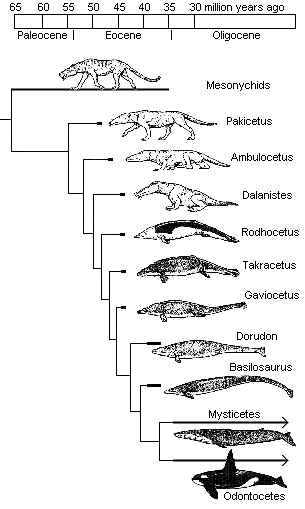
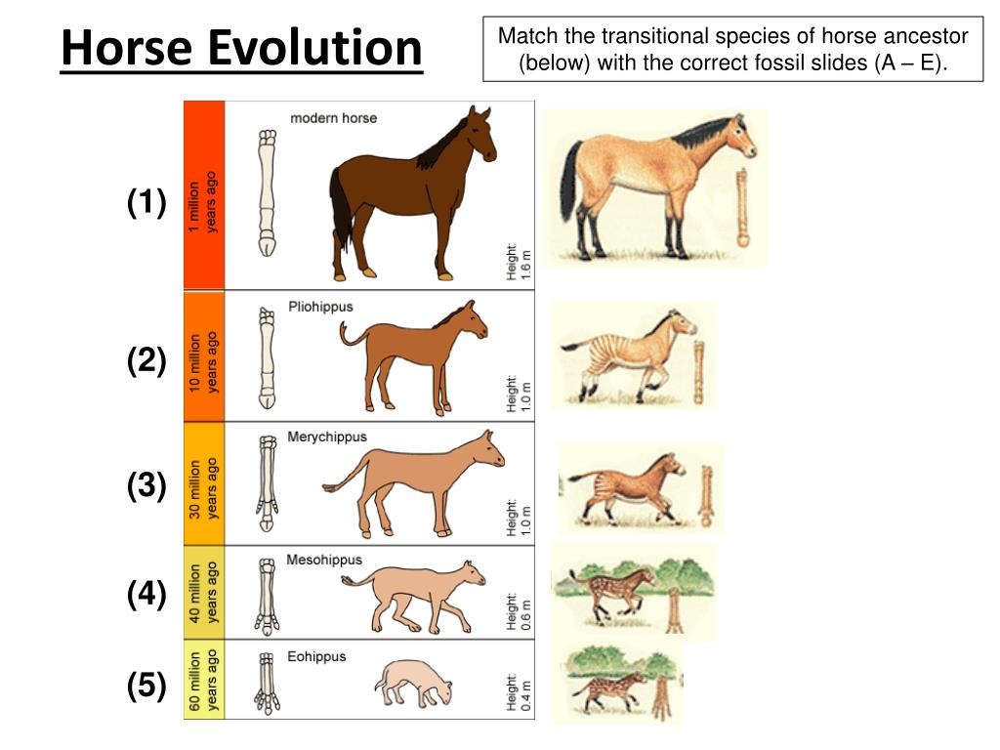

# Transitional Fossil Trick

Some creationists will claim that there are no transitional fossils.  However most of the fossils that have been identified from millions of years ago qualify as a life form that is in between two other life forms, and therefor serves as a transitional fossil.  The change in evolution is remarkably continuous although not always at the same rate.

I am not a biologist and I have not studied these fossils in detail.  That is a job for paleontologists.  And indeed they have pieced together these sequences of animals found in the fossil record.  For some strange reason Christian apologists completely ignore this work, and insist that there are no transitional fossils.

When a creationists repeats this claim, I start by asking what they mean by transitional fossil.  There is the "crocoduck" joke where some claim that a transition from crocodile to duck, you need to see on body part change to a duck, before other body parts.  So you should see a transitional fossil which has the body of a duck and the head of a crocodile.  If you understand how evolution works, this never happens.  I am not sure whether any real creationist believes this silly theory or not, or whether this is just a joke put up by people wanting to make creationists look silly.  I find it hard to believe that any creationist actually believe this, but in conversation with them I am persuaded that some actually believe that.

## Whales

Here is an image the depicts the changing of an earlier creature into a whale.  

Here someone has gone to the trouble of listing some of the transitional fossils that are found on the way to the whale.  We start with a common ancestor between cows and whales, and then hippos and whales.  Those 

Mesonchynids were clearly land animals and that would be classified in the bible as a kind of animal that lives on land.  I won't go through all the steps, but what you see is a series of different kinds of animals that get increasingly more like an aquatic whale.  These fossils have been uncovered and they are transitions on the way to being a whale which is a kind of animal that lives in the sea.  This is how evolution changes one kind of animal into another kind.

## Horse Evolution

Here is a chart showing the transitional fossils on the way to a horse

* The "pilohippus" is an animal that lived 10 million years ago and evolved into the horse.  
* The "meryhippus" lived 20 million years before that (30MYA) and evolved into the pilohippus. 
* The "mesohippus" was 10 million years before that, and 
* the "ecohippus" 20 million years before that.

what you clearly see here is a line of animals that changed form over time.  The ecohippus was a rather small animal, more like a small deer or a small cow.  Over time is steadily went through changes into a horse.  The transitional fossils are well known, and in reality there are lots in between these as well.

Furthermore, there are more independently identified animals before the ecohippus stretching all the way back to the first mammals 225 million years ago.
