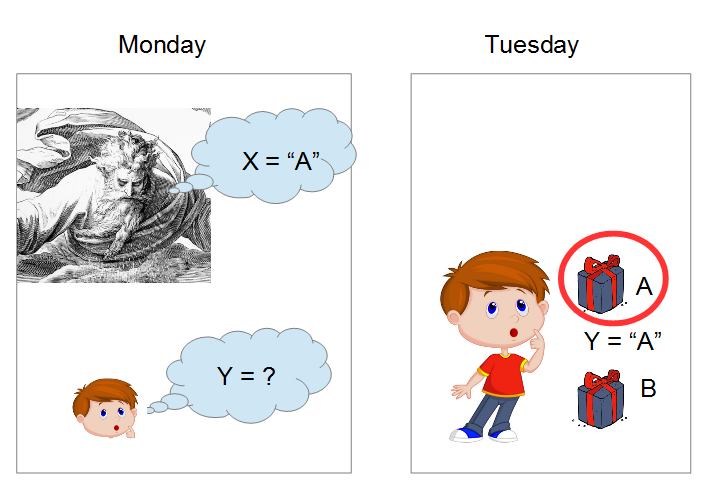
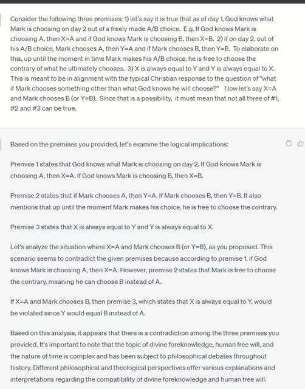

#  Omniscience and Free Will are Incompatible

**Guest Post by Invisible Pink Unicorn**

Proof that it is logically impossible for anyone or anything to have infallible knowledge of yet to be made free choices.

Christians often make the claim that God knows everything. If asked for specifics, they’ll say this includes knowledge about the future (foreknowledge) and that such knowledge is infallible. Christians also often make the claim that man has free will. Upon being asked for specifics, they’ll agree that free will entails the ability to freely make a choice and that up until the time an option is chosen, a different option could have been chosen. At quick glance, these claims may not appear to be in conflict. However, if we dig a little deeper into each of these claims, we’ll see that they are.

Let’s say Pete is faced with a free choice of A or B. He is due to make this choice on Tuesday (day 2). We’ll call Pete’s day 2 A/B choice variable Y – meaning if Pete chooses A, then variable Y gets a value of A and if Pete chooses B, then variable Y gets a value of B. This also means prior to day 2, variable Y has no value (or the choice lies in an unmade state), and on day 2, variable Y will acquire a value of either A or B – to be decided freely by Pete.

Given the Christian claim that God has infallible foreknowledge, this would mean God knows infallibly what A/B choice Pete will make when the choice still lies in an unmade state. To gain further clarity on this, it can be asked, “if it were asked on day 1 does God know infallibly what Pete’s day 2 A/B choice will be, would the answer be YES?”. Christians would typically agree.

So we’ll call what is true on day 1 about God’s knowledge of Pete’s day 2 A/B choice variable X. In other words, if as of day 1, God knows Pete will choose A, then variable X has a value of A – and if as of day 1, God knows Pete will choose B, then variable X has a value of B. If on day 1 it is true that God knows infallibly what Pete’s day 2 A/B choice will be, then it follows that X has a static or fixed value of either A or B as of day 1.

If asked for further specifics, such as what if Pete chooses something in conflict with what God knows he will choose, Christians will respond with the assertion that Pete will choose whatever God knows he will choose. This means that if variable X is equal to A, then variable Y must be equal to A; if variable Y is equal to B, then variable X must be equal to B, etc.

We now have three conditions:

1) X (or God’s knowledge as of day 1 of Pete’s day 2 A/B choice) has a value of either A or B on day 1 and this value is fixed and cannot change. If it is A, it will remain A. If it is B, it will remain B. This follows the assertion that God has infallible knowledge of future events.

2) Y (or Pete’s day 2 A/B choice) receives its value on day 2. Once Y receives its value, it becomes locked. Prior to receiving its value, it could potentially become A or B, as Pete freely chooses A or B. This follows the assertion that Pete has free will or can freely make choices.

3) X is equal to Y. This follows the assertion that whatever Pete chooses is precisely the same as what God knew he would choose.

Not all three of these conditions can be true.

If #1 & #2 are true, then #3 can’t be true, as X wouldn’t necessarily be equal to Y, nor would Y necessarily be equal to X. Not only would X receive a value at a different point in time than Y, but Y could be assigned a value in conflict with the static value of X.

If #1 & #3 are true, then #2 can’t be true. Pete wouldn’t be able to freely choose A or B, as variable Y would already be defined as being equal to variable X. Christians will often argue that God’s knowledge of Pete’s future choice is a function of Pete’s day 2 choice. But this doesn’t hold true if the answer to the question “if asked on day 1, does God know what Pete’s day 2 A/B choice will be?” is YES.

If #2 & #3 are true, then #1 can’t be true. What this means is if variable Y gets its value on day 2, then variable X also gets its value on day 2 and gets the same value as variable Y. It then follows that God can’t have infallible knowledge on day 1 of Pete’s day 2 A/B choice.

Therefore, it is logically impossible for God (or anyone) to have infallible foreknowledge of a yet to be made free choice.

At a high level, what’s going on is some people have made claims. These claims are equivalent to:

1) X has a value of A or B on day 1, meaning it must be equal to A or equal to B as of day 1. This is derived from the Christian claim that if asked on day 1, “does God know what Pete will choose tomorrow”, they would say “yes”.

2) Y gets a value of A or B on day 2, meaning Y has no value prior to day 2 and could be either A or B. This is derived from the Christian claim that Pete freely can choose either A or B and that up until the time he freely chooses either A or B, he could choose the other option.

3) X is always equal to Y and vice versa. This is derived from the Christian claim that whatever God knows Pete will choose is what Pete will choose and whatever Pete chooses is what God knew he would choose.

Since 1, 2 and 3 can’t all be true, we can conclude – provided we’re responding to the aforementioned claims – that the God described here can’t have infallible knowledge of Pete’s freely made choices.

## Update

May 2023 the logic problem was submitted to chat GPT, and here is the result:

