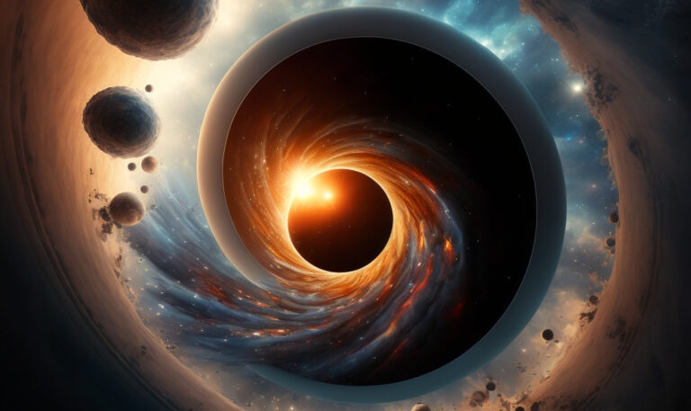

#  On God

The big question: “Do you believe in God?”  I have written a lot here on various related topics, but here is my attempt to answer this question directly.

:::tip[Key Takeaway]

I use the term "god" to refer to the original cause of the universe (whatever that is), as well as the fundamental properties that define existence.  God is the essence that make this universe the way this universe turned out to be.

:::

## What Do We Mean By God?

There are so many different conceptions of God but they have one thing in common:  god is the creator of the universe.  If the universe was created by some entity, God is that entity.

Beyond that, there are so many different variations of what is meant by a “personal god” which I reject.  I hope to clarify why in a different post.  For this post, let’s just focus on the creator god.

## Did a God create the Universe?

My official position is agnostic.  It is not weak agnosticism which is just throwing up your hands and saying “I don’t know.”   Instead, strong agnosticism says that the nature of the universe makes it impossible to know whether God exists or created the universe.  I am confident that not only I don’t know, but also that nobody on the planet knows.  It is something that is not knowable.

Deism is the name given to believing that a god created the universe and then just let it run.  The Big Bang is the scientifically accepted theory of the formation of the universe, but nobody knows what caused the big bang.  I can't deny the possibility that it was created by something outside the universe.  There are cosmologists working on whether there are any clues in the cosmic background radiation that might tell us what happened before the big bang, but the results are far from conclusive.

I leave open the idea that one day mankind, or whatever replaces mankind, might actually work out how to determine the nature of God in detail.  Maybe even to understand why God created the universe.  This is far beyond what anyone can do today, however if someone came up with good evidence I would take a look.

I do feel it is important that I make it clear that I am not in any way **against** the idea of there being a God.  The universe exists.  It might have been created.  There might have been something outside the universe that created it.  That still utterly fails to answer the question about how everything began.  I believe understanding this is the most important quest for knowledge presented to mankind.

## Are you an Atheist?

I am open to the idea that there might be a god.  But I certainly have come to the conclusions that **all the religions currently known to mankind portray a false view of god.**  Obviously I have not studied all of them, but all of the ones I have studied seem to clearly be untrue.

Atheism is a social movement that exists only as a reaction of the encroachment of religious people pushing their demands on others.  Without the Christians trying to capture and indoctrinate children at school into their cult, there would be no real reason for atheists to exist.  As the president of the Atheist Community of San Jose said:  “our goal is to put ourselves out of business by making atheist groups unnecessary.”

Decades ago I came to know how persecuted the atheists are all around the world.  At the same time, the worlds most dominating religion, the most privileged people in the world in general, were complaining that they were “most persecuted.”  The sheer ugly irony of this affected me, and I felt it important to stand with the atheists.  The people who are the most privileged in the US, complain about being persecuted, and then get together and gang up on the atheists.  There are 13 countries in the world where simply claiming you are an atheist is punishable by the death penalty.  There is NO country that does the same for Christians.  Atheists die around the world, and those godly theists let it happen.

So I will proudly say **I stand with the atheists**, because the atheists stand for freedom of thought and freedom to live you life in your own way, and at the same time respecting the rights of others.  I know, this is not how the godly Christians portray atheists, but let’s just admit here that Christians have a tendency to lie about atheists.

## Why create the Universe?

It is logical to conclude that if God made the universe some particular way, then it intended the universe to be that way.  If the universe does something, then we can assume that God intended it to do something.  So God wants the universe to do what it does.

It seems clear to me that the purpose of creating the universe was to allow the things that form in the universe to form.  Was there are purpose to the universe?  Yes, obviously to allow things to form.  It is not a sand box where a god fiddles.  Everything in the universe forms on its own — and that is actually the miracle.  This god does not have to scoot hydrogen into balls in order to light the stars: they form all on their own.  This god does not attach hydrogen to oxygen to make water: water forms all on its own.  Yes, it might be reasonable to claim this happening because this creator god wanted it to happen.  I don’t claim to know the motives of any god, however it is undeniable that the universe has the property that is DOES allow things to create themselves.

It is impossible to say what God expects the universe to form into.  We can’t know that end goal.  However it seems clear "forming" is the purpose of the universe.

## God’s Nature is Growth

Everything that God does is done by growth.  That is, everything starts small, and then gets larger.  Also known as _auto-poësis_.

**Nature** does not create a tree by suddenly poofing the completed product into existence.  Instead it starts from a tiny seed, and grows into a tree.  Nature does not make a forest by poofing it into existence fully formed, but instead by starting with a single tree, which makes seeds, and the forest grows from many generations of this cycle.  

**Stars** form from material that slowly collects together, until gravity get intense enough, and the stars light themselves.  

**Babies** are not born with a fully adult mind, but start with very primitive capabilities but grow into an adult mind.  Everything is formed in the universe through processes of growth and interaction.  This is the way that god works in the universe and it is seen in everything.

Such growth is also called “_self-organization_”.  It is a fact that things in the universe can self-organize.  Stars self organize.  Galaxies self-organize.  Apple trees self-organize.  All living things self-organize.  The mind self-organizes.  Even the christian church self-organizes, and so do communities and nations.

Imagine for a moment that things did not create themselves.  Imagine visiting 100 billion galaxies, each with 100 billion stars, and cupping hydrogen-balls together and then lighting them to make a star.  Even an infinite being is insulted by this idea.  Instead, how much more powerful to create a universe that fills itself with creation?

As the universe forms and grows, it exhibits new levels of emergence.  Macro phenomenon appear only with extremely large aggregates of lower level phenomena.  And in these new level emerge properties that do not exist in the constituent parts.  The universe is still becoming.  I think the universe is about half way through the real ultimate fully developed state.  This is pure speculation, but if you consider the scale of the universe, humans are mid-level between atoms and galactic clusters.  I don’t believe we are the end product.

## Does God Perform Miracles?

The miracles in the bible seem more like parlour tricks that might impress a relatively ignorant bronze age person.  Walking on water, for instance, is a pointless thing for a God who could smash stars into each other, but water is a common thing in the world, and sometimes the ability to get across water without getting wet would be really nice.  In liquid form everyone knows that you can't stand on it.  So it is the kind of trick that would impress an ancient person as being "impossible" and only something a God could do.  It is the kind of supernatural action that someone who knows little about the world would think up.  God could have made a quad-copter appear, adn that would be much more impressive, but those ancient bible writers could not think of that.

I don’t believe that God steps in to violate natural laws to impress ancient people.  I don’t believe that God parted the seas in such a way that Moses and his gang could walk across the Red Sea.  I don’t believe that God steps in to cure a cancer that would otherwise have killed someone.  The reason is clear, but complicated.

God set up the universe in precisely the way that he set it up.  Thus the “laws of nature” are very much the “laws of God”.   The clearest articulation of the will of God, is those laws of nature.  All I am saying here is that the universe is exactly how God wanted the universe to be, and the way it is are those laws of nature that we talk about.  I see a complete equivalence between the will of God and the laws of nature.

A miracle then is something that is against the will of God.   It is God saying “oops I didn’t mean that, so do something different.”   The thing is, I just don’t see a real god doing this.  God might be interested in a day to day thing, such a whether a particular gang in the middle east is able to get across the Red Sea.  But stepping in to make it happen would just spoil the entire universe.  If you believe that God created the universe for some “goal,” then the goal is met when the original design principles of the universe play out.   Meddling with, and violating the will of God, to achieve some short term goal strikes me a something a person would do, and not a God who can construct a whole universe.

## Does God Care About Humans?

It is reasonable to assume that God cares about the universe or else it would not exist.  God created the universe to then create all the many things within it, and obviously cares about all the things that are created. More than that, humans represent the highest organization of anything that has ever appeared on the planet in billions of years.  Humans and human-like emergence (I feel certain there are some others someplace) represent the universe’s path to even greater organization.

Does God care about an individual Betty who slipped off a cliff and is now dangling from a small branch over almost certain death?  No.  Betty’s death is part of the natural flow of the universe.  Death is part of God’s will.  Violating the laws of nature to prolong Betty’s life would be a self-contradiction.  It would be like setting up a race, and then enabling someone to cheat.  It makes no logical sense at all for God to violate his own laws.

Yes, just like god cares about everything that creates itself in the universe.  Humans represent an important step in the development of self-aware consciousness that can create new levels of organization.

## Is God Active?

Yes and No.  You will notice that there is a complete equivalence between God’s will and the laws of the universe.  These laws could have been put in place long ago, and then God disappears and we would never know it.  This equivalence is quite the same thing that Spinoza meant when he describes God as the principles behind the universe.

I also see it somewhat like Hegel when he said that God is immanent in all of creation.  Thus, a God who set out the laws of nature, is present in all of nature.  As a new kind of thing forms in the universe, so does God form in the universe.  As intelligence appears in animals, so does God gain intelligence. God  is active ONLY through the natural unfolding of creation we see in the universe.

We very much are the universe trying to understand itself, or simply God trying to understand itself through the creation. That includes humans.  As humans progress, so does God progress.  It is all part of one big package.

## What is the Purpose of it All?

Whether or not there is a God, it is a fact that the universe exists.  If there is a God, then the way the universe behaves is God’s will.  Clearly, thing self-organize in the universe.  The purpose of the universe must then be to create things through self-organization.  The universe is huge, and we exist in the “middle scale”.

To me, this indicates that there are larger scales of organization yet to come.  The universe is not over.  It is not done.   There is still more to create.  Things which we are just a small, tiny part of it.  We are talking about organization 10 billion times more complex the entire global compute network.

How it will operate is beyond our comprehension.

## God is NOT . . .

Above is a discussion of what attributes god might or might not have.  What we can do though is to address and eliminate some common misconceptions of god:

* micromanage - it seems ridiculous to think that a creator of a huge universe would be concerned about the daily gossip in a group of humans and tweaking elements on a scale that matters to humans.  If god wanted an improved universe it would restart the whole thing from the beginning in the better form, and not make tiny tweaks.
* prayers - it seems ridiculous to think that a god would micromanage the universe to a level that matters to individual humans.  People wish this was true.
* perfection - claiming that god is the most perfect thing that exists seems arbitrary in that god could never make a creation better than itself.  What if god made a creation better than itself?  It would not be considered perfect.  It seems that perfect is a description that depends heavily on the person saying it: perfect for me might not be perfect for you.
* human form - with a universe on the scale, coming to earth and appearing as a half-human half-god seems like something a human would very much like to see, but makes no sense from god's perspective.
* walk on water - many of the miracles of the bible seem to be more like parlor tricks that would be persuasive from a human point of view, but silly from the god's perspective.
* has a message - if god had a message it would be distributed in a way equally available to everyone, and certainly would not select a few unreliable prophets to dole out the privileged information
* bible - using a book to record the critical message, flawed by language translations, like the bible is something that a real god would never do because it is too easy to create hoaxes.  God would communicate in a way that could be clearly seen and understood by the weakest of humans.
* twelve apostles - if god has a message, then 12 apostles will not be needed to follow around a half-man half-god.  Such a pattern reflects a human pattern for organizing a message, but not a god's.
* natural disasters - god does not affect natural disasters like floods, tornados, hurricanes, earthquakes either positive or negative.  From the perspective of the universe these kinds of disasters are a challenge to humans, but no reason to think that god would want to micromanage the conditions on earth to that degree of granularity.

Any religion based on a god with these qualities seems more like a human-centric religion than one really about god.

## What Causes Theists?

Theists believe (arrogantly) that the universe must work in a way that is intuitive to them. They look at a watch, and it does not evolve. They look at a painting, and it does not evolve. They look at their living room, and it does not clean up or organize itself. This experience at home forms their intuition about the world and nothing in the house evolves on its own within their lifespan.

But when they were children, they had the experience of their parents providing everything they needed. The parent produced things without them having any idea how they were produced. This forms the basis of the idea that it is possible for someone to produce things as needed. They then apply this home learning to the world and conclude there must be SOMETHING that is acting like a parent, and making the world exist.

To be fair, evolution is extremely complex and takes work to understand. Their mistake is thinking that the world SHOULD be intuitive and easy to understand. When they can't understand it, they give up and say that God did it. It is just easier.