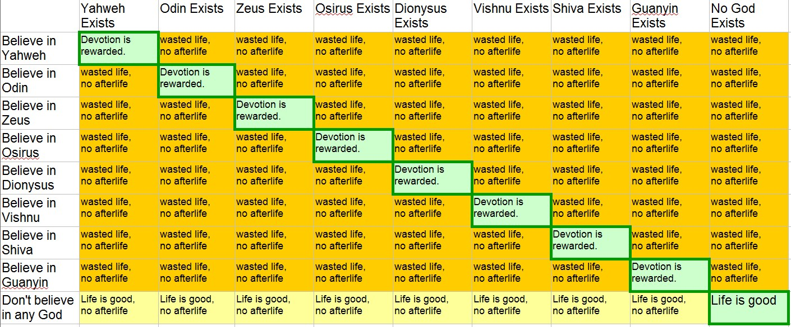

# Pascal's Wager

Pascal is famous for considering the way you spend you life is like a bet.  You don't know whether god exists or nog.   But you have two choices:  you can choose to believe in god or not.   And there are two possible realities:  god exists or it doesn't.  From Pascal's point of view, the _cost_ of believing in god is small, and the payoff if true is large, so it should make sense then to just believe because the return on investment is so large.

:::tip[Key Takeaway]

Pascal's Wager depends on there being one and only one religion.  When you consider many religions, the options for picking the wrong religion change the stakes.

:::

## It Assumes One Religion

The wager fails because it assumes that there is one and only one religion.  Thus choosing to believe in god is a binary choice.  Either you do or you do not.  And either that one religion is true, or not.

But we have over 4000 religions in the world today.  How do you know if you are praying to the right one.  Worshipping the wrong god is as bad as worshiping no god -- in fact it might be worse in some cases.  You only get the afterlife if you believe in the right god.   The truth table looks like the following.

The above is only 8 religions.  If we put all 4000 on there, the "devotion is rewarded" would be a tiny line down the diagonal.  The advantage of believing is only the diagonal, while the disadvantage of believing is the large orange colored space.  The advantage of not believing is the yellow row on the bottom.

You don't get to choose the columns -- that is fixed by reality.  You only get to choose the row you are on.  In any given row, there are many bad orange squares, and at most on good green square.

The advantage of the don't believe in god is that no matter what god exists, you never waste your life.  Of course you might miss out on heaven, but getting the right god is exceedingly rare: a 1:4000 chance.