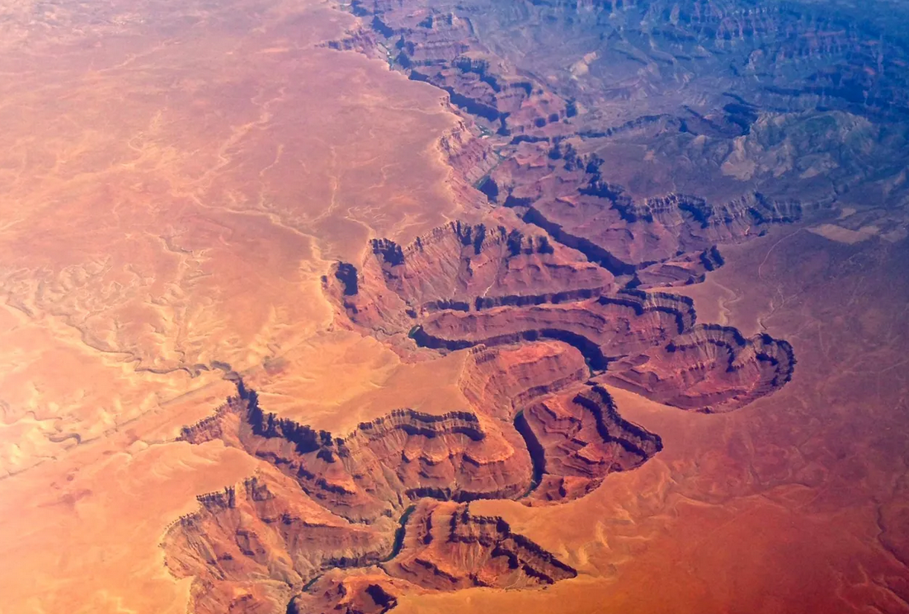

# Canyons and Valleys

_An example of self organization_

Are canyons organized or random?  They are actually quite organized.  If you drop water at any point in the canyon, it will always flow down to the river.  This is true of any spot in the canyon and it didn't just happen by chance to be this way.

The organization comes from the mechanism that forms it: flowing water.  Water flows downhill and as it does so it carries a little of the land with it.  But it can only take it down.  As it does so, it combined with other streams next to it, to make a stronger stream that carves the land better.  The single river at the bottom takes ALL of the material out of the canyon.

**Design**: This organized land feature comes without the need of an intelligence to direct it.  No fairy is needed to direct the side canyons to connect to the main canyon.  The organization simply falls out of the process.

**Energy**: The energy needed to construct this organization comes from the sun.  Water is evaporated from the ocean, carried up into rain clouds, and dropped on the land to flow back to the sea.  The precipitation cycle, fueled by the sun, allows canyons to be cut in the land.

**Self-Organized**: The canyon itself is responsible for the ongoing carving of the canyon.   When the land was flat, the canyon could have formed anywhere.  But as the canyon starts to form, it causes side canyons to form.  Those in turn have smaller side canyons.  It might have started as an accidental line in the sand, the canyon itself organized the further growth of the canyon.