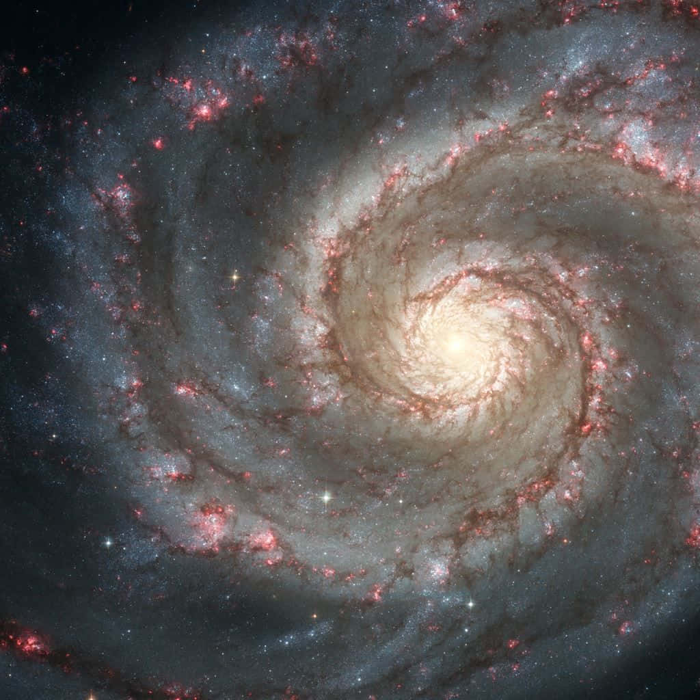

# Galaxies

_An example of self organization_

In all of space, matter tends to clump into collections of stars known as galaxies.  A galaxy is not just a random bunch of stars, but they have definite structure to them.  Most of them spiral in a pronounced way, and they have definite denser streaks called arms.

What is it that commanded the galaxy organize matter in this way?  The galaxy itself.  A small fluctuation causes a process to start to collect matter on a galactic scale.  Once it gets going, the gravity from the denser parts is stronger, and pulls more matter into it.  The galactic core itself causes matter to spin around it.  The matter spinning causes itself to group into arms.  

**Design**: No intelligence is needed to organize matter into a galaxy -- it just does it all on its own.  

**Energy**: The energy needed to construct this organization comes from the original energy of the universe.  When matter falls into a gravity well, it is considered to be at negative potential energy.  As the well forms, it draws matter to it, giving it energy in exchange for the negative energy potential of being down in the well.

**Self-Organized**: Nothing outside of the galaxy causes the galaxy to exit.  The gravity from the matter in the galaxy itself itself causes that matter to form into a galaxy, and nothing else.  The gravity comes from the matter, and that causes more matter to collect.