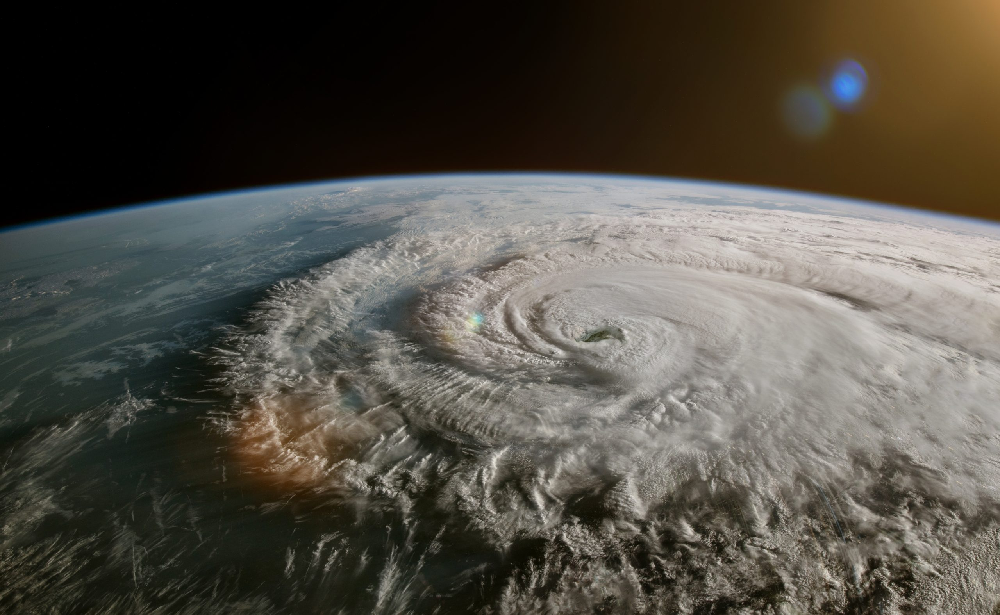
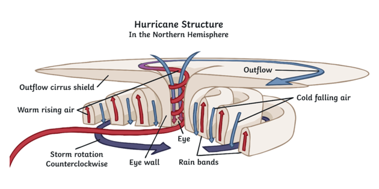

# Hurricanes

_An example of self organization_

The atmosphere would be smooth and still if the earth was a cold dark planet away from any source of heat. But the earth has a sun, and that causes the atmosphere to move around and form active patterns. 

We don't normally think of a hurricane as organized. Instead it feels like the worst kind of chaos. Look at a hurricane and you will clearly see that there is some structure there: winds whirling around with an eye in the center.   There are distinct arms of the hurricane that spiral out from the center.   Each hurricane rotates in the same way that all the other hurricanes in that hemisphere rotate.

 Within the hurricane there are distinct structures of air flow, with bands of rain circling the central eye which is void of clouds or precipitation.

 

**Design**: The structure of the hurricane comes without any intelligence having to design it.

**Energy**: The energy needed to construct this organization comes from the sun.  Water is evaporated from the ocean.  The warm air, heated by the sun rises.  Rising air, because of the spin of the earth, the Coriolis effect causes the air mass to spin in a circle.  Once it starts spinning, additional heat and rising air causes it to spin faster and stronger.

**Self-Organized**: A hurricane can form anywhere in the hot belt around the middle of the planet, and at anytime during hurricane season.  What causes a particular hurricane to form at a particular time?  Some small glitch triggers it, but as it starts to grow there is a feedback effect:  the new rising air adds energy to the existing cycle that is running.  It is the hurricane itself that causes the hurricane to grow larger.  No outside influence is needed to "spin" the hurricane at a particular place and time.