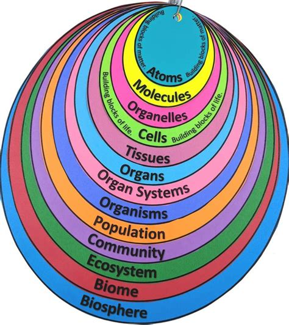

# Living Things

Living organizms are such an obvious example of self-organization it seems unnecessary to mention it.  After all, the word 'organism' is based on the root of 'organization'.  Here is a depiction of a single cell:

## Growth and Self-Organization

Growth means literally getting bigger, but in life getting bigger requires that more cells be created, and that those cells become more organized.  The growth of a baby into an adult is one of getting bigger, but many more much important changes in being organized.  The growth of a seedling into a tree is the same: a full grown tree is not just a seedling that is bigger: instead it has more branches, more leaves, and more connections between everything to make it all work. 

The fact that living things can grow, and that they grow all on their own, is the best example of self-organization.  There is nothing outside of the tree that takes responsibility for making the tree larger.  Sure, the tree needs materials to get larger, but the collection of those materials, and the organization of those materials is entirely the job of the tree to do.

## Many Layers

There is not only a single kind of organization.  There are many nested layers of organization:

