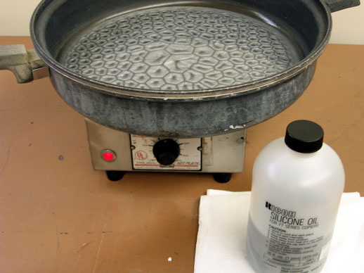

#  Rayleigh-Bénard Convection

One well known example of self-organization is Rayleigh–Bénard convection where structures form spontaneously when a fluid is heated.

## TL;DR

In fluid thermodynamics, Rayleigh–Bénard convection is a type of natural convection, occurring in a planar horizontal layer of fluid heated from below, in which the fluid develops a regular pattern of convection cells known as Bénard cells. The phenomenon is easily studied because of its analytical and experimental accessibility. The convection patterns are the most carefully examined example of self-organizing nonlinear systems.

As the fluid is heated from below in a gravitational field, the warmer fluid expands and becomes lighter causing it to rise, while the cooler, heavier fluid lowers.  What happens is that “convection cells” are formed, vertical columns of a definite size where the fluid is flowing down, and other cells where the fluid is flowing up. The cells are roughly hexagonal in shape, but need not be perfectly so.

The organized pattern, once established, can persist for a long time and is easily observed.  This organization is spontaneous in the sense that no external factor designates where the border between the cells will be.  The cell boundaries are simply determined by interaction  within the fluid itself.

## Simple

Some may scoff at how these patterns are so simple: a hexagonal column with fluid flowing up, with a hexagonal column of fluid flowing down, might not seem the paramount of organization.  The advantage of a simple example is that it can be readily demonstrated.  There is no question that the cells are more organized than not having cells.  It is equally obvious that the details of the cells, their size and shape, it not determined by anything outside the fluid.

## Non-Linear

You start with a smooth fluid heated from the bottom.  As a few molecules randomly flow in one direction, it allows others to flow in that same direction more freely.  Non linear systems have a “spark that leads to fire” aspect to them:  a small change, allows more change, leading to a natural amplification of change.

Non linear systems have a natural amplifier effect that allow butterfly effects to drive the system.  Small random causes trigger the beginnings of flow, but after than the physical factors of the fluid reinforce flows that work, and inhibit flows that don’t.

The size and shape of the cells that form depend on the viscosity and thermal conduction ability.  Thick fluids would tend to form bigger cells than thin fluids, however if the fluid does not conduct heat well those cells might tend to be smaller than fluids that conduct heat well.  If these properties of the fluid are consistent, and the heating of the fluid consistent, then the cells will tend to be consistent, showing that the organization comes from the fluid, and not external factors.

## Causation

One might insist that the cells are “caused” by the heat being applied to the system. It is true that without the heat the cells will not form.  A flow of energy is needed in all examples of self organization.  But the application of a uniform heat does not “cause” the boundaries of the cells at any particular point.  The size, shape, and existence of the cells comes from the fluid itself.

## Creation

When a convection cell forms, it “comes into existence”.  That is: at one moment there was no cell, and the next there was a cell.  I don’t mean to imply that it was instantaneous, but simply that over a short period of time, a cell is created without _coming from_ any other thing.  The verb for something coming into existence is creation. The cell is created literally out of nothing.  Obviously, the cell is a structure within the fluid, and made of the fluid, but the cell itself is something that appeared out of nothing.  And when the heat is turned off the cell will disappear into nothing.  Cell formation is an example of spontaneous creation and spontaneous destruction.

## Theists

My theist friends insist that nothing can organize on its own.  They say that the second law of thermodynamics requires that all things become more disorganized on their own.  What then causes the formation of Bénard cells?

The idea that God — or some intelligence — steps in to designate the boundaries of the cells, creating a up-flowing cells at this place, and a down-flowing cell at another is ludicrous.  This is clearly a natural phenomenon that can be repeated on demand.  To suggest that every time a fluid is heated, God pops by to draw the boundary of such cells and instructing the cells in which way to flow is an unbelievable level of micro management.  Such micro management would deny essentially that natural phenomena exist at all.  (e.g. objects fall because God moves them downward —  each and every one, each and every time).  When we talk about natural phenomena we mean thing that just happen that way without needing intelligence.  The theists explanation that God does all the organization of such things is childish.

This is an example of natural phenomena that create organization without intelligence.  There are many more.

This is not an argument that there is no God.  This argument is only against the false intuition that all organization must be caused by intelligence.

## Conclusions

Rayleigh–Bénard convection may be the simplest example of self-organization, but it has the advantage of being simple enough to show that nothing external is causing the formation of cells. Suggesting that this organization is caused by intelligence is just unbelievable.

This is a clear example of how nature can create spontaneous organization, creating things spontaneously from nothing if the right conditions exist.

## References

*   What is a Convection Cell?
*   [Rayleigh–Bénard convection](https://en.wikipedia.org/wiki/Rayleigh%E2%80%93B%C3%A9nard_convection) wikipedia page
*   [The Self-Made Tapestry, Pattern Formation in Nature](https://global.oup.com/academic/product/the-self-made-tapestry-9780198502432?cc=us&lang=en&) – [Philip Ball](https://en.wikipedia.org/wiki/Philip_Ball) 
*   [Review of “Self Made Tapestry”](http://bactra.org/reviews/self-made-tapestry/) by Cosma Shalizi