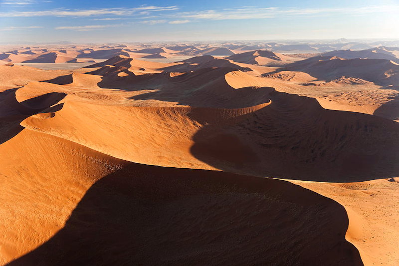
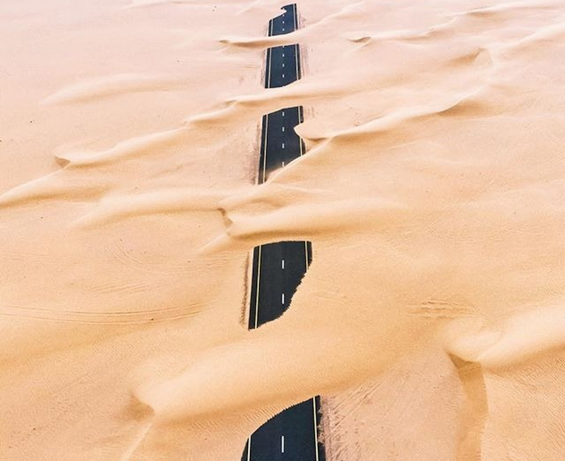

# Sand Dunes

_An example of self organization_

The wind blowing across a sandy plain does not simply move the sand smoothly from one place to another, but instead tends to pile it up into structures we call dunes.  There obviously must be a lot of sand, and there needs to be a prevailing wind direction, but otherwise no external guidance is needed.  The shape of the dune reinforces its own shape.  On the windward side, the wind blows the grains up piling them higher and around the sides.  The otherside is shielded from most of the wind, but still some carry the sand downward aided by gravity.

There is no particular external reason for a sand dune being in one place or another.  Once a sand dune is established, the forces work to build and maintain it based on the shape of the sand dune itself.  

They also will move.  The fact that the shape of the sand dune is causing the existence of the sand dune is demonstrated adequately when sand dunes move slowly, while maintain a shape, but not being dependent on any particular fixed land feature.  (The land does need to be flat for the most part.)

**Design**: This organized land feature comes without the need of an intelligence to organize it.  The organization simply falls out of the process.

**Energy**: The energy needed to construct this organization comes from the wind which ultimately comes from the sun warming the atmosphere causing it to move from place to place.

**Self-Organized**: The shape of the dune causes the ongoing building of the dune.  A dune started in the right place will grow without anything external to the dune causing it.  Dunes placed near each other will have some effect on each other, causing dunes in a large desert to be quite evenly placed.

## References

* [The Science Behind Sand dunes](https://blog.byjus.com/knowledge-vine/how-are-sand-dunes-formed/) is a blog post from 2022 that explains the three different ways that sand is moved by the wind, and how those all contribute to the size and shape of a sand dune.

