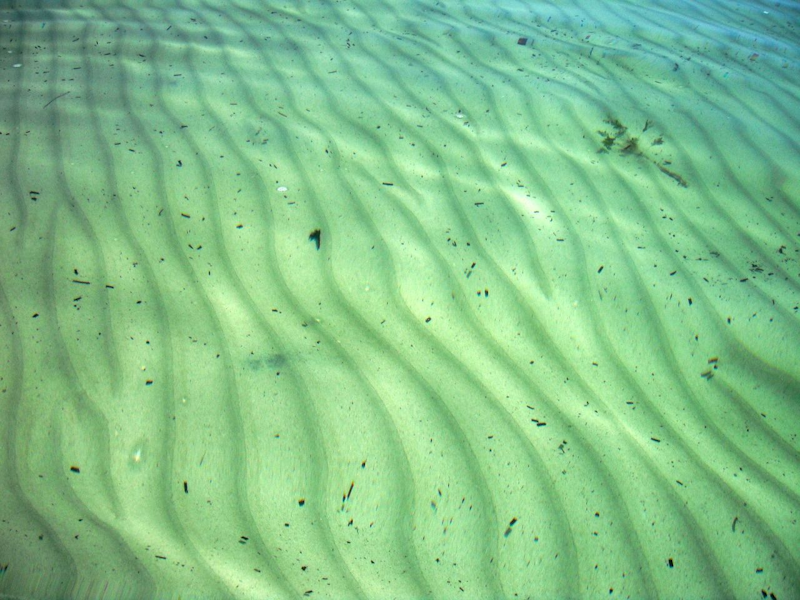

# Sand Ripples

_An example of self organization_

Another thing that organizes itself is the ripples that form in sand.  The wind blows the sand of course but why doesn't it just blow smoothly along.  Why do ripples form at very regular intervals?

Again, it is another case of interplay between various forces, but most importantly, once the pattern of ripples starts, it causes the ripples to form around that one.  Each ripple has an effect on the neighboring ripples.  The effect builds to the point that there are regular, evenly spaced ripples in the surface of the sand.  The organization of those sand ripples was not imposed by any external intelligence, but simply came out of the ripples themselves.

A very similar thing happens underwater.  The water flows over, often as the result of waves that wash up and down on the beach.  Offshore the water pushes the sand around, but it does not push evenly and smoothly.  Ripples form and again, each ripple causes the ripples around it.  No external influence -- not even the waves at the surface of the water -- are causing these ripples in the sand.

**Design**: No external intelligence is needed to designate where the ripples form, nor is one needed to determine the height and width of the ripples.

**Energy**: The energy needed to construct this organization comes from the wind blowing across the surface, and the energy of the wind comes ultimately from the sun heating the atmosphere causing it to move about.  Underwater ripples are causes by water flowing, which is also ultimately fueled by the sun.

**Self-Organized**: Each ripple causes the ripple around it.  The sand and the wind are a given condition that must exist, but the exact placement of the ripples is organized purely from the existing ripples.  One might envision that some "accidental" ripple started the process -- it is hard to say how it starts, but once established the ripple-building process does everything else from the existing ripples.

