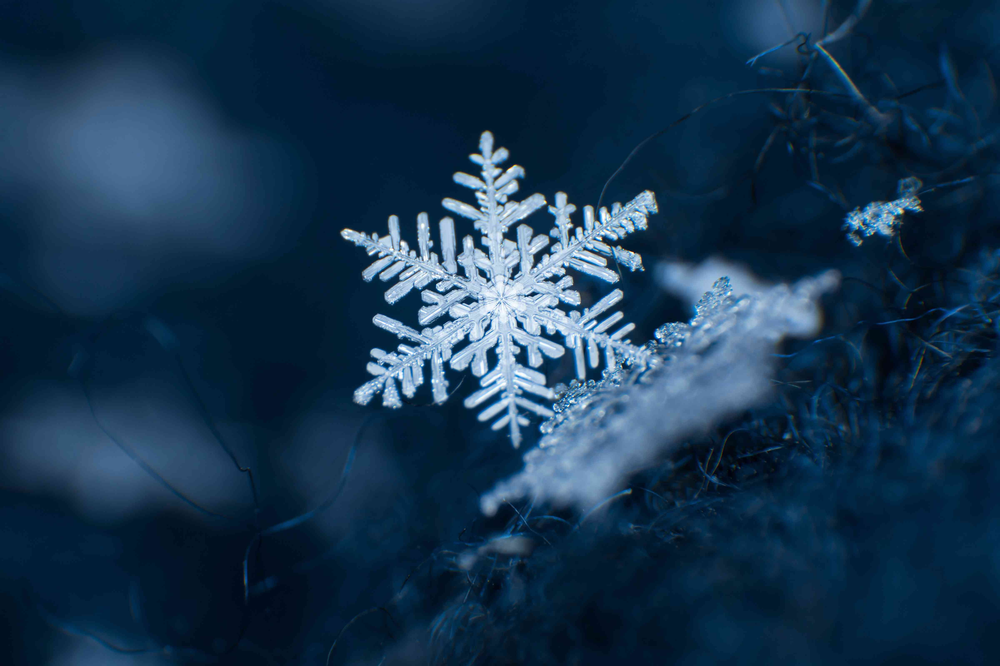

# Snowflakes

What creates a snowflake?  For a snowflake to form there must be the right conditions.  You need air with water in it at the right temperature and pressure such that it is super-saturated, which is the condition for an ice crystal to form.  However there is nothing about that environment that actually forms an individual snowflake.  The crystal could be started by the resence of a bit of dust, or there could be a small spontaneous bunching of molecules.  Once started, the ice crystal grows all by itself, based on simply the shape of the molecule and the attractive forced involved.

the molecules in a gas are bouncing around effectively randomly.  The shape of the molecule makes it attracted to particular places.  The molecules will hit the crystal and bounce off, but once in a while one hits at just the right place, and **sticks**.  If is the shape of the molecule, and the elecrostatic field it produces, that causes the formation of the crystal.

Nothing external to the crystal builds any given crystal.  It is the crystal itself that causes the crystal to build -- given the right environmental conditions.