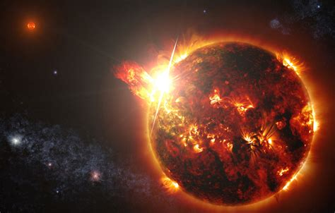

# Stars

Stars started forming about 100 million years after the big bang.  At that time space was filled with a lot of lone hydrogen.  For some reason that is not well understood, that hydrogen started to clump.  The gravitational attraction of those clumps gathered hydrogen together to the point where it ignited and started shining as a star.  This organization happened without any external organization.

Once they began burning, they start making helium and other more exotic elements.  Over the life of the star potential builds up until the point where it explodes as a nova or supernova.  This entire process is critical to supplying higher elements to the rest of the universe, and it runs without any external guidance.