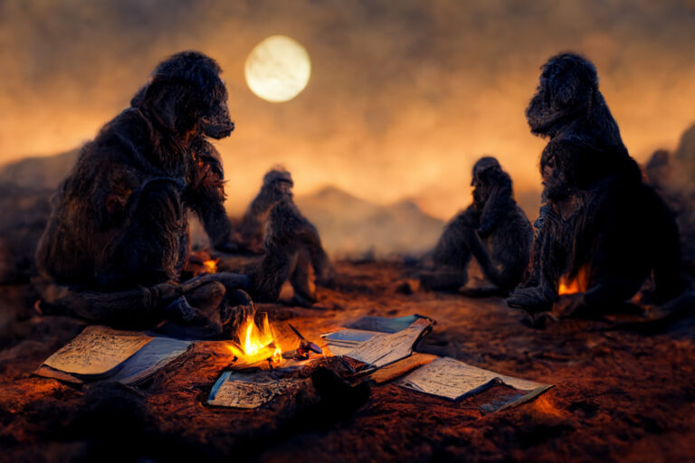

#  The ape wrote “I am”

> **Guest post from Jason Jarvis**

Of gods and machines and realising all is one….

Once on a tiny blue dot, on a planet orbiting a sun itself one of a trillion in a galaxy one of a trillion a hairless ape evolved the ability to code. This evolution may indeed have taken place a trillion times in different places.

The ape had not only learnt to manipulate tools but made marks, perhaps at first on tree bark, then paths, then the hides of dead animals to account for things, time, objects, trade and eventually memories and a sense of self discovered through writing.

The ape wrote, “I am.”

At first it saw itself as part of nature.

The ape wrote, “I think.”

“I am a mind. I have purpose.”

It saw mind everywhere: in the trees, in the breeze, in the glint of sunlight that could be a predator’s eyes. It learned to survive by seeing mind.

The randomness of nature was reinterpreted as spirits, malevolent or benevolent until one ape wrote, “In the beginning, God…”

One cosmic mind made all this and made it for us, the hairless ape, as a test. If we pass we shall wake from sleep of death and no longer be apes in time, subject to disease and death but eternal angels merging with the cosmic mind God who made us to worship it as the big King like the top alpha male leading the troop of apes.

Later hairless apes took the coding further.

They realised that only hairless apes like themselves who they called Man had real mind. The animals, the trees, the breeze were dead things put here for us.

The ape no longer saw itself as part of nature but as its Lord and master like God is our King, Lord and master.

The ape wrote, “I think therefore I am.”

Animals, trees, plants, planets, stars were matter following programs, machines. We alone had soul.

Well maybe not all hairless apes. Maybe just people like us who look like us, who follow the right codes. Others are heathens, machines, not really human.

Then later still other apes wrote, “God is dead.”

“All is machine. We ourselves are machine.”

“There is no mind.”

They thought that the previous apes who believed in spirits, gods and God were primitive and mistaken…

They killed the trees. They killed nature. They killed themselves.

Unless one day just maybe a few of these apes realise that the machine is itself a fiction, a useful fiction, like gods were, and actually we are part of nature, mind is everywhere we are part of the ocean and only when we realise that will we stop killing the trees, the breeze the seas and seize the possibilities and become one with the God we dreamed of and know that inside each drop is the whole ocean there is no me and you no machine no separation just motion and infinite joy… We came from the stars we are the stars I AM written large

You are me I am you the trees, breeze, seas, forest, stars, the alpha and omega…

All is mind…

There’s no separation…