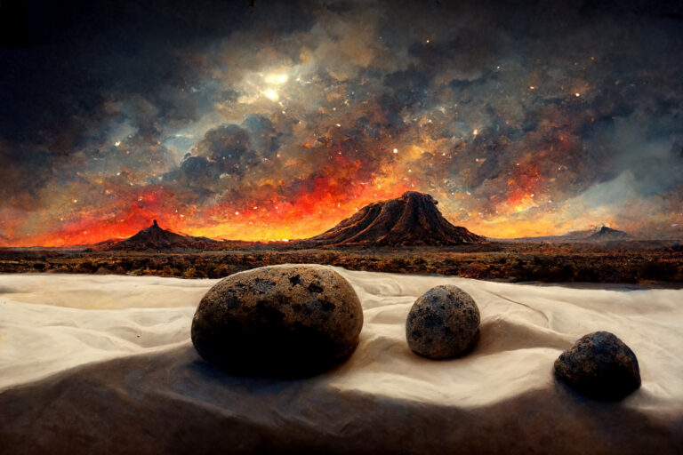

#  Why Is There More Than Mist?

This is for those people who believe that the second law of thermodynamics rules out the possibility of life and evolution.  Let’s consider for a moment the implications of this naïve view of entropy, and see the most profound examples that show how wrongheaded it is.

## Entropy

The second law of thermodynamics says that entropy always increases.  Entropy is a measure of disorder of things.  Thus things always move from ordered to disordered.  Always.

Ordered things are organized.  They are bunched together in ways that are not that probably.  Disorder is everything broken apart.  Drop a glass and the pieces go flying: entropy has increased.  The resulting spread of glass shards is obviously more disorganized than the original one-piece glass.  It is a statistical measure: there are simply so many more ways for something to be broken, than for it to be not broken.

This argument is then used to defend the idea that the offspring of a living organism could never be organized to any greater degree than the parents.  Evolution, which is widely recognized as generating more and more elaborately organized things over time seems to go against the idea of increasing entropy.  “_It can’t happen_” says the naïve thermodynamicist.

## The Universe

Imagine the big bang.  The entire mass of the universe in a point too small to see.   Very very hot.  As it spreads rapidly, and the energy of the universe starts condensing into leptons which dominate the universe for about 9 seconds, and after that photons condense out of the energy of the universe.

This one perfect point source of energy spreads out in a spray of photons and other tiny particles in a way that would put any spray can to shame.  The energy is literally too hot for there to be any nuclei, and every more so too hot for any atoms.  For the next few thousand years it is a spray of subatomic particle.  Eventually things cool enough for atoms to form.

Remember, entropy always increases.  Imagine an aerosol spray of atoms streaming across the universe.  The naïve view of entropy says that those atoms should continue to just spread out.  From a mist of atoms, they would just spread out in space, and get thinner and thinner and thinner.  Nothing but a fine dusting of atoms spread out.

But that is not what happens.  Instead, something very surprising happens, the atoms start clumping together.  The atoms (mostly hydrogen) start grouping together, and they form **_stars_**.

You may not think of stars as being particularly organized, but they are tightly compacted matter compared to the space around them.  Instead of an evenly spread out mist, gravity has acted in a way to bring atoms together to a point of space which had nothing there before.  The force of gravity lights the fire of fusion, and to then organize protons into helium, lithium, beryllium and heavier types of nuclei.  All by itself.

## The Mistake

The mistake of the naïve thermodynamicist is thinking that increasing of entropy means that everything will be spread out evenly.  While it is absolutely true that entropy of the universe has always constantly increased, it did not do so **_evenly_**.  Some parts of the universe get more organized, while other parts get a lot less organized.

Stars don’t just form once, but they explode, spread material across space, and that will eventually re-coalesce into a new star.  The process happens over and over again.  The element of iron and higher and only happen in the extreme violence of a nova or super nova explosion of a star.  The fact that the Earth has plenty of iron tells us that all the atoms on Earth used to be deep within a star, long long ago.  There is a cycle that causes stars to form, explode, and re-form again.

If the naïve interpretation of the second law of thermodynamics was true, then everything would decay.  Stars would not form, but they would fall apart and evaporate and never form again.  The universe would be a completely disorganized ball of very very thin mist.

## Self-Organization

The true magic of the universe is that things don’t just decay.  There are any number of processes that actually build up organization over time.  Not only do stars form by themselves, but galaxies form.  Solar systems form.   Planets such as the Earth form.

The material of Earth was collected together by gravity, but realize that there was nothing “here” before all the material of the Earth simply got together.  The atmosphere is lighter and stays on the outside edge, and then amazingly clouds, thunderstorms, hurricanes, tornadoes, and other weather automatically form all on their own.  Water evaporates, precipitates, and rivers form all on their own.

Why then should we be surprised, that self-replicating molecules would form?  Once there were primitive life forms, why would it be surprising that life would get more and more complex all on its own?  Evolution is just one more example of self-organization that we see around us.

Does the second law of thermodynamics prevent any of this self-organization?  _Absolutely not._  Understand that is most of these systems energy arrives in a lower entropy form, and flows through the system, generally emitting higher entropy radiation.  The entropy inequality is satisfied, but still, things get organized all on their own in the middle of the flow of energy.

## Final Thoughts

We live on the edge of chaos, in a very thin line between the solid rock below our feet, and the empty space above our heads.  This is a very special place, bathed in (low entropy) energy from the sun, and proving the right conditions for evolution to run over and over and over, creating higher and higher organization over time, and radiating (higher entropy) energy back out to space.  This may be non-intuitive, but it is reality.  Self-organization is all around us, and any inability to see it, is due to a faulty intuition.   Nobody ever promised you that the universe would be _intuitive_.