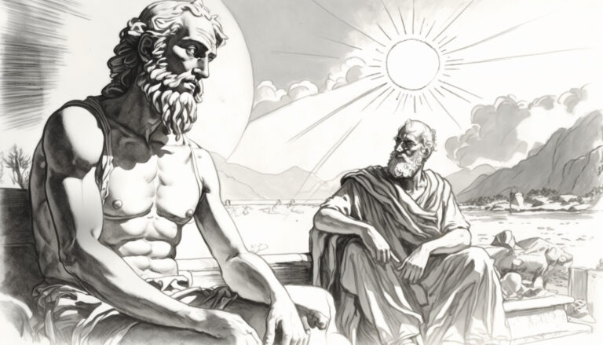

#  Why Are We Here?

That is indeed the eternal question.

I am convinced there is no easy answer, and doubtless the question will remain unanswered within my lifetime. It is not my goal to arrive at an answer, but instead to take the journey toward that answer.

## Being

The purpose of this blog is to record discussion of particular aspects of the human condition as we search for ways to improve ourselves. Is that not the goal of our existence: to be the best that we can be?

How sad it would be for humans, indeed any species, to be destined to descend to a lower form of being. There is ample evidence that universe is continually building, and becoming. We are, quite simply, to become.

## To become something better.

And that, though it sound contrite, and possibly trivial, is why we are here. Join me on this journey. We owe it to the future generations.

This is a set of collecting writings on philosophy and other topics.  Enjoy.
